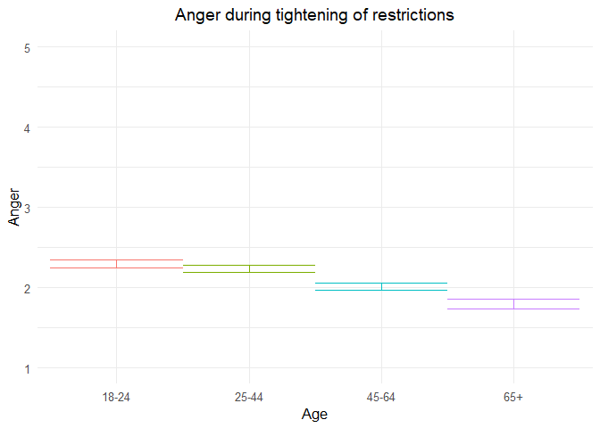
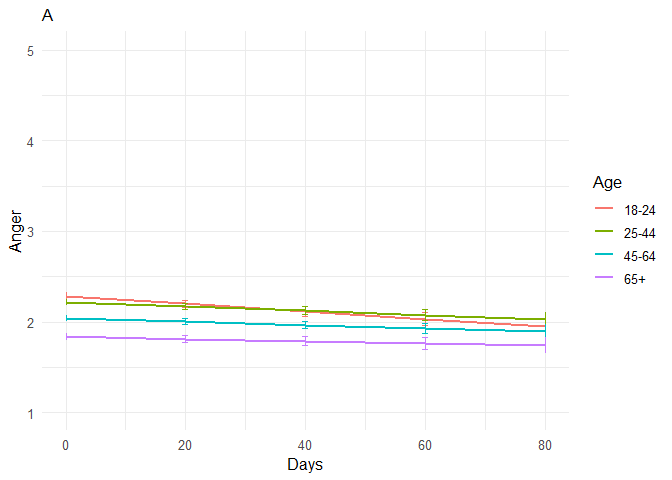
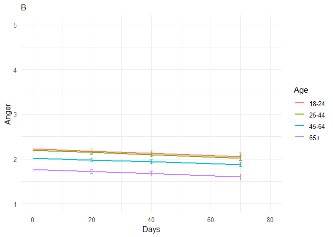
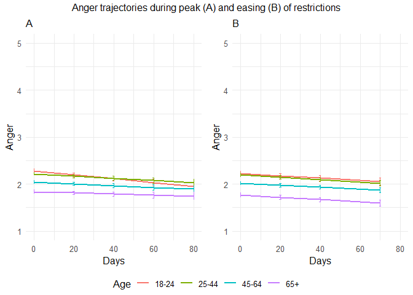

211105 anger additional analyses
================
Anne Margit
11/05/2021

``` r
load("data_analyse2_p1.Rdata")
load("data_analyse2_p2.Rdata")
load("data_analyse2_p3.Rdata")
```

``` r
options(scipen=999)

library(dplyr)
library(tidyverse)
library(ggpubr)
library(ggplot2)
library(rockchalk)
library(effects)
library(nlme)
library(lattice)
library(broom.mixed)
library(purrr)
library(stargazer)
```

    ## Warning: package 'stargazer' was built under R version 4.0.3

``` r
library(viridis)  
```

    ## Warning: package 'viridis' was built under R version 4.0.3

``` r
data_analyse2_p1$Edu <- as.numeric(data_analyse2_p1$Edu)
```

# Phase 1

*Random: IC for ID and Country + Covariates Gender and Education*

``` r
model_Angp1 <- lme(fixed = Ang ~ Gender + Edu + Age_new,
                  random = ~1 | Country/ID, 
                  data = data_analyse2_p1, 
                  na.action = na.omit)

summary(model_Angp1)
```

    Linear mixed-effects model fit by REML
     Data: data_analyse2_p1 
           AIC      BIC    logLik
      10164.47 10221.45 -5073.237
    
    Random effects:
     Formula: ~1 | Country
            (Intercept)
    StdDev:   0.1357594
    
     Formula: ~1 | ID %in% Country
            (Intercept)  Residual
    StdDev:   0.4940149 0.6757098
    
    Fixed effects: Ang ~ Gender + Edu + Age_new 
                     Value  Std.Error   DF   t-value p-value
    (Intercept)  2.3091585 0.07379923 2716 31.289738  0.0000
    Gender1      0.0983566 0.03199046 2716  3.074561  0.0021
    Edu         -0.0156378 0.01161073 2716 -1.346840  0.1781
    Age_new1    -0.0681744 0.04427564 2716 -1.539772  0.1237
    Age_new2    -0.2889178 0.04697541 2716 -6.150406  0.0000
    Age_new3    -0.5034519 0.06707385 2716 -7.505934  0.0000
     Correlation: 
             (Intr) Gendr1 Edu    Ag_nw1 Ag_nw2
    Gender1  -0.322                            
    Edu      -0.640 -0.048                     
    Age_new1 -0.274  0.080 -0.250              
    Age_new2 -0.324  0.131 -0.166  0.711       
    Age_new3 -0.278  0.186 -0.100  0.489  0.490
    
    Standardized Within-Group Residuals:
            Min          Q1         Med          Q3         Max 
    -2.84792350 -0.59628159 -0.08359548  0.48223670  3.61246075 
    
    Number of Observations: 4155
    Number of Groups: 
            Country ID %in% Country 
                 26            2747 

*Plot of predicted values*

``` r
ef_Angp1 <- effect("Age_new", model_Angp1)

plot_Angp1 <- ggplot(as.data.frame(ef_Angp1), 
  aes(Age_new, fit, color=Age_new)) + geom_line() + 
  geom_errorbar(aes(ymin=fit-se, ymax=fit+se), width=1) + theme_minimal(base_size=12) + 
  labs(title="Anger during tightening of restrictions", y = "Anger") +
  theme(plot.title = element_text(hjust = 0.5)) +
  scale_x_discrete(name ="Age", labels=c("18-24", "25-44", "45-64", "65+")) +
  theme(legend.position = "none") +                 
  scale_color_discrete() + 
  expand_limits(y=c(1, 5))
```

``` r
plot_Angp1
```

<!-- -->

``` r
intervals(model_Angp1)
```

    Approximate 95% confidence intervals
    
     Fixed effects:
                      lower        est.        upper
    (Intercept)  2.16445016  2.30915848  2.453866793
    Gender1      0.03562851  0.09835662  0.161084726
    Edu         -0.03840456 -0.01563780  0.007128963
    Age_new1    -0.15499174 -0.06817439  0.018642951
    Age_new2    -0.38102900 -0.28891784 -0.196806676
    Age_new3    -0.63497281 -0.50345187 -0.371930923
    attr(,"label")
    [1] "Fixed effects:"
    
     Random Effects:
      Level: Country 
                         lower      est.    upper
    sd((Intercept)) 0.08448167 0.1357594 0.218161
      Level: ID 
                        lower      est.     upper
    sd((Intercept)) 0.4656377 0.4940149 0.5241216
    
     Within-group standard error:
        lower      est.     upper 
    0.6555807 0.6757098 0.6964570 

``` r
VarCorr(model_Angp1)
```

``` 
            Variance     StdDev   
Country =   pdLogChol(1)          
(Intercept) 0.0184306    0.1357594
ID =        pdLogChol(1)          
(Intercept) 0.2440507    0.4940149
Residual    0.4565838    0.6757098
```

*Effect sizes*

``` r
ISDs <- data_analyse2_p1 %>% 
  group_by(ID) %>%
  summarize_at(c("Ang"), sd, na.rm=TRUE) %>%
  ungroup()

ISDs_av <- ISDs %>%
  summarize_at(c("Ang"), mean, na.rm=TRUE) %>%
  stack() %>%
  rename(sd=values) 
```

> Effect size = regression coefficient / average ISD of Anger

``` r
coef_Angp1 = tidy(model_Angp1, 
               effects = "fixed")

coef_Angp1 <- coef_Angp1 %>%
  mutate (e_size = estimate/0.5856845) %>% 
  mutate(across(2:7, round, 2)) 
```

``` r
coef_Angp1
```

    ## # A tibble: 6 x 7
    ##   term        estimate std.error    df statistic p.value e_size
    ##   <chr>          <dbl>     <dbl> <dbl>     <dbl>   <dbl>  <dbl>
    ## 1 (Intercept)    2.31       0.07  2716     31.3     0      3.94
    ## 2 Gender1        0.1        0.03  2716      3.07    0      0.17
    ## 3 Edu           -0.02       0.01  2716     -1.35    0.18  -0.03
    ## 4 Age_new1      -0.07       0.04  2716     -1.54    0.12  -0.12
    ## 5 Age_new2      -0.290      0.05  2716     -6.15    0     -0.49
    ## 6 Age_new3      -0.5        0.07  2716     -7.51    0     -0.86

``` r
coef_Angp1 <- as.matrix(coef_Angp1)
```

# Phase 2

*Best model*

> Random intercept for ID and Country, random slope for Country and ID,
> no correlation between random intercept and slope for Country, AR
> correlation structure at Measurement level

``` r
data_analyse2_p2$Edu <- as.numeric(data_analyse2_p2$Edu)

data_analyse2_p2 <- data_analyse2_p2[with(data_analyse2_p2, order(Country, ID, Time)),]
data_analyse2_p2$Time <- as.numeric(data_analyse2_p2$Time)

model_Angp2 <- lme(fixed = Ang ~ Gender + Edu + DaysMax_p2 + Age_new + DaysMax_p2*Age_new,
                  random = list(Country = pdDiag(~DaysMax_p2), ID = ~DaysMax_p2),  
                  data = data_analyse2_p2, 
                  na.action = na.omit,
                  correlation = corAR1(form = ~ Time | Country/ID))
summary(model_Angp2)
```

    Linear mixed-effects model fit by REML
     Data: data_analyse2_p2 
           AIC      BIC    logLik
      75694.31 75835.31 -37830.16
    
    Random effects:
     Formula: ~DaysMax_p2 | Country
     Structure: Diagonal
            (Intercept)  DaysMax_p2
    StdDev:   0.1340311 0.002720283
    
     Formula: ~DaysMax_p2 | ID %in% Country
     Structure: General positive-definite, Log-Cholesky parametrization
                StdDev     Corr  
    (Intercept) 0.53765074 (Intr)
    DaysMax_p2  0.00819724 0.636 
    Residual    0.71495857       
    
    Correlation Structure: ARMA(1,0)
     Formula: ~Time | Country/ID 
     Parameter estimate(s):
        Phi1 
    0.135426 
    Fixed effects: Ang ~ Gender + Edu + DaysMax_p2 + Age_new + DaysMax_p2 * Age_new 
                             Value  Std.Error    DF  t-value p-value
    (Intercept)          2.2400230 0.04831344 20356 46.36438  0.0000
    Gender1              0.0965417 0.01875792  9176  5.14672  0.0000
    Edu                 -0.0051366 0.00615839  9176 -0.83408  0.4043
    DaysMax_p2          -0.0041681 0.00131404 20356 -3.17196  0.0015
    Age_new1            -0.0655513 0.03578039  9176 -1.83204  0.0670
    Age_new2            -0.2410586 0.03689560  9176 -6.53353  0.0000
    Age_new3            -0.4469384 0.04492136  9176 -9.94935  0.0000
    DaysMax_p2:Age_new1  0.0018345 0.00125107 20356  1.46635  0.1426
    DaysMax_p2:Age_new2  0.0023127 0.00127079 20356  1.81993  0.0688
    DaysMax_p2:Age_new3  0.0030268 0.00144722 20356  2.09148  0.0365
     Correlation: 
                        (Intr) Gendr1 Edu    DysM_2 Ag_nw1 Ag_nw2 Ag_nw3 DM_2:A_1
    Gender1             -0.293                                                   
    Edu                 -0.476 -0.031                                            
    DaysMax_p2          -0.337  0.004 -0.003                                     
    Age_new1            -0.397  0.043 -0.227  0.404                              
    Age_new2            -0.431  0.074 -0.147  0.388  0.751                       
    Age_new3            -0.388  0.135 -0.103  0.320  0.618  0.619                
    DaysMax_p2:Age_new1  0.298  0.003  0.026 -0.710 -0.589 -0.463 -0.382         
    DaysMax_p2:Age_new2  0.289  0.003  0.034 -0.698 -0.471 -0.607 -0.383  0.807  
    DaysMax_p2:Age_new3  0.256  0.001  0.027 -0.616 -0.414 -0.410 -0.619  0.710  
                        DM_2:A_2
    Gender1                     
    Edu                         
    DaysMax_p2                  
    Age_new1                    
    Age_new2                    
    Age_new3                    
    DaysMax_p2:Age_new1         
    DaysMax_p2:Age_new2         
    DaysMax_p2:Age_new3  0.707  
    
    Standardized Within-Group Residuals:
           Min         Q1        Med         Q3        Max 
    -3.6429225 -0.5471959 -0.1468287  0.4799907  4.4034801 
    
    Number of Observations: 29574
    Number of Groups: 
            Country ID %in% Country 
                 33            9214 

*Plot of predicted values*

``` r
ef_Angp2 <- effect("DaysMax_p2:Age_new", model_Angp2)
plot_Angp2 <- ggplot(as.data.frame(ef_Angp2), aes(DaysMax_p2, fit, color=Age_new)) + 
  geom_line(size=1) + 
  geom_errorbar(aes(ymin=fit-se, ymax=fit+se), width=1) + 
  theme_minimal(base_size=12) + 
  labs(title="A",
       x="Days", y = "Anger") +
  xlim(0,80)+
  theme(plot.title = element_text(size=12)) +
  scale_color_discrete(name="Age", labels = c("18-24", "25-44", "45-64", "65+")) + 
  expand_limits(y=c(1, 5))
```

``` r
plot_Angp2
```

<!-- -->

``` r
VarCorr(model_Angp2)
```

``` 
            Variance              StdDev      Corr  
Country =   pdDiag(DaysMax_p2)                      
(Intercept) 0.017964330383        0.134031080       
DaysMax_p2  0.000007399938        0.002720283       
ID =        pdLogChol(DaysMax_p2)                   
(Intercept) 0.289068317866        0.537650740 (Intr)
DaysMax_p2  0.000067194748        0.008197240 0.636 
Residual    0.511165750336        0.714958565       
```

``` r
intervals(model_Angp2, which = 'fixed')
```

    Approximate 95% confidence intervals
    
     Fixed effects:
                                lower         est.        upper
    (Intercept)          2.1453247530  2.240022993  2.334721234
    Gender1              0.0597720182  0.096541709  0.133311401
    Edu                 -0.0172084304 -0.005136611  0.006935209
    DaysMax_p2          -0.0067437280 -0.004168097 -0.001592465
    Age_new1            -0.1356887954 -0.065551267  0.004586262
    Age_new2            -0.3133821683 -0.241058587 -0.168735006
    Age_new3            -0.5349942596 -0.446938405 -0.358882551
    DaysMax_p2:Age_new1 -0.0006176911  0.001834501  0.004286693
    DaysMax_p2:Age_new2 -0.0001781080  0.002312750  0.004803607
    DaysMax_p2:Age_new3  0.0001901578  0.003026819  0.005863480
    attr(,"label")
    [1] "Fixed effects:"

*Effect sizes*

**Within person SD and average within person SD**

``` r
ISDs <- data_analyse2_p2 %>% 
  group_by(ID) %>%
  summarize_at(c("DaysMax_p2", "Ang"), sd, na.rm=TRUE) %>%
  ungroup()

ISDs_av <- ISDs %>%
  summarize_at(c("DaysMax_p2", "Ang"), mean, na.rm=TRUE) %>%
  stack() %>%
  rename(sd=values) 
```

> Effect sizes for intercept and main effect of age and covariates =
> regression coefficient / average ISD of Anger Effect size for main
> effect of DaysMax = (regression coefficient \* 28)/ average ISD of
> Anger Effect sizes for interaction effects = (regression coefficient
> \* 28)/ average ISD of Anger The effect sizes for main effect of
> DaysMax and the interaction effects reflect the increase in SD of
> Anger over 4 weeks (28 days)

``` r
coef_Angp2 = tidy(model_Angp2, 
               effects = "fixed")
coef_Angp2 <- coef_Angp2 %>%
  mutate(e_size = ifelse(row_number()== 1 | row_number()== 2 |  row_number()== 3 |  row_number()== 5 |  row_number()== 6 |  row_number()== 7, estimate/0.5748763, (estimate*28)/0.5748763)) %>%
  mutate(across(2:7, round, 2)) 
```

``` r
coef_Angp2 <- as.matrix(coef_Angp2)
coef_Angp2
```

    ##       term                  estimate std.error df      statistic p.value
    ##  [1,] "(Intercept)"         " 2.24"  "0.05"    "20356" "46.36"   "0.00" 
    ##  [2,] "Gender1"             " 0.10"  "0.02"    " 9176" " 5.15"   "0.00" 
    ##  [3,] "Edu"                 "-0.01"  "0.01"    " 9176" "-0.83"   "0.40" 
    ##  [4,] "DaysMax_p2"          " 0.00"  "0.00"    "20356" "-3.17"   "0.00" 
    ##  [5,] "Age_new1"            "-0.07"  "0.04"    " 9176" "-1.83"   "0.07" 
    ##  [6,] "Age_new2"            "-0.24"  "0.04"    " 9176" "-6.53"   "0.00" 
    ##  [7,] "Age_new3"            "-0.45"  "0.04"    " 9176" "-9.95"   "0.00" 
    ##  [8,] "DaysMax_p2:Age_new1" " 0.00"  "0.00"    "20356" " 1.47"   "0.14" 
    ##  [9,] "DaysMax_p2:Age_new2" " 0.00"  "0.00"    "20356" " 1.82"   "0.07" 
    ## [10,] "DaysMax_p2:Age_new3" " 0.00"  "0.00"    "20356" " 2.09"   "0.04" 
    ##       e_size 
    ##  [1,] " 3.90"
    ##  [2,] " 0.17"
    ##  [3,] "-0.01"
    ##  [4,] "-0.20"
    ##  [5,] "-0.11"
    ##  [6,] "-0.42"
    ##  [7,] "-0.78"
    ##  [8,] " 0.09"
    ##  [9,] " 0.11"
    ## [10,] " 0.15"

# Phase 3

> Random intercept for ID and Country, random slope for ID and AR
> correlation structure at Measurement level

``` r
data_analyse2_p3$Edu <- as.numeric(data_analyse2_p3$Edu)
data_analyse2_p3 <- data_analyse2_p3[with(data_analyse2_p3, order(Country, ID, Time)),]
data_analyse2_p3$Time <- as.numeric(data_analyse2_p3$Time)
model_Angp3 <- lme(fixed = Ang ~ Gender + Edu + DaysPhase3 + Age_new + DaysPhase3*Age_new,
                  random = list (Country = ~1, ID = ~DaysPhase3), 
                  data = data_analyse2_p3, 
                  na.action = na.omit,
                  correlation = corAR1(form = ~ Time | Country/ID))
summary(model_Angp3)
```

    Linear mixed-effects model fit by REML
     Data: data_analyse2_p3 
           AIC      BIC    logLik
      65387.35 65517.37 -32677.68
    
    Random effects:
     Formula: ~1 | Country
            (Intercept)
    StdDev:   0.1856012
    
     Formula: ~DaysPhase3 | ID %in% Country
     Structure: General positive-definite, Log-Cholesky parametrization
                StdDev     Corr  
    (Intercept) 0.83735012 (Intr)
    DaysPhase3  0.01034354 -0.254
    Residual    0.71242192       
    
    Correlation Structure: ARMA(1,0)
     Formula: ~Time | Country/ID 
     Parameter estimate(s):
         Phi1 
    0.1176299 
    Fixed effects: Ang ~ Gender + Edu + DaysPhase3 + Age_new + DaysPhase3 * Age_new 
                             Value  Std.Error    DF  t-value p-value
    (Intercept)          2.2613059 0.06328604 17940 35.73151  0.0000
    Gender1              0.0366501 0.02439301  7009  1.50248  0.1330
    Edu                 -0.0135899 0.00811023  7009 -1.67565  0.0939
    DaysPhase3          -0.0024205 0.00124199 17940 -1.94892  0.0513
    Age_new1            -0.0308135 0.04728351  7009 -0.65168  0.5146
    Age_new2            -0.2081007 0.04642954  7009 -4.48208  0.0000
    Age_new3            -0.4605091 0.05315136  7009 -8.66411  0.0000
    DaysPhase3:Age_new1 -0.0000795 0.00143660 17940 -0.05534  0.9559
    DaysPhase3:Age_new2  0.0004169 0.00139050 17940  0.29980  0.7643
    DaysPhase3:Age_new3  0.0000792 0.00153809 17940  0.05151  0.9589
     Correlation: 
                        (Intr) Gendr1 Edu    DysPh3 Ag_nw1 Ag_nw2 Ag_nw3 DP3:A_1
    Gender1             -0.301                                                  
    Edu                 -0.482 -0.027                                           
    DaysPhase3          -0.342 -0.003 -0.007                                    
    Age_new1            -0.422  0.049 -0.212  0.464                             
    Age_new2            -0.500  0.103 -0.110  0.472  0.751                      
    Age_new3            -0.481  0.179 -0.071  0.412  0.659  0.699               
    DaysPhase3:Age_new1  0.299  0.000  0.004 -0.862 -0.542 -0.409 -0.357        
    DaysPhase3:Age_new2  0.307  0.002  0.007 -0.892 -0.416 -0.539 -0.370  0.771 
    DaysPhase3:Age_new3  0.280 -0.002  0.003 -0.806 -0.375 -0.382 -0.530  0.697 
                        DP3:A_2
    Gender1                    
    Edu                        
    DaysPhase3                 
    Age_new1                   
    Age_new2                   
    Age_new3                   
    DaysPhase3:Age_new1        
    DaysPhase3:Age_new2        
    DaysPhase3:Age_new3  0.721 
    
    Standardized Within-Group Residuals:
           Min         Q1        Med         Q3        Max 
    -3.8838662 -0.4775681 -0.1528943  0.4577506  4.5348028 
    
    Number of Observations: 24990
    Number of Groups: 
            Country ID %in% Country 
                 32            7046 

``` r
VarCorr(model_Angp3)
```

``` 
            Variance              StdDev     Corr  
Country =   pdLogChol(1)                           
(Intercept) 0.0344478202          0.18560124       
ID =        pdLogChol(DaysPhase3)                  
(Intercept) 0.7011552316          0.83735012 (Intr)
DaysPhase3  0.0001069889          0.01034354 -0.254
Residual    0.5075449989          0.71242192       
```

*Confidence intervals*

``` r
intervals(model_Angp3, which = 'fixed')
```

    Approximate 95% confidence intervals
    
     Fixed effects:
                               lower           est.          upper
    (Intercept)          2.137259206  2.26130594297  2.38535267955
    Gender1             -0.011167632  0.03665005432  0.08446774073
    Edu                 -0.029488424 -0.01358991083  0.00230860268
    DaysPhase3          -0.004854954 -0.00242053783  0.00001387853
    Age_new1            -0.123503514 -0.03081353205  0.06187644998
    Age_new2            -0.299116600 -0.20810066545 -0.11708473067
    Age_new3            -0.564701866 -0.46050912859 -0.35631639145
    DaysPhase3:Age_new1 -0.002895383 -0.00007950302  0.00273637658
    DaysPhase3:Age_new2 -0.002308651  0.00041686915  0.00314238975
    DaysPhase3:Age_new3 -0.002935585  0.00007922791  0.00309404071
    attr(,"label")
    [1] "Fixed effects:"

*Plot of predicted values*

``` r
ef_Angp3 <- effect("DaysPhase3:Age_new", model_Angp3)
plot_Angp3 <- ggplot(as.data.frame(ef_Angp3), aes(DaysPhase3, fit, color=Age_new)) + 
  geom_line(size=1) + 
  geom_errorbar(aes(ymin=fit-se, ymax=fit+se), width=1) + 
  theme_minimal(base_size=12) + 
  xlim(0,80)+
  labs(title="B",
       x="Days", y = "Anger") +
  theme(plot.title = element_text(size = 12)) +
  scale_color_discrete(name="Age", labels = c("18-24", "25-44", "45-64", "65+")) + 
  expand_limits(y=c(1, 5))
```

``` r
plot_Angp3
```

    ## Warning: Removed 4 row(s) containing missing values (geom_path).

<!-- -->

``` r
plot_Angp2and3 <- ggarrange(plot_Angp2, plot_Angp3 , 
          ncol = 2, nrow = 1, common.legend=TRUE, legend= "bottom")
```

    ## Warning: Removed 4 row(s) containing missing values (geom_path).

``` r
plot_Angp2and3 <- annotate_figure(plot_Angp2and3,top = text_grob("Anger trajectories during peak (A) and easing (B) of restrictions", size = 12))
```

``` r
plot_Angp2and3
```

<!-- -->

*Effect sizes* **Within person SD and average within person SD for
Anger**

``` r
ISDs <- data_analyse2_p3 %>% 
  group_by(ID) %>%
  summarize_at(c("Ang"), sd, na.rm=TRUE) %>%
  ungroup()
ISDs_av <- ISDs %>%
  summarize_at(c("Ang"), mean, na.rm=TRUE) %>%
  stack() %>%
  rename(sd=values) 
```

> Effect sizes for intercept and main effect of age = regression
> coefficient / average ISD of Anger Effect size for main effect of
> DaysMax = (regression coefficient \* 28)/ average ISD of Anger Effect
> sizes for interaction effects = (regression coefficient \* 28)/
> average ISD of Anger The effect sizes for main effect of DaysMax and
> the interaction effects reflect the increase in SD of Anger over 4
> weeks (28 days)

``` r
coef_Angp3 = tidy(model_Angp3, 
               effects = "fixed")
coef_Angp3 <- coef_Angp3 %>%
 mutate(e_size = ifelse(row_number()== 1 | row_number()== 2 |  row_number()== 3 |  row_number()== 5 |  row_number()== 6 |  row_number()== 7, estimate/0.5398661, (estimate*28)/0.5398661)) %>%
  mutate(across(2:7, round, 2)) 
```

``` r
coef_Angp3 <- as.matrix(coef_Angp3)
coef_Angp3
```

    ##       term                  estimate std.error df      statistic p.value
    ##  [1,] "(Intercept)"         " 2.26"  "0.06"    "17940" "35.73"   "0.00" 
    ##  [2,] "Gender1"             " 0.04"  "0.02"    " 7009" " 1.50"   "0.13" 
    ##  [3,] "Edu"                 "-0.01"  "0.01"    " 7009" "-1.68"   "0.09" 
    ##  [4,] "DaysPhase3"          " 0.00"  "0.00"    "17940" "-1.95"   "0.05" 
    ##  [5,] "Age_new1"            "-0.03"  "0.05"    " 7009" "-0.65"   "0.51" 
    ##  [6,] "Age_new2"            "-0.21"  "0.05"    " 7009" "-4.48"   "0.00" 
    ##  [7,] "Age_new3"            "-0.46"  "0.05"    " 7009" "-8.66"   "0.00" 
    ##  [8,] "DaysPhase3:Age_new1" " 0.00"  "0.00"    "17940" "-0.06"   "0.96" 
    ##  [9,] "DaysPhase3:Age_new2" " 0.00"  "0.00"    "17940" " 0.30"   "0.76" 
    ## [10,] "DaysPhase3:Age_new3" " 0.00"  "0.00"    "17940" " 0.05"   "0.96" 
    ##       e_size 
    ##  [1,] " 4.19"
    ##  [2,] " 0.07"
    ##  [3,] "-0.03"
    ##  [4,] "-0.13"
    ##  [5,] "-0.06"
    ##  [6,] "-0.39"
    ##  [7,] "-0.85"
    ##  [8,] " 0.00"
    ##  [9,] " 0.02"
    ## [10,] " 0.00"

``` r
stargazer(coef_Angp1, coef_Angp2, coef_Angp3,
type="html", df = TRUE, out="star_coefAngp123.doc",  single.row=TRUE, digits = 2, align = TRUE)
```

    ## 
    ## <table style="text-align:center"><tr><td colspan="7" style="border-bottom: 1px solid black"></td></tr><tr><td>term</td><td>estimate</td><td>std.error</td><td>df</td><td>statistic</td><td>p.value</td><td>e_size</td></tr>
    ## <tr><td colspan="7" style="border-bottom: 1px solid black"></td></tr><tr><td>(Intercept)</td><td>2.31</td><td>0.07</td><td>2716</td><td>31.29</td><td>0.00</td><td>3.94</td></tr>
    ## <tr><td>Gender1</td><td>0.10</td><td>0.03</td><td>2716</td><td>3.07</td><td>0.00</td><td>0.17</td></tr>
    ## <tr><td>Edu</td><td>-0.02</td><td>0.01</td><td>2716</td><td>-1.35</td><td>0.18</td><td>-0.03</td></tr>
    ## <tr><td>Age_new1</td><td>-0.07</td><td>0.04</td><td>2716</td><td>-1.54</td><td>0.12</td><td>-0.12</td></tr>
    ## <tr><td>Age_new2</td><td>-0.29</td><td>0.05</td><td>2716</td><td>-6.15</td><td>0.00</td><td>-0.49</td></tr>
    ## <tr><td>Age_new3</td><td>-0.50</td><td>0.07</td><td>2716</td><td>-7.51</td><td>0.00</td><td>-0.86</td></tr>
    ## <tr><td colspan="7" style="border-bottom: 1px solid black"></td></tr></table>
    ## 
    ## <table style="text-align:center"><tr><td colspan="7" style="border-bottom: 1px solid black"></td></tr><tr><td>term</td><td>estimate</td><td>std.error</td><td>df</td><td>statistic</td><td>p.value</td><td>e_size</td></tr>
    ## <tr><td colspan="7" style="border-bottom: 1px solid black"></td></tr><tr><td>(Intercept)</td><td>2.24</td><td>0.05</td><td>20356</td><td>46.36</td><td>0.00</td><td>3.90</td></tr>
    ## <tr><td>Gender1</td><td>0.10</td><td>0.02</td><td>9176</td><td>5.15</td><td>0.00</td><td>0.17</td></tr>
    ## <tr><td>Edu</td><td>-0.01</td><td>0.01</td><td>9176</td><td>-0.83</td><td>0.40</td><td>-0.01</td></tr>
    ## <tr><td>DaysMax_p2</td><td>0.00</td><td>0.00</td><td>20356</td><td>-3.17</td><td>0.00</td><td>-0.20</td></tr>
    ## <tr><td>Age_new1</td><td>-0.07</td><td>0.04</td><td>9176</td><td>-1.83</td><td>0.07</td><td>-0.11</td></tr>
    ## <tr><td>Age_new2</td><td>-0.24</td><td>0.04</td><td>9176</td><td>-6.53</td><td>0.00</td><td>-0.42</td></tr>
    ## <tr><td>Age_new3</td><td>-0.45</td><td>0.04</td><td>9176</td><td>-9.95</td><td>0.00</td><td>-0.78</td></tr>
    ## <tr><td>DaysMax_p2:Age_new1</td><td>0.00</td><td>0.00</td><td>20356</td><td>1.47</td><td>0.14</td><td>0.09</td></tr>
    ## <tr><td>DaysMax_p2:Age_new2</td><td>0.00</td><td>0.00</td><td>20356</td><td>1.82</td><td>0.07</td><td>0.11</td></tr>
    ## <tr><td>DaysMax_p2:Age_new3</td><td>0.00</td><td>0.00</td><td>20356</td><td>2.09</td><td>0.04</td><td>0.15</td></tr>
    ## <tr><td colspan="7" style="border-bottom: 1px solid black"></td></tr></table>
    ## 
    ## <table style="text-align:center"><tr><td colspan="7" style="border-bottom: 1px solid black"></td></tr><tr><td>term</td><td>estimate</td><td>std.error</td><td>df</td><td>statistic</td><td>p.value</td><td>e_size</td></tr>
    ## <tr><td colspan="7" style="border-bottom: 1px solid black"></td></tr><tr><td>(Intercept)</td><td>2.26</td><td>0.06</td><td>17940</td><td>35.73</td><td>0.00</td><td>4.19</td></tr>
    ## <tr><td>Gender1</td><td>0.04</td><td>0.02</td><td>7009</td><td>1.50</td><td>0.13</td><td>0.07</td></tr>
    ## <tr><td>Edu</td><td>-0.01</td><td>0.01</td><td>7009</td><td>-1.68</td><td>0.09</td><td>-0.03</td></tr>
    ## <tr><td>DaysPhase3</td><td>0.00</td><td>0.00</td><td>17940</td><td>-1.95</td><td>0.05</td><td>-0.13</td></tr>
    ## <tr><td>Age_new1</td><td>-0.03</td><td>0.05</td><td>7009</td><td>-0.65</td><td>0.51</td><td>-0.06</td></tr>
    ## <tr><td>Age_new2</td><td>-0.21</td><td>0.05</td><td>7009</td><td>-4.48</td><td>0.00</td><td>-0.39</td></tr>
    ## <tr><td>Age_new3</td><td>-0.46</td><td>0.05</td><td>7009</td><td>-8.66</td><td>0.00</td><td>-0.85</td></tr>
    ## <tr><td>DaysPhase3:Age_new1</td><td>0.00</td><td>0.00</td><td>17940</td><td>-0.06</td><td>0.96</td><td>0.00</td></tr>
    ## <tr><td>DaysPhase3:Age_new2</td><td>0.00</td><td>0.00</td><td>17940</td><td>0.30</td><td>0.76</td><td>0.02</td></tr>
    ## <tr><td>DaysPhase3:Age_new3</td><td>0.00</td><td>0.00</td><td>17940</td><td>0.05</td><td>0.96</td><td>0.00</td></tr>
    ## <tr><td colspan="7" style="border-bottom: 1px solid black"></td></tr></table>

``` r
stargazer(model_Angp1, model_Angp2, model_Angp3,
type="html", df = TRUE, out="star_modelAngp123.doc",  single.row=TRUE, digits = 2, align = TRUE,
intercept.top = TRUE, intercept.bottom = FALSE)
```

    ## 
    ## <table style="text-align:center"><tr><td colspan="4" style="border-bottom: 1px solid black"></td></tr><tr><td style="text-align:left"></td><td colspan="3"><em>Dependent variable:</em></td></tr>
    ## <tr><td></td><td colspan="3" style="border-bottom: 1px solid black"></td></tr>
    ## <tr><td style="text-align:left"></td><td colspan="3">Ang</td></tr>
    ## <tr><td style="text-align:left"></td><td>(1)</td><td>(2)</td><td>(3)</td></tr>
    ## <tr><td colspan="4" style="border-bottom: 1px solid black"></td></tr><tr><td style="text-align:left">Constant</td><td>2.31<sup>***</sup> (0.07)</td><td>2.24<sup>***</sup> (0.05)</td><td>2.26<sup>***</sup> (0.06)</td></tr>
    ## <tr><td style="text-align:left">Gender1</td><td>0.10<sup>***</sup> (0.03)</td><td>0.10<sup>***</sup> (0.02)</td><td>0.04 (0.02)</td></tr>
    ## <tr><td style="text-align:left">Edu</td><td>-0.02 (0.01)</td><td>-0.01 (0.01)</td><td>-0.01<sup>*</sup> (0.01)</td></tr>
    ## <tr><td style="text-align:left">DaysMax_p2</td><td></td><td>-0.004<sup>***</sup> (0.001)</td><td></td></tr>
    ## <tr><td style="text-align:left">DaysPhase3</td><td></td><td></td><td>-0.002<sup>*</sup> (0.001)</td></tr>
    ## <tr><td style="text-align:left">Age_new1</td><td>-0.07 (0.04)</td><td>-0.07<sup>*</sup> (0.04)</td><td>-0.03 (0.05)</td></tr>
    ## <tr><td style="text-align:left">Age_new2</td><td>-0.29<sup>***</sup> (0.05)</td><td>-0.24<sup>***</sup> (0.04)</td><td>-0.21<sup>***</sup> (0.05)</td></tr>
    ## <tr><td style="text-align:left">Age_new3</td><td>-0.50<sup>***</sup> (0.07)</td><td>-0.45<sup>***</sup> (0.04)</td><td>-0.46<sup>***</sup> (0.05)</td></tr>
    ## <tr><td style="text-align:left">DaysMax_p2:Age_new1</td><td></td><td>0.002 (0.001)</td><td></td></tr>
    ## <tr><td style="text-align:left">DaysMax_p2:Age_new2</td><td></td><td>0.002<sup>*</sup> (0.001)</td><td></td></tr>
    ## <tr><td style="text-align:left">DaysMax_p2:Age_new3</td><td></td><td>0.003<sup>**</sup> (0.001)</td><td></td></tr>
    ## <tr><td style="text-align:left">DaysPhase3:Age_new1</td><td></td><td></td><td>-0.0001 (0.001)</td></tr>
    ## <tr><td style="text-align:left">DaysPhase3:Age_new2</td><td></td><td></td><td>0.0004 (0.001)</td></tr>
    ## <tr><td style="text-align:left">DaysPhase3:Age_new3</td><td></td><td></td><td>0.0001 (0.002)</td></tr>
    ## <tr><td colspan="4" style="border-bottom: 1px solid black"></td></tr><tr><td style="text-align:left">Observations</td><td>4,155</td><td>29,574</td><td>24,990</td></tr>
    ## <tr><td style="text-align:left">Log Likelihood</td><td>-5,073.24</td><td>-37,830.16</td><td>-32,677.68</td></tr>
    ## <tr><td style="text-align:left">Akaike Inf. Crit.</td><td>10,164.47</td><td>75,694.31</td><td>65,387.35</td></tr>
    ## <tr><td style="text-align:left">Bayesian Inf. Crit.</td><td>10,221.45</td><td>75,835.31</td><td>65,517.37</td></tr>
    ## <tr><td colspan="4" style="border-bottom: 1px solid black"></td></tr><tr><td style="text-align:left"><em>Note:</em></td><td colspan="3" style="text-align:right"><sup>*</sup>p<0.1; <sup>**</sup>p<0.05; <sup>***</sup>p<0.01</td></tr>
    ## </table>
