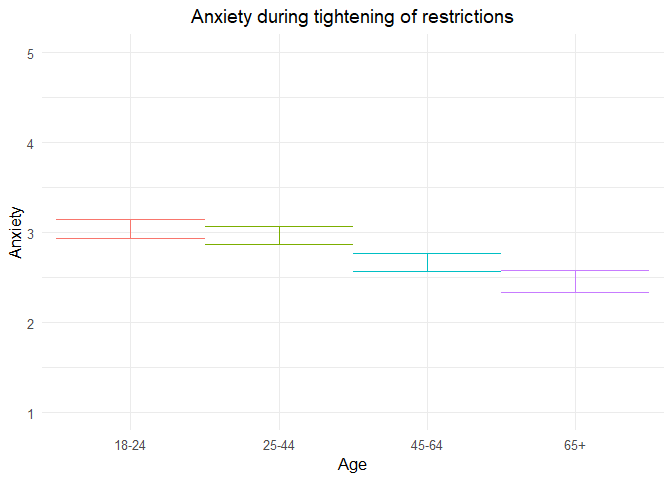

211109 anxiety additional analyses
================
Anne Margit
11/05/2021

``` r
load("data_analyse2_p1.Rdata")
load("data_analyse2_p2.Rdata")
load("data_analyse2_p3.Rdata")
```

``` r
options(scipen=999)

library(dplyr)
library(tidyverse)
library(ggpubr)
library(ggplot2)
library(rockchalk)
library(effects)
library(nlme)
library(lattice)
library(broom.mixed)
library(purrr)
library(stargazer)
```

    ## Warning: package 'stargazer' was built under R version 4.0.3

``` r
library(viridis)  
```

    ## Warning: package 'viridis' was built under R version 4.0.3

``` r
data_analyse2_p1$Edu <- as.numeric(data_analyse2_p1$Edu)
```

# Phase 1

*Random: IC for ID and Country + Covariates Gender and Education*

``` r
model_Anxp1 <- lme(fixed = Anxiety ~ Gender + Edu + Age_new,
                  random = ~1 | Country/ID, 
                  data = data_analyse2_p1, 
                  na.action = na.omit)

summary(model_Anxp1)
```

    Linear mixed-effects model fit by REML
     Data: data_analyse2_p1 
           AIC      BIC    logLik
      12722.36 12779.33 -6352.178
    
    Random effects:
     Formula: ~1 | Country
            (Intercept)
    StdDev:   0.3908474
    
     Formula: ~1 | ID %in% Country
            (Intercept) Residual
    StdDev:     0.82777 0.827943
    
    Fixed effects: Anxiety ~ Gender + Edu + Age_new 
                     Value  Std.Error   DF   t-value p-value
    (Intercept)  2.8028294 0.13242815 2716 21.164907  0.0000
    Gender1      0.3207511 0.04613041 2716  6.953138  0.0000
    Edu          0.0046943 0.01678235 2716  0.279715  0.7797
    Age_new1    -0.0726718 0.06428084 2716 -1.130536  0.2584
    Age_new2    -0.3735335 0.06823726 2716 -5.474040  0.0000
    Age_new3    -0.5846444 0.09685580 2716 -6.036235  0.0000
     Correlation: 
             (Intr) Gendr1 Edu    Ag_nw1 Ag_nw2
    Gender1  -0.263                            
    Edu      -0.523 -0.045                     
    Age_new1 -0.226  0.079 -0.247              
    Age_new2 -0.267  0.129 -0.164  0.714       
    Age_new3 -0.227  0.184 -0.100  0.493  0.499
    
    Standardized Within-Group Residuals:
            Min          Q1         Med          Q3         Max 
    -2.71820349 -0.56934606 -0.01102834  0.54549229  2.72707498 
    
    Number of Observations: 4155
    Number of Groups: 
            Country ID %in% Country 
                 26            2747 

*Plot of predicted values*

``` r
ef_Anxp1 <- effect("Age_new", model_Anxp1)

plot_Anxp1 <- ggplot(as.data.frame(ef_Anxp1), 
  aes(Age_new, fit, color=Age_new)) + geom_line() + 
  geom_errorbar(aes(ymin=fit-se, ymax=fit+se), width=1) + theme_minimal(base_size=12) + 
  labs(title="Anxiety during tightening of restrictions", y = "Anxiety") +
  theme(plot.title = element_text(hjust = 0.5)) +
  scale_x_discrete(name ="Age", labels=c("18-24", "25-44", "45-64", "65+")) +
  theme(legend.position = "none") +                 
  scale_color_discrete() + 
  expand_limits(y=c(1, 5))
```

``` r
plot_Anxp1
```

<!-- -->

``` r
intervals(model_Anxp1)
```

    Approximate 95% confidence intervals
    
     Fixed effects:
                      lower         est.       upper
    (Intercept)  2.54315929  2.802829402  3.06249952
    Gender1      0.23029687  0.320751126  0.41120538
    Edu         -0.02821319  0.004694269  0.03760173
    Age_new1    -0.19871613 -0.072671825  0.05337248
    Age_new2    -0.50733566 -0.373533473 -0.23973128
    Age_new3    -0.77456290 -0.584644380 -0.39472586
    attr(,"label")
    [1] "Fixed effects:"
    
     Random Effects:
      Level: Country 
                        lower      est.     upper
    sd((Intercept)) 0.2703409 0.3908474 0.5650706
      Level: ID 
                        lower    est.     upper
    sd((Intercept)) 0.7880923 0.82777 0.8694453
    
     Within-group standard error:
        lower      est.     upper 
    0.7997903 0.8279430 0.8570866 

``` r
VarCorr(model_Anxp1)
```

``` 
            Variance     StdDev   
Country =   pdLogChol(1)          
(Intercept) 0.1527617    0.3908474
ID =        pdLogChol(1)          
(Intercept) 0.6852032    0.8277700
Residual    0.6854895    0.8279430
```

*Effect sizes*

``` r
ISDs <- data_analyse2_p1 %>% 
  group_by(ID) %>%
  summarize_at(c("Anxiety"), sd, na.rm=TRUE) %>%
  ungroup()

ISDs_av <- ISDs %>%
  summarize_at(c("Anxiety"), mean, na.rm=TRUE) %>%
  stack() %>%
  rename(sd=values) 
```

> Effect size = regression coefficient / average ISD of Anxiety

``` r
coef_Anxp1 = tidy(model_Anxp1, 
               effects = "fixed")

coef_Anxp1 <- coef_Anxp1 %>%
  mutate (e_size = estimate/0.6174475) %>% 
  mutate(across(2:7, round, 2)) 
```

``` r
coef_Anxp1
```

    ## # A tibble: 6 x 7
    ##   term        estimate std.error    df statistic p.value e_size
    ##   <chr>          <dbl>     <dbl> <dbl>     <dbl>   <dbl>  <dbl>
    ## 1 (Intercept)    2.8        0.13  2716     21.2     0      4.54
    ## 2 Gender1        0.32       0.05  2716      6.95    0      0.52
    ## 3 Edu            0          0.02  2716      0.28    0.78   0.01
    ## 4 Age_new1      -0.07       0.06  2716     -1.13    0.26  -0.12
    ## 5 Age_new2      -0.37       0.07  2716     -5.47    0     -0.6 
    ## 6 Age_new3      -0.580      0.1   2716     -6.04    0     -0.95

``` r
coef_Anxp1 <- as.matrix(coef_Anxp1)
```

# Phase 2

*Best model*

> Random intercept for ID and Country, random slope for Country and ID,
> no correlation between random intercept and slope for Country, AR
> correlation structure at Measurement level

``` r
data_analyse2_p2$Edu <- as.numeric(data_analyse2_p2$Edu)

data_analyse2_p2 <- data_analyse2_p2[with(data_analyse2_p2, order(Country, ID, Time)),]
data_analyse2_p2$Time <- as.numeric(data_analyse2_p2$Time)

model_Anxp2 <- lme(fixed = Anxiety ~ Gender + Edu + DaysMax_p2 + Age_new + DaysMax_p2*Age_new,
                  random = list(Country = pdDiag(~DaysMax_p2), ID = ~DaysMax_p2),  
                  data = data_analyse2_p2, 
                  na.action = na.omit,
                  correlation = corAR1(form = ~ Time | Country/ID))
summary(model_Anxp2)
```

    Linear mixed-effects model fit by REML
     Data: data_analyse2_p2 
           AIC      BIC    logLik
      79996.26 80137.27 -39981.13
    
    Random effects:
     Formula: ~DaysMax_p2 | Country
     Structure: Diagonal
            (Intercept) DaysMax_p2
    StdDev:    0.338486 0.00507526
    
     Formula: ~DaysMax_p2 | ID %in% Country
     Structure: General positive-definite, Log-Cholesky parametrization
                StdDev      Corr  
    (Intercept) 0.900217170 (Intr)
    DaysMax_p2  0.009778399 -0.331
    Residual    0.741717971       
    
    Correlation Structure: ARMA(1,0)
     Formula: ~Time | Country/ID 
     Parameter estimate(s):
         Phi1 
    0.2215363 
    Fixed effects: Anxiety ~ Gender + Edu + DaysMax_p2 + Age_new + DaysMax_p2 *      Age_new 
                             Value  Std.Error    DF  t-value p-value
    (Intercept)          2.6719526 0.08112936 20356 32.93447  0.0000
    Gender1              0.2357929 0.02272902  9176 10.37409  0.0000
    Edu                 -0.0170111 0.00745225  9176 -2.28268  0.0225
    DaysMax_p2          -0.0057540 0.00168147 20356 -3.42202  0.0006
    Age_new1             0.0717633 0.04576449  9176  1.56810  0.1169
    Age_new2            -0.1387723 0.04715607  9176 -2.94283  0.0033
    Age_new3            -0.3920443 0.05703333  9176 -6.87395  0.0000
    DaysMax_p2:Age_new1 -0.0036250 0.00133192 20356 -2.72164  0.0065
    DaysMax_p2:Age_new2 -0.0038583 0.00136012 20356 -2.83672  0.0046
    DaysMax_p2:Age_new3 -0.0040426 0.00155372 20356 -2.60190  0.0093
     Correlation: 
                        (Intr) Gendr1 Edu    DysM_2 Ag_nw1 Ag_nw2 Ag_nw3 DM_2:A_1
    Gender1             -0.211                                                   
    Edu                 -0.346 -0.030                                            
    DaysMax_p2          -0.225  0.004 -0.008                                     
    Age_new1            -0.311  0.042 -0.210  0.349                              
    Age_new2            -0.335  0.071 -0.131  0.336  0.753                       
    Age_new3            -0.302  0.136 -0.090  0.280  0.625  0.632                
    DaysMax_p2:Age_new1  0.236  0.001  0.026 -0.581 -0.619 -0.486 -0.404         
    DaysMax_p2:Age_new2  0.229  0.000  0.031 -0.567 -0.490 -0.638 -0.408  0.807  
    DaysMax_p2:Age_new3  0.205 -0.010  0.020 -0.499 -0.430 -0.432 -0.654  0.709  
                        DM_2:A_2
    Gender1                     
    Edu                         
    DaysMax_p2                  
    Age_new1                    
    Age_new2                    
    Age_new3                    
    DaysMax_p2:Age_new1         
    DaysMax_p2:Age_new2         
    DaysMax_p2:Age_new3  0.708  
    
    Standardized Within-Group Residuals:
            Min          Q1         Med          Q3         Max 
    -3.48057855 -0.54358866 -0.09941661  0.53166244  3.68388934 
    
    Number of Observations: 29574
    Number of Groups: 
            Country ID %in% Country 
                 33            9214 

*Plot of predicted values*

``` r
ef_Anxp2 <- effect("DaysMax_p2:Age_new", model_Anxp2)
plot_Anxp2 <- ggplot(as.data.frame(ef_Anxp2), aes(DaysMax_p2, fit, color=Age_new)) + 
  geom_line(size=1) + 
  geom_errorbar(aes(ymin=fit-se, ymax=fit+se), width=1) + 
  theme_minimal(base_size=12) + 
  labs(title="A",
       x="Days", y = "Anxiety") +
  xlim(0,80)+
  theme(plot.title = element_text(size=12)) +
  scale_color_discrete(name="Age", labels = c("18-24", "25-44", "45-64", "65+")) + 
  expand_limits(y=c(1, 5))
```

``` r
plot_Anxp2
```

<!-- -->

``` r
VarCorr(model_Anxp2)
```

``` 
            Variance              StdDev      Corr  
Country =   pdDiag(DaysMax_p2)                      
(Intercept) 0.11457276947         0.338485996       
DaysMax_p2  0.00002575826         0.005075260       
ID =        pdLogChol(DaysMax_p2)                   
(Intercept) 0.81039095285         0.900217170 (Intr)
DaysMax_p2  0.00009561709         0.009778399 -0.331
Residual    0.55014554833         0.741717971       
```

``` r
intervals(model_Anxp2, which = 'fixed')
```

    Approximate 95% confidence intervals
    
     Fixed effects:
                               lower         est.         upper
    (Intercept)          2.512932498  2.671952569  2.8309726401
    Gender1              0.191238939  0.235792883  0.2803468278
    Edu                 -0.031619199 -0.017011124 -0.0024030492
    DaysMax_p2          -0.009049863 -0.005754037 -0.0024582110
    Age_new1            -0.017945301  0.071763286  0.1614718717
    Age_new2            -0.231208712 -0.138772326 -0.0463359395
    Age_new3            -0.503842284 -0.392044263 -0.2802462419
    DaysMax_p2:Age_new1 -0.006235678 -0.003625007 -0.0010143367
    DaysMax_p2:Age_new2 -0.006524205 -0.003858268 -0.0011923310
    DaysMax_p2:Age_new3 -0.007088026 -0.004042618 -0.0009972098
    attr(,"label")
    [1] "Fixed effects:"

*Effect sizes*

**Within person SD and average within person SD**

``` r
ISDs <- data_analyse2_p2 %>% 
  group_by(ID) %>%
  summarize_at(c("DaysMax_p2", "Anxiety"), sd, na.rm=TRUE) %>%
  ungroup()

ISDs_av <- ISDs %>%
  summarize_at(c("DaysMax_p2", "Anxiety"), mean, na.rm=TRUE) %>%
  stack() %>%
  rename(sd=values) 
```

> Effect sizes for intercept and main effect of age and covariates =
> regression coefficient / average ISD of Anxiety Effect size for main
> effect of DaysMax = (regression coefficient \* 28)/ average ISD of
> Anxiety Effect sizes for interaction effects = (regression coefficient
> \* 28)/ average ISD of Anxiety The effect sizes for main effect of
> DaysMax and the interaction effects reflect the increase in SD of
> Anxiety over 4 weeks (28 days)

``` r
coef_Anxp2 = tidy(model_Anxp2, 
               effects = "fixed")
coef_Anxp2 <- coef_Anxp2 %>%
  mutate(e_size = ifelse(row_number()== 1 | row_number()== 2 |  row_number()== 3 |  row_number()== 5 |  row_number()== 6 |  row_number()== 7, estimate/0.5862621, (estimate*28)/0.5862621)) %>%
  mutate(across(2:7, round, 2)) 
```

``` r
coef_Anxp2 <- as.matrix(coef_Anxp2)
coef_Anxp2
```

    ##       term                  estimate std.error df      statistic p.value
    ##  [1,] "(Intercept)"         " 2.67"  "0.08"    "20356" "32.93"   "0.00" 
    ##  [2,] "Gender1"             " 0.24"  "0.02"    " 9176" "10.37"   "0.00" 
    ##  [3,] "Edu"                 "-0.02"  "0.01"    " 9176" "-2.28"   "0.02" 
    ##  [4,] "DaysMax_p2"          "-0.01"  "0.00"    "20356" "-3.42"   "0.00" 
    ##  [5,] "Age_new1"            " 0.07"  "0.05"    " 9176" " 1.57"   "0.12" 
    ##  [6,] "Age_new2"            "-0.14"  "0.05"    " 9176" "-2.94"   "0.00" 
    ##  [7,] "Age_new3"            "-0.39"  "0.06"    " 9176" "-6.87"   "0.00" 
    ##  [8,] "DaysMax_p2:Age_new1" " 0.00"  "0.00"    "20356" "-2.72"   "0.01" 
    ##  [9,] "DaysMax_p2:Age_new2" " 0.00"  "0.00"    "20356" "-2.84"   "0.00" 
    ## [10,] "DaysMax_p2:Age_new3" " 0.00"  "0.00"    "20356" "-2.60"   "0.01" 
    ##       e_size 
    ##  [1,] " 4.56"
    ##  [2,] " 0.40"
    ##  [3,] "-0.03"
    ##  [4,] "-0.27"
    ##  [5,] " 0.12"
    ##  [6,] "-0.24"
    ##  [7,] "-0.67"
    ##  [8,] "-0.17"
    ##  [9,] "-0.18"
    ## [10,] "-0.19"

# Phase 3

> Random intercept for ID and Country, random slope for ID and AR
> correlation structure at Measurement level

``` r
data_analyse2_p3$Edu <- as.numeric(data_analyse2_p3$Edu)
data_analyse2_p3 <- data_analyse2_p3[with(data_analyse2_p3, order(Country, ID, Time)),]
data_analyse2_p3$Time <- as.numeric(data_analyse2_p3$Time)
model_Anxp3 <- lme(fixed = Anxiety ~ Gender + Edu + DaysPhase3 + Age_new + DaysPhase3*Age_new,
                  random = list (Country = ~1, ID = ~DaysPhase3), 
                  data = data_analyse2_p3, 
                  na.action = na.omit,
                  correlation = corAR1(form = ~ Time | Country/ID))
summary(model_Anxp3)
```

    Linear mixed-effects model fit by REML
     Data: data_analyse2_p3 
           AIC      BIC    logLik
      65154.49 65284.51 -32561.25
    
    Random effects:
     Formula: ~1 | Country
            (Intercept)
    StdDev:   0.2861561
    
     Formula: ~DaysPhase3 | ID %in% Country
     Structure: General positive-definite, Log-Cholesky parametrization
                StdDev     Corr  
    (Intercept) 0.86859208 (Intr)
    DaysPhase3  0.01140198 -0.341
    Residual    0.71044605       
    
    Correlation Structure: ARMA(1,0)
     Formula: ~Time | Country/ID 
     Parameter estimate(s):
         Phi1 
    0.1643351 
    Fixed effects: Anxiety ~ Gender + Edu + DaysPhase3 + Age_new + DaysPhase3 *      Age_new 
                             Value  Std.Error    DF   t-value p-value
    (Intercept)          2.6551619 0.07497037 17940  35.41615  0.0000
    Gender1              0.1777712 0.02472798  7009   7.18907  0.0000
    Edu                 -0.0198063 0.00823130  7009  -2.40622  0.0161
    DaysPhase3          -0.0003787 0.00126794 17940  -0.29869  0.7652
    Age_new1            -0.1627942 0.04860446  7009  -3.34937  0.0008
    Age_new2            -0.3529992 0.04782476  7009  -7.38110  0.0000
    Age_new3            -0.6586689 0.05474826  7009 -12.03087  0.0000
    DaysPhase3:Age_new1 -0.0028514 0.00146656 17940  -1.94430  0.0519
    DaysPhase3:Age_new2 -0.0044858 0.00142000 17940  -3.15899  0.0016
    DaysPhase3:Age_new3 -0.0038464 0.00157165 17940  -2.44735  0.0144
     Correlation: 
                        (Intr) Gendr1 Edu    DysPh3 Ag_nw1 Ag_nw2 Ag_nw3 DP3:A_1
    Gender1             -0.257                                                  
    Edu                 -0.413 -0.027                                           
    DaysPhase3          -0.304 -0.003 -0.007                                    
    Age_new1            -0.365  0.048 -0.211  0.475                             
    Age_new2            -0.429  0.101 -0.111  0.482  0.752                      
    Age_new3            -0.412  0.176 -0.073  0.420  0.660  0.700               
    DaysPhase3:Age_new1  0.266 -0.001  0.004 -0.862 -0.555 -0.418 -0.365        
    DaysPhase3:Age_new2  0.273  0.002  0.006 -0.891 -0.425 -0.552 -0.378  0.770 
    DaysPhase3:Age_new3  0.249 -0.002  0.002 -0.805 -0.383 -0.390 -0.543  0.696 
                        DP3:A_2
    Gender1                    
    Edu                        
    DaysPhase3                 
    Age_new1                   
    Age_new2                   
    Age_new3                   
    DaysPhase3:Age_new1        
    DaysPhase3:Age_new2        
    DaysPhase3:Age_new3  0.720 
    
    Standardized Within-Group Residuals:
           Min         Q1        Med         Q3        Max 
    -3.9365698 -0.4975001 -0.1359925  0.5026912  4.0926282 
    
    Number of Observations: 24990
    Number of Groups: 
            Country ID %in% Country 
                 32            7046 

``` r
VarCorr(model_Anxp3)
```

``` 
            Variance              StdDev     Corr  
Country =   pdLogChol(1)                           
(Intercept) 0.0818852907          0.28615606       
ID =        pdLogChol(DaysPhase3)                  
(Intercept) 0.7544522075          0.86859208 (Intr)
DaysPhase3  0.0001300052          0.01140198 -0.341
Residual    0.5047335969          0.71044605       
```

*Confidence intervals*

``` r
intervals(model_Anxp3, which = 'fixed')
```

    Approximate 95% confidence intervals
    
     Fixed effects:
                               lower          est.          upper
    (Intercept)          2.508212719  2.6551618616  2.80211100404
    Gender1              0.129296876  0.1777712009  0.22624552573
    Edu                 -0.035942166 -0.0198063341 -0.00367050244
    DaysPhase3          -0.002864006 -0.0003787172  0.00210657205
    Age_new1            -0.258073674 -0.1627942312 -0.06751478806
    Age_new2            -0.446750237 -0.3529992320 -0.25924822644
    Age_new3            -0.765992089 -0.6586689420 -0.55134579508
    DaysPhase3:Age_new1 -0.005726019 -0.0028514228  0.00002317315
    DaysPhase3:Age_new2 -0.007269118 -0.0044857750 -0.00170243233
    DaysPhase3:Age_new3 -0.006926981 -0.0038463905 -0.00076579979
    attr(,"label")
    [1] "Fixed effects:"

*Plot of predicted values*

``` r
ef_Anxp3 <- effect("DaysPhase3:Age_new", model_Anxp3)
plot_Anxp3 <- ggplot(as.data.frame(ef_Anxp3), aes(DaysPhase3, fit, color=Age_new)) + 
  geom_line(size=1) + 
  geom_errorbar(aes(ymin=fit-se, ymax=fit+se), width=1) + 
  theme_minimal(base_size=12) + 
  xlim(0,80)+
  labs(title="B",
       x="Days", y = "Anxiety") +
  theme(plot.title = element_text(size = 12)) +
  scale_color_discrete(name="Age", labels = c("18-24", "25-44", "45-64", "65+")) + 
  expand_limits(y=c(1, 5))
```

``` r
plot_Anxp3
```

    ## Warning: Removed 4 row(s) containing missing values (geom_path).

<!-- -->

``` r
plot_Anxp2and3 <- ggarrange(plot_Anxp2, plot_Anxp3 , 
          ncol = 2, nrow = 1, common.legend=TRUE, legend= "bottom")
```

    ## Warning: Removed 4 row(s) containing missing values (geom_path).

``` r
plot_Anxp2and3 <- annotate_figure(plot_Anxp2and3,top = text_grob("Anxiety trajectories during peak (A) and easing (B) of restrictions", size = 12))
```

``` r
plot_Anxp2and3
```

<!-- -->

*Effect sizes* **Within person SD and average within person SD for
Anxiety**

``` r
ISDs <- data_analyse2_p3 %>% 
  group_by(ID) %>%
  summarize_at(c("Anxiety"), sd, na.rm=TRUE) %>%
  ungroup()
ISDs_av <- ISDs %>%
  summarize_at(c("Anxiety"), mean, na.rm=TRUE) %>%
  stack() %>%
  rename(sd=values) 
```

> Effect sizes for intercept and main effect of age = regression
> coefficient / average ISD of Anxiety Effect size for main effect of
> DaysMax = (regression coefficient \* 28)/ average ISD of Anxiety
> Effect sizes for interaction effects = (regression coefficient \* 28)/
> average ISD of Anxiety The effect sizes for main effect of DaysMax and
> the interaction effects reflect the increase in SD of Anxiety over 4
> weeks (28 days)

``` r
coef_Anxp3 = tidy(model_Anxp3, 
               effects = "fixed")
coef_Anxp3 <- coef_Anxp3 %>%
 mutate(e_size = ifelse(row_number()== 1 | row_number()== 2 |  row_number()== 3 |  row_number()== 5 |  row_number()== 6 |  row_number()== 7, estimate/0.5501028, (estimate*28)/0.5501028)) %>%
  mutate(across(2:7, round, 2)) 
```

``` r
coef_Anxp3 <- as.matrix(coef_Anxp3)
coef_Anxp3
```

    ##       term                  estimate std.error df      statistic p.value
    ##  [1,] "(Intercept)"         " 2.66"  "0.07"    "17940" " 35.42"  "0.00" 
    ##  [2,] "Gender1"             " 0.18"  "0.02"    " 7009" "  7.19"  "0.00" 
    ##  [3,] "Edu"                 "-0.02"  "0.01"    " 7009" " -2.41"  "0.02" 
    ##  [4,] "DaysPhase3"          " 0.00"  "0.00"    "17940" " -0.30"  "0.77" 
    ##  [5,] "Age_new1"            "-0.16"  "0.05"    " 7009" " -3.35"  "0.00" 
    ##  [6,] "Age_new2"            "-0.35"  "0.05"    " 7009" " -7.38"  "0.00" 
    ##  [7,] "Age_new3"            "-0.66"  "0.05"    " 7009" "-12.03"  "0.00" 
    ##  [8,] "DaysPhase3:Age_new1" " 0.00"  "0.00"    "17940" " -1.94"  "0.05" 
    ##  [9,] "DaysPhase3:Age_new2" " 0.00"  "0.00"    "17940" " -3.16"  "0.00" 
    ## [10,] "DaysPhase3:Age_new3" " 0.00"  "0.00"    "17940" " -2.45"  "0.01" 
    ##       e_size 
    ##  [1,] " 4.83"
    ##  [2,] " 0.32"
    ##  [3,] "-0.04"
    ##  [4,] "-0.02"
    ##  [5,] "-0.30"
    ##  [6,] "-0.64"
    ##  [7,] "-1.20"
    ##  [8,] "-0.15"
    ##  [9,] "-0.23"
    ## [10,] "-0.20"

``` r
stargazer(coef_Anxp1, coef_Anxp2, coef_Anxp3,
type="html", df = TRUE, out="star_coefAnxp123.doc",  single.row=TRUE, digits = 2, align = TRUE)
```

    ## 
    ## <table style="text-align:center"><tr><td colspan="7" style="border-bottom: 1px solid black"></td></tr><tr><td>term</td><td>estimate</td><td>std.error</td><td>df</td><td>statistic</td><td>p.value</td><td>e_size</td></tr>
    ## <tr><td colspan="7" style="border-bottom: 1px solid black"></td></tr><tr><td>(Intercept)</td><td>2.80</td><td>0.13</td><td>2716</td><td>21.16</td><td>0.00</td><td>4.54</td></tr>
    ## <tr><td>Gender1</td><td>0.32</td><td>0.05</td><td>2716</td><td>6.95</td><td>0.00</td><td>0.52</td></tr>
    ## <tr><td>Edu</td><td>0.00</td><td>0.02</td><td>2716</td><td>0.28</td><td>0.78</td><td>0.01</td></tr>
    ## <tr><td>Age_new1</td><td>-0.07</td><td>0.06</td><td>2716</td><td>-1.13</td><td>0.26</td><td>-0.12</td></tr>
    ## <tr><td>Age_new2</td><td>-0.37</td><td>0.07</td><td>2716</td><td>-5.47</td><td>0.00</td><td>-0.60</td></tr>
    ## <tr><td>Age_new3</td><td>-0.58</td><td>0.10</td><td>2716</td><td>-6.04</td><td>0.00</td><td>-0.95</td></tr>
    ## <tr><td colspan="7" style="border-bottom: 1px solid black"></td></tr></table>
    ## 
    ## <table style="text-align:center"><tr><td colspan="7" style="border-bottom: 1px solid black"></td></tr><tr><td>term</td><td>estimate</td><td>std.error</td><td>df</td><td>statistic</td><td>p.value</td><td>e_size</td></tr>
    ## <tr><td colspan="7" style="border-bottom: 1px solid black"></td></tr><tr><td>(Intercept)</td><td>2.67</td><td>0.08</td><td>20356</td><td>32.93</td><td>0.00</td><td>4.56</td></tr>
    ## <tr><td>Gender1</td><td>0.24</td><td>0.02</td><td>9176</td><td>10.37</td><td>0.00</td><td>0.40</td></tr>
    ## <tr><td>Edu</td><td>-0.02</td><td>0.01</td><td>9176</td><td>-2.28</td><td>0.02</td><td>-0.03</td></tr>
    ## <tr><td>DaysMax_p2</td><td>-0.01</td><td>0.00</td><td>20356</td><td>-3.42</td><td>0.00</td><td>-0.27</td></tr>
    ## <tr><td>Age_new1</td><td>0.07</td><td>0.05</td><td>9176</td><td>1.57</td><td>0.12</td><td>0.12</td></tr>
    ## <tr><td>Age_new2</td><td>-0.14</td><td>0.05</td><td>9176</td><td>-2.94</td><td>0.00</td><td>-0.24</td></tr>
    ## <tr><td>Age_new3</td><td>-0.39</td><td>0.06</td><td>9176</td><td>-6.87</td><td>0.00</td><td>-0.67</td></tr>
    ## <tr><td>DaysMax_p2:Age_new1</td><td>0.00</td><td>0.00</td><td>20356</td><td>-2.72</td><td>0.01</td><td>-0.17</td></tr>
    ## <tr><td>DaysMax_p2:Age_new2</td><td>0.00</td><td>0.00</td><td>20356</td><td>-2.84</td><td>0.00</td><td>-0.18</td></tr>
    ## <tr><td>DaysMax_p2:Age_new3</td><td>0.00</td><td>0.00</td><td>20356</td><td>-2.60</td><td>0.01</td><td>-0.19</td></tr>
    ## <tr><td colspan="7" style="border-bottom: 1px solid black"></td></tr></table>
    ## 
    ## <table style="text-align:center"><tr><td colspan="7" style="border-bottom: 1px solid black"></td></tr><tr><td>term</td><td>estimate</td><td>std.error</td><td>df</td><td>statistic</td><td>p.value</td><td>e_size</td></tr>
    ## <tr><td colspan="7" style="border-bottom: 1px solid black"></td></tr><tr><td>(Intercept)</td><td>2.66</td><td>0.07</td><td>17940</td><td>35.42</td><td>0.00</td><td>4.83</td></tr>
    ## <tr><td>Gender1</td><td>0.18</td><td>0.02</td><td>7009</td><td>7.19</td><td>0.00</td><td>0.32</td></tr>
    ## <tr><td>Edu</td><td>-0.02</td><td>0.01</td><td>7009</td><td>-2.41</td><td>0.02</td><td>-0.04</td></tr>
    ## <tr><td>DaysPhase3</td><td>0.00</td><td>0.00</td><td>17940</td><td>-0.30</td><td>0.77</td><td>-0.02</td></tr>
    ## <tr><td>Age_new1</td><td>-0.16</td><td>0.05</td><td>7009</td><td>-3.35</td><td>0.00</td><td>-0.30</td></tr>
    ## <tr><td>Age_new2</td><td>-0.35</td><td>0.05</td><td>7009</td><td>-7.38</td><td>0.00</td><td>-0.64</td></tr>
    ## <tr><td>Age_new3</td><td>-0.66</td><td>0.05</td><td>7009</td><td>-12.03</td><td>0.00</td><td>-1.20</td></tr>
    ## <tr><td>DaysPhase3:Age_new1</td><td>0.00</td><td>0.00</td><td>17940</td><td>-1.94</td><td>0.05</td><td>-0.15</td></tr>
    ## <tr><td>DaysPhase3:Age_new2</td><td>0.00</td><td>0.00</td><td>17940</td><td>-3.16</td><td>0.00</td><td>-0.23</td></tr>
    ## <tr><td>DaysPhase3:Age_new3</td><td>0.00</td><td>0.00</td><td>17940</td><td>-2.45</td><td>0.01</td><td>-0.20</td></tr>
    ## <tr><td colspan="7" style="border-bottom: 1px solid black"></td></tr></table>

``` r
stargazer(model_Anxp1, model_Anxp2, model_Anxp3,
type="html", df = TRUE, out="star_modelAnxp123.doc",  single.row=TRUE, digits = 2, align = TRUE,
intercept.top = TRUE, intercept.bottom = FALSE)
```

    ## 
    ## <table style="text-align:center"><tr><td colspan="4" style="border-bottom: 1px solid black"></td></tr><tr><td style="text-align:left"></td><td colspan="3"><em>Dependent variable:</em></td></tr>
    ## <tr><td></td><td colspan="3" style="border-bottom: 1px solid black"></td></tr>
    ## <tr><td style="text-align:left"></td><td colspan="3">Anxiety</td></tr>
    ## <tr><td style="text-align:left"></td><td>(1)</td><td>(2)</td><td>(3)</td></tr>
    ## <tr><td colspan="4" style="border-bottom: 1px solid black"></td></tr><tr><td style="text-align:left">Constant</td><td>2.80<sup>***</sup> (0.13)</td><td>2.67<sup>***</sup> (0.08)</td><td>2.66<sup>***</sup> (0.07)</td></tr>
    ## <tr><td style="text-align:left">Gender1</td><td>0.32<sup>***</sup> (0.05)</td><td>0.24<sup>***</sup> (0.02)</td><td>0.18<sup>***</sup> (0.02)</td></tr>
    ## <tr><td style="text-align:left">Edu</td><td>0.005 (0.02)</td><td>-0.02<sup>**</sup> (0.01)</td><td>-0.02<sup>**</sup> (0.01)</td></tr>
    ## <tr><td style="text-align:left">DaysMax_p2</td><td></td><td>-0.01<sup>***</sup> (0.002)</td><td></td></tr>
    ## <tr><td style="text-align:left">DaysPhase3</td><td></td><td></td><td>-0.0004 (0.001)</td></tr>
    ## <tr><td style="text-align:left">Age_new1</td><td>-0.07 (0.06)</td><td>0.07 (0.05)</td><td>-0.16<sup>***</sup> (0.05)</td></tr>
    ## <tr><td style="text-align:left">Age_new2</td><td>-0.37<sup>***</sup> (0.07)</td><td>-0.14<sup>***</sup> (0.05)</td><td>-0.35<sup>***</sup> (0.05)</td></tr>
    ## <tr><td style="text-align:left">Age_new3</td><td>-0.58<sup>***</sup> (0.10)</td><td>-0.39<sup>***</sup> (0.06)</td><td>-0.66<sup>***</sup> (0.05)</td></tr>
    ## <tr><td style="text-align:left">DaysMax_p2:Age_new1</td><td></td><td>-0.004<sup>***</sup> (0.001)</td><td></td></tr>
    ## <tr><td style="text-align:left">DaysMax_p2:Age_new2</td><td></td><td>-0.004<sup>***</sup> (0.001)</td><td></td></tr>
    ## <tr><td style="text-align:left">DaysMax_p2:Age_new3</td><td></td><td>-0.004<sup>***</sup> (0.002)</td><td></td></tr>
    ## <tr><td style="text-align:left">DaysPhase3:Age_new1</td><td></td><td></td><td>-0.003<sup>*</sup> (0.001)</td></tr>
    ## <tr><td style="text-align:left">DaysPhase3:Age_new2</td><td></td><td></td><td>-0.004<sup>***</sup> (0.001)</td></tr>
    ## <tr><td style="text-align:left">DaysPhase3:Age_new3</td><td></td><td></td><td>-0.004<sup>**</sup> (0.002)</td></tr>
    ## <tr><td colspan="4" style="border-bottom: 1px solid black"></td></tr><tr><td style="text-align:left">Observations</td><td>4,155</td><td>29,574</td><td>24,990</td></tr>
    ## <tr><td style="text-align:left">Log Likelihood</td><td>-6,352.18</td><td>-39,981.13</td><td>-32,561.25</td></tr>
    ## <tr><td style="text-align:left">Akaike Inf. Crit.</td><td>12,722.36</td><td>79,996.26</td><td>65,154.49</td></tr>
    ## <tr><td style="text-align:left">Bayesian Inf. Crit.</td><td>12,779.33</td><td>80,137.27</td><td>65,284.51</td></tr>
    ## <tr><td colspan="4" style="border-bottom: 1px solid black"></td></tr><tr><td style="text-align:left"><em>Note:</em></td><td colspan="3" style="text-align:right"><sup>*</sup>p<0.1; <sup>**</sup>p<0.05; <sup>***</sup>p<0.01</td></tr>
    ## </table>
