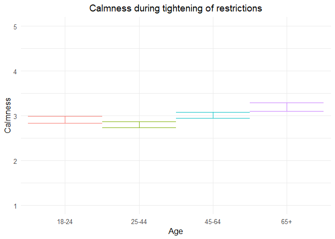
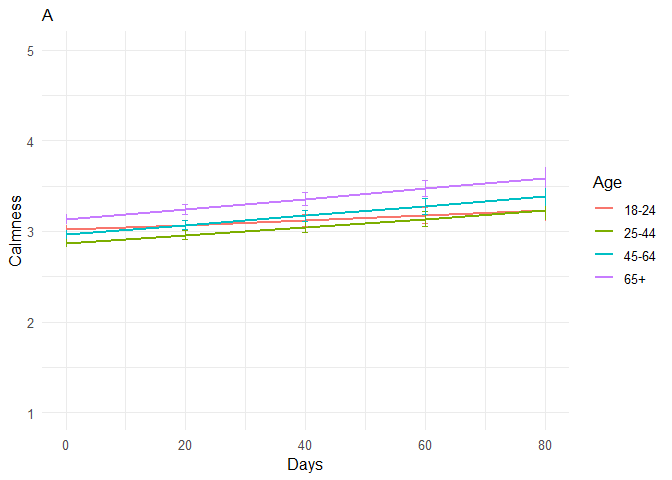
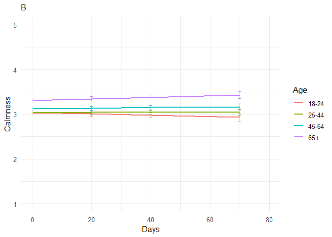
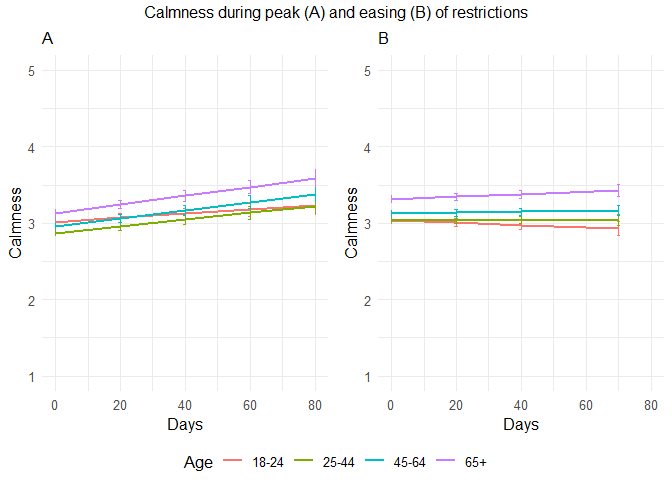

211110 calmness additional analyses
================
Anne Margit
11/05/2021

``` r
load("data_analyse2_p1.Rdata")
load("data_analyse2_p2.Rdata")
load("data_analyse2_p3.Rdata")
```

``` r
options(scipen=999)

library(dplyr)
library(tidyverse)
library(ggpubr)
library(ggplot2)
library(rockchalk)
library(effects)
library(nlme)
library(lattice)
library(broom.mixed)
library(purrr)
library(stargazer)
```

    ## Warning: package 'stargazer' was built under R version 4.0.3

``` r
library(viridis)  
```

    ## Warning: package 'viridis' was built under R version 4.0.3

``` r
data_analyse2_p1$Edu <- as.numeric(data_analyse2_p1$Edu)
```

# Phase 1

*Random: IC for ID and Country + Covariates Gender and Education*

``` r
model_Calmp1 <- lme(fixed = Calm ~ Gender + Edu + Age_new,
                  random = ~1 | Country/ID, 
                  data = data_analyse2_p1, 
                  na.action = na.omit)

summary(model_Calmp1)
```

    Linear mixed-effects model fit by REML
     Data: data_analyse2_p1 
          AIC      BIC    logLik
      11721.1 11778.08 -5851.551
    
    Random effects:
     Formula: ~1 | Country
            (Intercept)
    StdDev:   0.2543328
    
     Formula: ~1 | ID %in% Country
            (Intercept)  Residual
    StdDev:   0.7083855 0.7503211
    
    Fixed effects: Calm ~ Gender + Edu + Age_new 
                     Value  Std.Error   DF   t-value p-value
    (Intercept)  3.0606285 0.10358875 2716 29.545955  0.0000
    Gender1     -0.2766727 0.04043393 2716 -6.842588  0.0000
    Edu          0.0103181 0.01469617 2716  0.702097  0.4827
    Age_new1    -0.1173997 0.05625182 2716 -2.087039  0.0370
    Age_new2     0.0969080 0.05968693 2716  1.623605  0.1046
    Age_new3     0.2787570 0.08477110 2716  3.288350  0.0010
     Correlation: 
             (Intr) Gendr1 Edu    Ag_nw1 Ag_nw2
    Gender1  -0.293                            
    Edu      -0.582 -0.045                     
    Age_new1 -0.252  0.079 -0.248              
    Age_new2 -0.297  0.129 -0.164  0.713       
    Age_new3 -0.254  0.185 -0.099  0.493  0.496
    
    Standardized Within-Group Residuals:
            Min          Q1         Med          Q3         Max 
    -3.38314645 -0.54135787  0.07578988  0.57275745  2.90205041 
    
    Number of Observations: 4155
    Number of Groups: 
            Country ID %in% Country 
                 26            2747 

*Plot of predicted values*

``` r
ef_Calmp1 <- effect("Age_new", model_Calmp1)

plot_Calmp1 <- ggplot(as.data.frame(ef_Calmp1), 
  aes(Age_new, fit, color=Age_new)) + geom_line() + 
  geom_errorbar(aes(ymin=fit-se, ymax=fit+se), width=1) + theme_minimal(base_size=12) + 
  labs(title="Calmness during tightening of restrictions", y = "Calmness") +
  theme(plot.title = element_text(hjust = 0.5)) +
  scale_x_discrete(name ="Age", labels=c("18-24", "25-44", "45-64", "65+")) +
  theme(legend.position = "none") +                 
  scale_color_discrete() + 
  expand_limits(y=c(1, 5))
```

``` r
plot_Calmp1
```

<!-- -->

``` r
intervals(model_Calmp1)
```

    Approximate 95% confidence intervals
    
     Fixed effects:
                      lower        est.        upper
    (Intercept)  2.85750778  3.06062851  3.263749249
    Gender1     -0.35595706 -0.27667268 -0.197388311
    Edu         -0.01849867  0.01031813  0.039134927
    Age_new1    -0.22770044 -0.11739975 -0.007099049
    Age_new2    -0.02012838  0.09690802  0.213944414
    Age_new3     0.11253463  0.27875700  0.444979371
    attr(,"label")
    [1] "Fixed effects:"
    
     Random Effects:
      Level: Country 
                        lower      est.     upper
    sd((Intercept)) 0.1709555 0.2543328 0.3783742
      Level: ID 
                        lower      est.     upper
    sd((Intercept)) 0.6704543 0.7083855 0.7484627
    
     Within-group standard error:
        lower      est.     upper 
    0.7241795 0.7503211 0.7774062 

``` r
VarCorr(model_Calmp1)
```

``` 
            Variance     StdDev   
Country =   pdLogChol(1)          
(Intercept) 0.06468515   0.2543328
ID =        pdLogChol(1)          
(Intercept) 0.50181007   0.7083855
Residual    0.56298169   0.7503211
```

*Effect sizes*

``` r
ISDs <- data_analyse2_p1 %>% 
  group_by(ID) %>%
  summarize_at(c("Calm"), sd, na.rm=TRUE) %>%
  ungroup()

ISDs_av <- ISDs %>%
  summarize_at(c("Calm"), mean, na.rm=TRUE) %>%
  stack() %>%
  rename(sd=values) 
```

> Effect size = regression coefficient / average ISD of Calm

``` r
coef_Calmp1 = tidy(model_Calmp1, 
               effects = "fixed")

coef_Calmp1 <- coef_Calmp1 %>%
  mutate (e_size = estimate/0.5528142) %>% 
  mutate(across(2:7, round, 2)) 
```

``` r
coef_Calmp1
```

    ## # A tibble: 6 x 7
    ##   term        estimate std.error    df statistic p.value e_size
    ##   <chr>          <dbl>     <dbl> <dbl>     <dbl>   <dbl>  <dbl>
    ## 1 (Intercept)     3.06      0.1   2716     29.6     0      5.54
    ## 2 Gender1        -0.28      0.04  2716     -6.84    0     -0.5 
    ## 3 Edu             0.01      0.01  2716      0.7     0.48   0.02
    ## 4 Age_new1       -0.12      0.06  2716     -2.09    0.04  -0.21
    ## 5 Age_new2        0.1       0.06  2716      1.62    0.1    0.18
    ## 6 Age_new3        0.28      0.08  2716      3.29    0      0.5

``` r
coef_Calmp1 <- as.matrix(coef_Calmp1)
```

# Phase 2

*Best model*

> Random intercept for ID and Country, random slope for ID and country,
> no correlation between IC and S for ID and country + AR correlation
> structure at Measurement level

``` r
data_analyse2_p2$Edu <- as.numeric(data_analyse2_p2$Edu)
data_analyse2_p2 <- data_analyse2_p2[with(data_analyse2_p2, order(Country, ID, Time)),]
data_analyse2_p2$Time <- as.numeric(data_analyse2_p2$Time)
model_Calmp2 <- lme(fixed = Calm ~ Gender + Edu + DaysMax_p2 + Age_new + DaysMax_p2*Age_new,
                  random = list(Country= pdDiag(~DaysMax_p2), ID = pdDiag(~DaysMax_p2)), 
                  data = data_analyse2_p2, 
                  na.action = na.omit,
                  correlation = corAR1(form = ~ Time | Country/ID))
summary(model_Calmp2)
```

    Linear mixed-effects model fit by REML
     Data: data_analyse2_p2 
           AIC      BIC    logLik
      75547.46 75680.17 -37757.73
    
    Random effects:
     Formula: ~DaysMax_p2 | Country
     Structure: Diagonal
            (Intercept)  DaysMax_p2
    StdDev:   0.2189014 0.004806981
    
     Formula: ~DaysMax_p2 | ID %in% Country
     Structure: Diagonal
            (Intercept) DaysMax_p2  Residual
    StdDev:   0.7198923 0.00586374 0.7007005
    
    Correlation Structure: ARMA(1,0)
     Formula: ~Time | Country/ID 
     Parameter estimate(s):
         Phi1 
    0.1550343 
    Fixed effects: Calm ~ Gender + Edu + DaysMax_p2 + Age_new + DaysMax_p2 * Age_new 
                             Value  Std.Error    DF   t-value p-value
    (Intercept)          3.0333491 0.06070161 20356  49.97148  0.0000
    Gender1             -0.2803970 0.01993156  9176 -14.06799  0.0000
    Edu                  0.0380504 0.00653650  9176   5.82122  0.0000
    DaysMax_p2           0.0026461 0.00154570 20356   1.71190  0.0869
    Age_new1            -0.1450243 0.03930057  9176  -3.69013  0.0002
    Age_new2            -0.0540098 0.04048245  9176  -1.33415  0.1822
    Age_new3             0.1115575 0.04901953  9176   2.27578  0.0229
    DaysMax_p2:Age_new1  0.0017841 0.00117846 20356   1.51389  0.1301
    DaysMax_p2:Age_new2  0.0025822 0.00120072 20356   2.15051  0.0315
    DaysMax_p2:Age_new3  0.0031034 0.00136582 20356   2.27219  0.0231
     Correlation: 
                        (Intr) Gendr1 Edu    DysM_2 Ag_nw1 Ag_nw2 Ag_nw3 DM_2:A_1
    Gender1             -0.247                                                   
    Edu                 -0.404 -0.030                                            
    DaysMax_p2          -0.254  0.004 -0.005                                     
    Age_new1            -0.354  0.042 -0.216  0.328                              
    Age_new2            -0.382  0.073 -0.136  0.314  0.754                       
    Age_new3            -0.346  0.137 -0.094  0.260  0.625  0.630                
    DaysMax_p2:Age_new1  0.265  0.001  0.027 -0.561 -0.605 -0.478 -0.397         
    DaysMax_p2:Age_new2  0.258  0.001  0.031 -0.547 -0.483 -0.623 -0.400  0.813  
    DaysMax_p2:Age_new3  0.232 -0.008  0.022 -0.483 -0.426 -0.426 -0.638  0.717  
                        DM_2:A_2
    Gender1                     
    Edu                         
    DaysMax_p2                  
    Age_new1                    
    Age_new2                    
    Age_new3                    
    DaysMax_p2:Age_new1         
    DaysMax_p2:Age_new2         
    DaysMax_p2:Age_new3  0.716  
    
    Standardized Within-Group Residuals:
            Min          Q1         Med          Q3         Max 
    -4.08942340 -0.54587825  0.06189268  0.56091941  3.85702572 
    
    Number of Observations: 29574
    Number of Groups: 
            Country ID %in% Country 
                 33            9214 

``` r
VarCorr(model_Calmp2)
```

``` 
            Variance           StdDev     
Country =   pdDiag(DaysMax_p2)            
(Intercept) 0.04791781263      0.218901376
DaysMax_p2  0.00002310706      0.004806981
ID =        pdDiag(DaysMax_p2)            
(Intercept) 0.51824493503      0.719892308
DaysMax_p2  0.00003438345      0.005863740
Residual    0.49098112091      0.700700450
```

*Plot of predicted values*

``` r
ef_Calmp2 <- effect("DaysMax_p2:Age_new", model_Calmp2)
plot_Calmp2 <- ggplot(as.data.frame(ef_Calmp2), aes(DaysMax_p2, fit, color=Age_new)) + 
  geom_line(size=1) + 
  geom_errorbar(aes(ymin=fit-se, ymax=fit+se), width=1) + 
  theme_minimal(base_size=12) + 
  labs(title="A",
       x="Days", y = "Calmness") +
  xlim(0,80)+
  theme(plot.title = element_text(size=12)) +
  scale_color_discrete(name="Age", labels = c("18-24", "25-44", "45-64", "65+")) + 
  expand_limits(y=c(1, 5))
```

``` r
plot_Calmp2
```

<!-- -->

``` r
VarCorr(model_Calmp2)
```

``` 
            Variance           StdDev     
Country =   pdDiag(DaysMax_p2)            
(Intercept) 0.04791781263      0.218901376
DaysMax_p2  0.00002310706      0.004806981
ID =        pdDiag(DaysMax_p2)            
(Intercept) 0.51824493503      0.719892308
DaysMax_p2  0.00003438345      0.005863740
Residual    0.49098112091      0.700700450
```

``` r
intervals(model_Calmp2, which = 'fixed')
```

    Approximate 95% confidence intervals
    
     Fixed effects:
                                lower         est.        upper
    (Intercept)          2.9143690806  3.033349128  3.152329176
    Gender1             -0.3194672480 -0.280396956 -0.241326664
    Edu                  0.0252373805  0.038050368  0.050863356
    DaysMax_p2          -0.0003836123  0.002646082  0.005675776
    Age_new1            -0.2220622002 -0.145024345 -0.067986489
    Age_new2            -0.1333644224 -0.054009809  0.025344804
    Age_new3             0.0154683077  0.111557496  0.207646684
    DaysMax_p2:Age_new1 -0.0005258236  0.001784054  0.004093931
    DaysMax_p2:Age_new2  0.0002286500  0.002582154  0.004935658
    DaysMax_p2:Age_new3  0.0004262861  0.003103408  0.005780530
    attr(,"label")
    [1] "Fixed effects:"

*Effect sizes*

**Within person SD and average within person SD**

``` r
ISDs <- data_analyse2_p2 %>% 
  group_by(ID) %>%
  summarize_at(c("DaysMax_p2", "Calm"), sd, na.rm=TRUE) %>%
  ungroup()

ISDs_av <- ISDs %>%
  summarize_at(c("DaysMax_p2", "Calm"), mean, na.rm=TRUE) %>%
  stack() %>%
  rename(sd=values) 
```

> Effect sizes for intercept and main effect of age and covariates =
> regression coefficient / average ISD of Calmness Effect size for main
> effect of DaysMax = (regression coefficient \* 28)/ average ISD of
> Calmness Effect sizes for interaction effects = (regression
> coefficient \* 28)/ average ISD of Calmness The effect sizes for main
> effect of DaysMax and the interaction effects reflect the increase in
> SD of Calmness over 4 weeks (28 days)

``` r
coef_Calmp2 = tidy(model_Calmp2, 
               effects = "fixed")
coef_Calmp2 <- coef_Calmp2 %>%
  mutate(e_size = ifelse(row_number()== 1 | row_number()== 2 |  row_number()== 3 |  row_number()== 5 |  row_number()== 6 |  row_number()== 7, estimate/0.562548, (estimate*28)/0.562548)) %>%
  mutate(across(2:7, round, 2)) 
```

``` r
coef_Calmp2 <- as.matrix(coef_Calmp2)
coef_Calmp2
```

    ##       term                  estimate std.error df      statistic p.value
    ##  [1,] "(Intercept)"         " 3.03"  "0.06"    "20356" " 49.97"  "0.00" 
    ##  [2,] "Gender1"             "-0.28"  "0.02"    " 9176" "-14.07"  "0.00" 
    ##  [3,] "Edu"                 " 0.04"  "0.01"    " 9176" "  5.82"  "0.00" 
    ##  [4,] "DaysMax_p2"          " 0.00"  "0.00"    "20356" "  1.71"  "0.09" 
    ##  [5,] "Age_new1"            "-0.15"  "0.04"    " 9176" " -3.69"  "0.00" 
    ##  [6,] "Age_new2"            "-0.05"  "0.04"    " 9176" " -1.33"  "0.18" 
    ##  [7,] "Age_new3"            " 0.11"  "0.05"    " 9176" "  2.28"  "0.02" 
    ##  [8,] "DaysMax_p2:Age_new1" " 0.00"  "0.00"    "20356" "  1.51"  "0.13" 
    ##  [9,] "DaysMax_p2:Age_new2" " 0.00"  "0.00"    "20356" "  2.15"  "0.03" 
    ## [10,] "DaysMax_p2:Age_new3" " 0.00"  "0.00"    "20356" "  2.27"  "0.02" 
    ##       e_size 
    ##  [1,] " 5.39"
    ##  [2,] "-0.50"
    ##  [3,] " 0.07"
    ##  [4,] " 0.13"
    ##  [5,] "-0.26"
    ##  [6,] "-0.10"
    ##  [7,] " 0.20"
    ##  [8,] " 0.09"
    ##  [9,] " 0.13"
    ## [10,] " 0.15"

# Phase 3

> Random: IC for ID and Country, S for ID and country, no correlation
> between IC and S for ID and country + AR

``` r
data_analyse2_p3$Edu <- as.numeric(data_analyse2_p3$Edu)
data_analyse2_p3 <- data_analyse2_p3[with(data_analyse2_p3, order(Country, ID, Time)),]
data_analyse2_p3$Time <- as.numeric(data_analyse2_p3$Time)
model_Calmp3 <- lme(fixed = Calm ~ Gender + Edu + DaysPhase3 + Age_new + DaysPhase3*Age_new,
                  random = list(Country = pdDiag(~DaysPhase3), ID = pdDiag(~DaysPhase3)),
                  data = data_analyse2_p3, 
                  na.action = na.omit,
                  correlation = corAR1(form = ~ Time | Country/ID))
summary(model_Calmp3)
```

    Linear mixed-effects model fit by REML
     Data: data_analyse2_p3 
           AIC      BIC    logLik
      63427.64 63557.65 -31697.82
    
    Random effects:
     Formula: ~DaysPhase3 | Country
     Structure: Diagonal
            (Intercept)  DaysPhase3
    StdDev:   0.2118653 0.002563014
    
     Formula: ~DaysPhase3 | ID %in% Country
     Structure: Diagonal
            (Intercept)  DaysPhase3  Residual
    StdDev:   0.7229232 0.005219222 0.7099817
    
    Correlation Structure: ARMA(1,0)
     Formula: ~Time | Country/ID 
     Parameter estimate(s):
         Phi1 
    0.1446385 
    Fixed effects: Calm ~ Gender + Edu + DaysPhase3 + Age_new + DaysPhase3 * Age_new 
                             Value  Std.Error    DF   t-value p-value
    (Intercept)          3.0723892 0.06260770 17940  49.07367  0.0000
    Gender1             -0.2534670 0.02251429  7009 -11.25805  0.0000
    Edu                  0.0292090 0.00749195  7009   3.89871  0.0001
    DaysPhase3          -0.0015098 0.00128493 17940  -1.17500  0.2400
    Age_new1             0.0005163 0.04371022  7009   0.01181  0.9906
    Age_new2             0.0864647 0.04309523  7009   2.00636  0.0449
    Age_new3             0.2740334 0.04943414  7009   5.54340  0.0000
    DaysPhase3:Age_new1  0.0015926 0.00134557 17940   1.18361  0.2366
    DaysPhase3:Age_new2  0.0021621 0.00131823 17940   1.64016  0.1010
    DaysPhase3:Age_new3  0.0031895 0.00147078 17940   2.16856  0.0301
     Correlation: 
                        (Intr) Gendr1 Edu    DysPh3 Ag_nw1 Ag_nw2 Ag_nw3 DP3:A_1
    Gender1             -0.280                                                  
    Edu                 -0.451 -0.027                                           
    DaysPhase3          -0.301 -0.004 -0.006                                    
    Age_new1            -0.393  0.049 -0.212  0.416                             
    Age_new2            -0.463  0.102 -0.110  0.423  0.754                      
    Age_new3            -0.447  0.177 -0.071  0.373  0.661  0.704               
    DaysPhase3:Age_new1  0.278 -0.001  0.003 -0.773 -0.539 -0.413 -0.362        
    DaysPhase3:Age_new2  0.283  0.002  0.004 -0.793 -0.415 -0.540 -0.379  0.775 
    DaysPhase3:Age_new3  0.260 -0.002  0.000 -0.720 -0.374 -0.389 -0.535  0.699 
                        DP3:A_2
    Gender1                    
    Edu                        
    DaysPhase3                 
    Age_new1                   
    Age_new2                   
    Age_new3                   
    DaysPhase3:Age_new1        
    DaysPhase3:Age_new2        
    DaysPhase3:Age_new3  0.732 
    
    Standardized Within-Group Residuals:
            Min          Q1         Med          Q3         Max 
    -4.71189494 -0.52057223  0.08033981  0.55231238  3.40634463 
    
    Number of Observations: 24990
    Number of Groups: 
            Country ID %in% Country 
                 32            7046 

``` r
VarCorr(model_Calmp3)
```

``` 
            Variance           StdDev     
Country =   pdDiag(DaysPhase3)            
(Intercept) 0.044886913188     0.211865319
DaysPhase3  0.000006569039     0.002563014
ID =        pdDiag(DaysPhase3)            
(Intercept) 0.522617890745     0.722923157
DaysPhase3  0.000027240275     0.005219222
Residual    0.504073973856     0.709981671
```

*Confidence intervals*

``` r
intervals(model_Calmp3, which = 'fixed')
```

    Approximate 95% confidence intervals
    
     Fixed effects:
                                lower          est.        upper
    (Intercept)          2.9496720699  3.0723891771  3.195106284
    Gender1             -0.2976018290 -0.2534670192 -0.209332209
    Edu                  0.0145224674  0.0292089545  0.043895442
    DaysPhase3          -0.0040283847 -0.0015097932  0.001008798
    Age_new1            -0.0851689683  0.0005162949  0.086201558
    Age_new2             0.0019849938  0.0864646745  0.170944355
    Age_new3             0.1771275108  0.2740333885  0.370939266
    DaysPhase3:Age_new1 -0.0010448102  0.0015926296  0.004230070
    DaysPhase3:Age_new2 -0.0004217510  0.0021621115  0.004745974
    DaysPhase3:Age_new3  0.0003066074  0.0031894778  0.006072348
    attr(,"label")
    [1] "Fixed effects:"

*Plot of predicted values*

``` r
ef_Calmp3 <- effect("DaysPhase3:Age_new", model_Calmp3)
plot_Calmp3 <- ggplot(as.data.frame(ef_Calmp3), aes(DaysPhase3, fit, color=Age_new)) + 
  geom_line(size=1) + 
  geom_errorbar(aes(ymin=fit-se, ymax=fit+se), width=1) + 
  theme_minimal(base_size=12) + 
  xlim(0,80)+
  labs(title="B",
       x="Days", y = "Calmness") +
  theme(plot.title = element_text(size = 12)) +
  scale_color_discrete(name="Age", labels = c("18-24", "25-44", "45-64", "65+")) + 
  expand_limits(y=c(1, 5))
```

``` r
plot_Calmp3
```

    ## Warning: Removed 4 row(s) containing missing values (geom_path).

<!-- -->

``` r
plot_Calmp2and3 <- ggarrange(plot_Calmp2, plot_Calmp3 , 
          ncol = 2, nrow = 1, common.legend=TRUE, legend= "bottom")
```

    ## Warning: Removed 4 row(s) containing missing values (geom_path).

``` r
plot_Calmp2and3 <- annotate_figure(plot_Calmp2and3,top = text_grob("Calmness during peak (A) and easing (B) of restrictions", size = 12))
```

``` r
plot_Calmp2and3
```

<!-- -->

*Effect sizes* **Within person SD and average within person SD for
Calmness**

``` r
ISDs <- data_analyse2_p3 %>% 
  group_by(ID) %>%
  summarize_at(c("Calm"), sd, na.rm=TRUE) %>%
  ungroup()
ISDs_av <- ISDs %>%
  summarize_at(c("Calm"), mean, na.rm=TRUE) %>%
  stack() %>%
  rename(sd=values) 
```

> Effect sizes for intercept and main effect of age = regression
> coefficient / average ISD of Calmness Effect size for main effect of
> DaysMax = (regression coefficient \* 28)/ average ISD of Calmness
> Effect sizes for interaction effects = (regression coefficient \* 28)/
> average ISD of Calmness The effect sizes for main effect of DaysMax
> and the interaction effects reflect the increase in SD of Calmness
> over 4 weeks (28 days)

``` r
coef_Calmp3 = tidy(model_Calmp3, 
               effects = "fixed")
coef_Calmp3 <- coef_Calmp3 %>%
 mutate(e_size = ifelse(row_number()== 1 | row_number()== 2 |  row_number()== 3 |  row_number()== 5 |  row_number()== 6 |  row_number()== 7, estimate/0.5618942, (estimate*28)/0.5618942)) %>%
  mutate(across(2:7, round, 2)) 
```

``` r
coef_Calmp3 <- as.matrix(coef_Calmp3)
coef_Calmp3
```

    ##       term                  estimate std.error df      statistic p.value
    ##  [1,] "(Intercept)"         " 3.07"  "0.06"    "17940" " 49.07"  "0.00" 
    ##  [2,] "Gender1"             "-0.25"  "0.02"    " 7009" "-11.26"  "0.00" 
    ##  [3,] "Edu"                 " 0.03"  "0.01"    " 7009" "  3.90"  "0.00" 
    ##  [4,] "DaysPhase3"          " 0.00"  "0.00"    "17940" " -1.17"  "0.24" 
    ##  [5,] "Age_new1"            " 0.00"  "0.04"    " 7009" "  0.01"  "0.99" 
    ##  [6,] "Age_new2"            " 0.09"  "0.04"    " 7009" "  2.01"  "0.04" 
    ##  [7,] "Age_new3"            " 0.27"  "0.05"    " 7009" "  5.54"  "0.00" 
    ##  [8,] "DaysPhase3:Age_new1" " 0.00"  "0.00"    "17940" "  1.18"  "0.24" 
    ##  [9,] "DaysPhase3:Age_new2" " 0.00"  "0.00"    "17940" "  1.64"  "0.10" 
    ## [10,] "DaysPhase3:Age_new3" " 0.00"  "0.00"    "17940" "  2.17"  "0.03" 
    ##       e_size 
    ##  [1,] " 5.47"
    ##  [2,] "-0.45"
    ##  [3,] " 0.05"
    ##  [4,] "-0.08"
    ##  [5,] " 0.00"
    ##  [6,] " 0.15"
    ##  [7,] " 0.49"
    ##  [8,] " 0.08"
    ##  [9,] " 0.11"
    ## [10,] " 0.16"

``` r
stargazer(coef_Calmp1, coef_Calmp2, coef_Calmp3,
type="html", df = TRUE, out="star_coefCalmp123.doc",  single.row=TRUE, digits = 2, align = TRUE)
```

    ## 
    ## <table style="text-align:center"><tr><td colspan="7" style="border-bottom: 1px solid black"></td></tr><tr><td>term</td><td>estimate</td><td>std.error</td><td>df</td><td>statistic</td><td>p.value</td><td>e_size</td></tr>
    ## <tr><td colspan="7" style="border-bottom: 1px solid black"></td></tr><tr><td>(Intercept)</td><td>3.06</td><td>0.10</td><td>2716</td><td>29.55</td><td>0.00</td><td>5.54</td></tr>
    ## <tr><td>Gender1</td><td>-0.28</td><td>0.04</td><td>2716</td><td>-6.84</td><td>0.00</td><td>-0.50</td></tr>
    ## <tr><td>Edu</td><td>0.01</td><td>0.01</td><td>2716</td><td>0.70</td><td>0.48</td><td>0.02</td></tr>
    ## <tr><td>Age_new1</td><td>-0.12</td><td>0.06</td><td>2716</td><td>-2.09</td><td>0.04</td><td>-0.21</td></tr>
    ## <tr><td>Age_new2</td><td>0.10</td><td>0.06</td><td>2716</td><td>1.62</td><td>0.10</td><td>0.18</td></tr>
    ## <tr><td>Age_new3</td><td>0.28</td><td>0.08</td><td>2716</td><td>3.29</td><td>0.00</td><td>0.50</td></tr>
    ## <tr><td colspan="7" style="border-bottom: 1px solid black"></td></tr></table>
    ## 
    ## <table style="text-align:center"><tr><td colspan="7" style="border-bottom: 1px solid black"></td></tr><tr><td>term</td><td>estimate</td><td>std.error</td><td>df</td><td>statistic</td><td>p.value</td><td>e_size</td></tr>
    ## <tr><td colspan="7" style="border-bottom: 1px solid black"></td></tr><tr><td>(Intercept)</td><td>3.03</td><td>0.06</td><td>20356</td><td>49.97</td><td>0.00</td><td>5.39</td></tr>
    ## <tr><td>Gender1</td><td>-0.28</td><td>0.02</td><td>9176</td><td>-14.07</td><td>0.00</td><td>-0.50</td></tr>
    ## <tr><td>Edu</td><td>0.04</td><td>0.01</td><td>9176</td><td>5.82</td><td>0.00</td><td>0.07</td></tr>
    ## <tr><td>DaysMax_p2</td><td>0.00</td><td>0.00</td><td>20356</td><td>1.71</td><td>0.09</td><td>0.13</td></tr>
    ## <tr><td>Age_new1</td><td>-0.15</td><td>0.04</td><td>9176</td><td>-3.69</td><td>0.00</td><td>-0.26</td></tr>
    ## <tr><td>Age_new2</td><td>-0.05</td><td>0.04</td><td>9176</td><td>-1.33</td><td>0.18</td><td>-0.10</td></tr>
    ## <tr><td>Age_new3</td><td>0.11</td><td>0.05</td><td>9176</td><td>2.28</td><td>0.02</td><td>0.20</td></tr>
    ## <tr><td>DaysMax_p2:Age_new1</td><td>0.00</td><td>0.00</td><td>20356</td><td>1.51</td><td>0.13</td><td>0.09</td></tr>
    ## <tr><td>DaysMax_p2:Age_new2</td><td>0.00</td><td>0.00</td><td>20356</td><td>2.15</td><td>0.03</td><td>0.13</td></tr>
    ## <tr><td>DaysMax_p2:Age_new3</td><td>0.00</td><td>0.00</td><td>20356</td><td>2.27</td><td>0.02</td><td>0.15</td></tr>
    ## <tr><td colspan="7" style="border-bottom: 1px solid black"></td></tr></table>
    ## 
    ## <table style="text-align:center"><tr><td colspan="7" style="border-bottom: 1px solid black"></td></tr><tr><td>term</td><td>estimate</td><td>std.error</td><td>df</td><td>statistic</td><td>p.value</td><td>e_size</td></tr>
    ## <tr><td colspan="7" style="border-bottom: 1px solid black"></td></tr><tr><td>(Intercept)</td><td>3.07</td><td>0.06</td><td>17940</td><td>49.07</td><td>0.00</td><td>5.47</td></tr>
    ## <tr><td>Gender1</td><td>-0.25</td><td>0.02</td><td>7009</td><td>-11.26</td><td>0.00</td><td>-0.45</td></tr>
    ## <tr><td>Edu</td><td>0.03</td><td>0.01</td><td>7009</td><td>3.90</td><td>0.00</td><td>0.05</td></tr>
    ## <tr><td>DaysPhase3</td><td>0.00</td><td>0.00</td><td>17940</td><td>-1.17</td><td>0.24</td><td>-0.08</td></tr>
    ## <tr><td>Age_new1</td><td>0.00</td><td>0.04</td><td>7009</td><td>0.01</td><td>0.99</td><td>0.00</td></tr>
    ## <tr><td>Age_new2</td><td>0.09</td><td>0.04</td><td>7009</td><td>2.01</td><td>0.04</td><td>0.15</td></tr>
    ## <tr><td>Age_new3</td><td>0.27</td><td>0.05</td><td>7009</td><td>5.54</td><td>0.00</td><td>0.49</td></tr>
    ## <tr><td>DaysPhase3:Age_new1</td><td>0.00</td><td>0.00</td><td>17940</td><td>1.18</td><td>0.24</td><td>0.08</td></tr>
    ## <tr><td>DaysPhase3:Age_new2</td><td>0.00</td><td>0.00</td><td>17940</td><td>1.64</td><td>0.10</td><td>0.11</td></tr>
    ## <tr><td>DaysPhase3:Age_new3</td><td>0.00</td><td>0.00</td><td>17940</td><td>2.17</td><td>0.03</td><td>0.16</td></tr>
    ## <tr><td colspan="7" style="border-bottom: 1px solid black"></td></tr></table>

``` r
stargazer(model_Calmp1, model_Calmp2, model_Calmp3,
type="html", df = TRUE, out="star_modelCalmp123.doc",  single.row=TRUE, digits = 2, align = TRUE,
intercept.top = TRUE, intercept.bottom = FALSE)
```

    ## 
    ## <table style="text-align:center"><tr><td colspan="4" style="border-bottom: 1px solid black"></td></tr><tr><td style="text-align:left"></td><td colspan="3"><em>Dependent variable:</em></td></tr>
    ## <tr><td></td><td colspan="3" style="border-bottom: 1px solid black"></td></tr>
    ## <tr><td style="text-align:left"></td><td colspan="3">Calm</td></tr>
    ## <tr><td style="text-align:left"></td><td>(1)</td><td>(2)</td><td>(3)</td></tr>
    ## <tr><td colspan="4" style="border-bottom: 1px solid black"></td></tr><tr><td style="text-align:left">Constant</td><td>3.06<sup>***</sup> (0.10)</td><td>3.03<sup>***</sup> (0.06)</td><td>3.07<sup>***</sup> (0.06)</td></tr>
    ## <tr><td style="text-align:left">Gender1</td><td>-0.28<sup>***</sup> (0.04)</td><td>-0.28<sup>***</sup> (0.02)</td><td>-0.25<sup>***</sup> (0.02)</td></tr>
    ## <tr><td style="text-align:left">Edu</td><td>0.01 (0.01)</td><td>0.04<sup>***</sup> (0.01)</td><td>0.03<sup>***</sup> (0.01)</td></tr>
    ## <tr><td style="text-align:left">DaysMax_p2</td><td></td><td>0.003<sup>*</sup> (0.002)</td><td></td></tr>
    ## <tr><td style="text-align:left">DaysPhase3</td><td></td><td></td><td>-0.002 (0.001)</td></tr>
    ## <tr><td style="text-align:left">Age_new1</td><td>-0.12<sup>**</sup> (0.06)</td><td>-0.15<sup>***</sup> (0.04)</td><td>0.001 (0.04)</td></tr>
    ## <tr><td style="text-align:left">Age_new2</td><td>0.10 (0.06)</td><td>-0.05 (0.04)</td><td>0.09<sup>**</sup> (0.04)</td></tr>
    ## <tr><td style="text-align:left">Age_new3</td><td>0.28<sup>***</sup> (0.08)</td><td>0.11<sup>**</sup> (0.05)</td><td>0.27<sup>***</sup> (0.05)</td></tr>
    ## <tr><td style="text-align:left">DaysMax_p2:Age_new1</td><td></td><td>0.002 (0.001)</td><td></td></tr>
    ## <tr><td style="text-align:left">DaysMax_p2:Age_new2</td><td></td><td>0.003<sup>**</sup> (0.001)</td><td></td></tr>
    ## <tr><td style="text-align:left">DaysMax_p2:Age_new3</td><td></td><td>0.003<sup>**</sup> (0.001)</td><td></td></tr>
    ## <tr><td style="text-align:left">DaysPhase3:Age_new1</td><td></td><td></td><td>0.002 (0.001)</td></tr>
    ## <tr><td style="text-align:left">DaysPhase3:Age_new2</td><td></td><td></td><td>0.002 (0.001)</td></tr>
    ## <tr><td style="text-align:left">DaysPhase3:Age_new3</td><td></td><td></td><td>0.003<sup>**</sup> (0.001)</td></tr>
    ## <tr><td colspan="4" style="border-bottom: 1px solid black"></td></tr><tr><td style="text-align:left">Observations</td><td>4,155</td><td>29,574</td><td>24,990</td></tr>
    ## <tr><td style="text-align:left">Log Likelihood</td><td>-5,851.55</td><td>-37,757.73</td><td>-31,697.82</td></tr>
    ## <tr><td style="text-align:left">Akaike Inf. Crit.</td><td>11,721.10</td><td>75,547.46</td><td>63,427.64</td></tr>
    ## <tr><td style="text-align:left">Bayesian Inf. Crit.</td><td>11,778.08</td><td>75,680.17</td><td>63,557.65</td></tr>
    ## <tr><td colspan="4" style="border-bottom: 1px solid black"></td></tr><tr><td style="text-align:left"><em>Note:</em></td><td colspan="3" style="text-align:right"><sup>*</sup>p<0.1; <sup>**</sup>p<0.05; <sup>***</sup>p<0.01</td></tr>
    ## </table>
