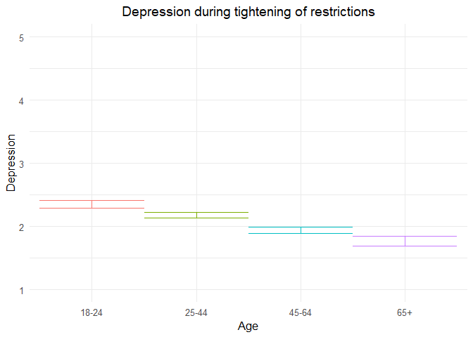
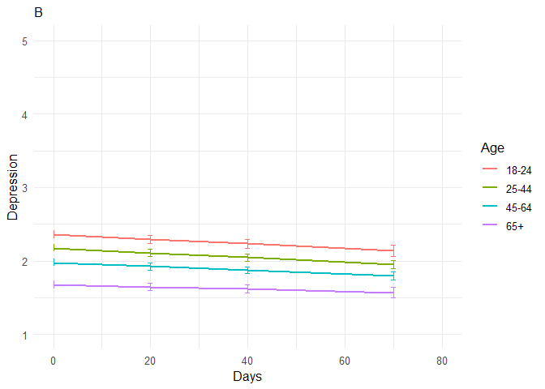
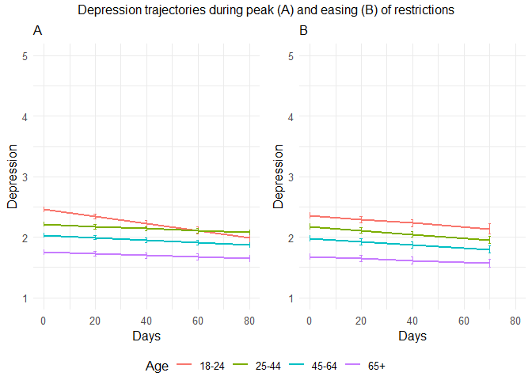

211109 depressed additional analyses
================
Anne Margit
11/05/2021

``` r
load("data_analyse2_p1.Rdata")
load("data_analyse2_p2.Rdata")
load("data_analyse2_p3.Rdata")
```

``` r
options(scipen=999)

library(dplyr)
library(tidyverse)
library(ggpubr)
library(ggplot2)
library(rockchalk)
library(effects)
library(nlme)
library(lattice)
library(broom.mixed)
library(purrr)
library(stargazer)
```

    ## Warning: package 'stargazer' was built under R version 4.0.3

``` r
library(viridis)  
```

    ## Warning: package 'viridis' was built under R version 4.0.3

``` r
data_analyse2_p1$Edu <- as.numeric(data_analyse2_p1$Edu)
```

# Phase 1

*Random: IC for ID and Country + Covariates Gender and Education*

``` r
model_Deprp1 <- lme(fixed = Depr ~ Gender + Edu + Age_new,
                  random = ~1 | Country/ID, 
                  data = data_analyse2_p1, 
                  na.action = na.omit)

summary(model_Deprp1)
```

    Linear mixed-effects model fit by REML
     Data: data_analyse2_p1 
           AIC      BIC    logLik
      11990.79 12047.77 -5986.396
    
    Random effects:
     Formula: ~1 | Country
            (Intercept)
    StdDev:   0.1187565
    
     Formula: ~1 | ID %in% Country
            (Intercept)  Residual
    StdDev:   0.7581329 0.7621639
    
    Fixed effects: Depr ~ Gender + Edu + Age_new 
                     Value  Std.Error   DF   t-value p-value
    (Intercept)  2.4257862 0.09138862 2716 26.543636  0.0000
    Gender1      0.1569809 0.04221050 2716  3.719002  0.0002
    Edu         -0.0380872 0.01523960 2716 -2.499224  0.0125
    Age_new1    -0.1723802 0.05856044 2716 -2.943628  0.0033
    Age_new2    -0.4092851 0.06185603 2716 -6.616738  0.0000
    Age_new3    -0.5849318 0.08731241 2716 -6.699298  0.0000
     Correlation: 
             (Intr) Gendr1 Edu    Ag_nw1 Ag_nw2
    Gender1  -0.342                            
    Edu      -0.677 -0.047                     
    Age_new1 -0.299  0.077 -0.244              
    Age_new2 -0.355  0.128 -0.155  0.711       
    Age_new3 -0.306  0.184 -0.093  0.495  0.492
    
    Standardized Within-Group Residuals:
           Min         Q1        Med         Q3        Max 
    -2.9179781 -0.5435638 -0.1697577  0.5146827  3.6863950 
    
    Number of Observations: 4155
    Number of Groups: 
            Country ID %in% Country 
                 26            2747 

*Plot of predicted values*

``` r
ef_Deprp1 <- effect("Age_new", model_Deprp1)

plot_Deprp1 <- ggplot(as.data.frame(ef_Deprp1), 
  aes(Age_new, fit, color=Age_new)) + geom_line() + 
  geom_errorbar(aes(ymin=fit-se, ymax=fit+se), width=1) + theme_minimal(base_size=12) + 
  labs(title="Depression during tightening of restrictions", y = "Depression") +
  theme(plot.title = element_text(hjust = 0.5)) +
  scale_x_discrete(name ="Age", labels=c("18-24", "25-44", "45-64", "65+")) +
  theme(legend.position = "none") +                 
  scale_color_discrete() + 
  expand_limits(y=c(1, 5))
```

``` r
plot_Deprp1
```

<!-- -->

``` r
intervals(model_Deprp1)
```

    Approximate 95% confidence intervals
    
     Fixed effects:
                      lower        est.       upper
    (Intercept)  2.24658791  2.42578617  2.60498443
    Gender1      0.07421297  0.15698092  0.23974887
    Edu         -0.06796955 -0.03808717 -0.00820479
    Age_new1    -0.28720767 -0.17238015 -0.05755263
    Age_new2    -0.53057478 -0.40928514 -0.28799550
    Age_new3    -0.75613732 -0.58493184 -0.41372636
    attr(,"label")
    [1] "Fixed effects:"
    
     Random Effects:
      Level: Country 
                         lower      est.     upper
    sd((Intercept)) 0.06896982 0.1187565 0.2044822
      Level: ID 
                        lower      est.     upper
    sd((Intercept)) 0.7191515 0.7581329 0.7992272
    
     Within-group standard error:
        lower      est.     upper 
    0.7353448 0.7621639 0.7899613 

``` r
VarCorr(model_Deprp1)
```

``` 
            Variance     StdDev   
Country =   pdLogChol(1)          
(Intercept) 0.0141031    0.1187565
ID =        pdLogChol(1)          
(Intercept) 0.5747654    0.7581329
Residual    0.5808939    0.7621639
```

*Effect sizes*

``` r
ISDs <- data_analyse2_p1 %>% 
  group_by(ID) %>%
  summarize_at(c("Depr"), sd, na.rm=TRUE) %>%
  ungroup()

ISDs_av <- ISDs %>%
  summarize_at(c("Depr"), mean, na.rm=TRUE) %>%
  stack() %>%
  rename(sd=values) 
```

> Effect size = regression coefficient / average ISD of Depression

``` r
coef_Deprp1 = tidy(model_Deprp1, 
               effects = "fixed")

coef_Deprp1 <- coef_Deprp1 %>%
  mutate (e_size = estimate/0.5216742) %>% 
  mutate(across(2:7, round, 2)) 
```

``` r
coef_Deprp1
```

    ## # A tibble: 6 x 7
    ##   term        estimate std.error    df statistic p.value e_size
    ##   <chr>          <dbl>     <dbl> <dbl>     <dbl>   <dbl>  <dbl>
    ## 1 (Intercept)    2.43       0.09  2716     26.5     0      4.65
    ## 2 Gender1        0.16       0.04  2716      3.72    0      0.3 
    ## 3 Edu           -0.04       0.02  2716     -2.5     0.01  -0.07
    ## 4 Age_new1      -0.17       0.06  2716     -2.94    0     -0.33
    ## 5 Age_new2      -0.41       0.06  2716     -6.62    0     -0.78
    ## 6 Age_new3      -0.580      0.09  2716     -6.7     0     -1.12

``` r
coef_Deprp1 <- as.matrix(coef_Deprp1)
```

# Phase 2

*Best model*

> Random intercept for ID and Country, random slope for Country, AR
> correlation structure at Measurement level

``` r
data_analyse2_p2$Edu <- as.numeric(data_analyse2_p2$Edu)
data_analyse2_p2 <- data_analyse2_p2[with(data_analyse2_p2, order(Country, ID, Time)),]
data_analyse2_p2$Time <- as.numeric(data_analyse2_p2$Time)
model_Deprp2 <- lme(fixed = Depr ~ Gender + Edu + DaysMax_p2 + Age_new + DaysMax_p2*Age_new,
                  random = list (Country = ~1, ID = ~DaysMax_p2), 
                  data = data_analyse2_p2, 
                  na.action = na.omit,
                  correlation = corAR1(form = ~ Time | Country/ID))
summary(model_Deprp2)
```

    Linear mixed-effects model fit by REML
     Data: data_analyse2_p2 
          AIC      BIC   logLik
      77280.4 77413.11 -38624.2
    
    Random effects:
     Formula: ~1 | Country
            (Intercept)
    StdDev:   0.1504013
    
     Formula: ~DaysMax_p2 | ID %in% Country
     Structure: General positive-definite, Log-Cholesky parametrization
                StdDev      Corr  
    (Intercept) 0.862838373 (Intr)
    DaysMax_p2  0.008034898 -0.31 
    Residual    0.711605596       
    
    Correlation Structure: ARMA(1,0)
     Formula: ~Time | Country/ID 
     Parameter estimate(s):
         Phi1 
    0.2309566 
    Fixed effects: Depr ~ Gender + Edu + DaysMax_p2 + Age_new + DaysMax_p2 * Age_new 
                             Value  Std.Error    DF   t-value p-value
    (Intercept)          2.5135260 0.05629836 20356  44.64652  0.0000
    Gender1              0.1598253 0.02188493  9176   7.30299  0.0000
    Edu                 -0.0366286 0.00715898  9176  -5.11646  0.0000
    DaysMax_p2          -0.0057452 0.00109382 20356  -5.25241  0.0000
    Age_new1            -0.2462958 0.04296879  9176  -5.73197  0.0000
    Age_new2            -0.4199086 0.04390978  9176  -9.56299  0.0000
    Age_new3            -0.7036982 0.05316481  9176 -13.23617  0.0000
    DaysMax_p2:Age_new1  0.0040966 0.00121161 20356   3.38116  0.0007
    DaysMax_p2:Age_new2  0.0036579 0.00122614 20356   2.98327  0.0029
    DaysMax_p2:Age_new3  0.0044380 0.00139840 20356   3.17362  0.0015
     Correlation: 
                        (Intr) Gendr1 Edu    DysM_2 Ag_nw1 Ag_nw2 Ag_nw3 DM_2:A_1
    Gender1             -0.293                                                   
    Edu                 -0.470 -0.031                                            
    DaysMax_p2          -0.371  0.001 -0.022                                     
    Age_new1            -0.443  0.046 -0.210  0.527                              
    Age_new2            -0.483  0.078 -0.128  0.517  0.744                       
    Age_new3            -0.435  0.144 -0.087  0.426  0.616  0.618                
    DaysMax_p2:Age_new1  0.337 -0.002  0.022 -0.896 -0.597 -0.458 -0.378         
    DaysMax_p2:Age_new2  0.331 -0.002  0.026 -0.887 -0.465 -0.613 -0.378  0.799  
    DaysMax_p2:Age_new3  0.296 -0.013  0.017 -0.778 -0.407 -0.402 -0.631  0.701  
                        DM_2:A_2
    Gender1                     
    Edu                         
    DaysMax_p2                  
    Age_new1                    
    Age_new2                    
    Age_new3                    
    DaysMax_p2:Age_new1         
    DaysMax_p2:Age_new2         
    DaysMax_p2:Age_new3  0.694  
    
    Standardized Within-Group Residuals:
           Min         Q1        Med         Q3        Max 
    -3.6005436 -0.4950746 -0.1744072  0.5050245  4.3602500 
    
    Number of Observations: 29574
    Number of Groups: 
            Country ID %in% Country 
                 33            9214 

``` r
VarCorr(model_Deprp2)
```

``` 
            Variance              StdDev      Corr  
Country =   pdLogChol(1)                            
(Intercept) 0.02262054232         0.150401271       
ID =        pdLogChol(DaysMax_p2)                   
(Intercept) 0.74449005788         0.862838373 (Intr)
DaysMax_p2  0.00006455959         0.008034898 -0.31 
Residual    0.50638252419         0.711605596       
```

*Plot of predicted values*

``` r
ef_Deprp2 <- effect("DaysMax_p2:Age_new", model_Deprp2)
plot_Deprp2 <- ggplot(as.data.frame(ef_Deprp2), aes(DaysMax_p2, fit, color=Age_new)) + 
  geom_line(size=1) + 
  geom_errorbar(aes(ymin=fit-se, ymax=fit+se), width=1) + 
  theme_minimal(base_size=12) + 
  labs(title="A",
       x="Days", y = "Depression") +
  xlim(0,80)+
  theme(plot.title = element_text(size=12)) +
  scale_color_discrete(name="Age", labels = c("18-24", "25-44", "45-64", "65+")) + 
  expand_limits(y=c(1, 5))
```

``` r
plot_Deprp2
```

<!-- -->

``` r
VarCorr(model_Deprp2)
```

``` 
            Variance              StdDev      Corr  
Country =   pdLogChol(1)                            
(Intercept) 0.02262054232         0.150401271       
ID =        pdLogChol(DaysMax_p2)                   
(Intercept) 0.74449005788         0.862838373 (Intr)
DaysMax_p2  0.00006455959         0.008034898 -0.31 
Residual    0.50638252419         0.711605596       
```

``` r
intervals(model_Deprp2, which = 'fixed')
```

    Approximate 95% confidence intervals
    
     Fixed effects:
                               lower         est.        upper
    (Intercept)          2.403176671  2.513525992  2.623875314
    Gender1              0.116925985  0.159825310  0.202724635
    Edu                 -0.050661810 -0.036628618 -0.022595426
    DaysMax_p2          -0.007889167 -0.005745193 -0.003601218
    Age_new1            -0.330524194 -0.246295806 -0.162067418
    Age_new2            -0.505981576 -0.419908634 -0.333835691
    Age_new3            -0.807913099 -0.703698240 -0.599483381
    DaysMax_p2:Age_new1  0.001721791  0.004096637  0.006471484
    DaysMax_p2:Age_new2  0.001254574  0.003657917  0.006061259
    DaysMax_p2:Age_new3  0.001697015  0.004437983  0.007178952
    attr(,"label")
    [1] "Fixed effects:"

*Effect sizes*

**Within person SD and average within person SD**

``` r
ISDs <- data_analyse2_p2 %>% 
  group_by(ID) %>%
  summarize_at(c("DaysMax_p2", "Depr"), sd, na.rm=TRUE) %>%
  ungroup()

ISDs_av <- ISDs %>%
  summarize_at(c("DaysMax_p2", "Depr"), mean, na.rm=TRUE) %>%
  stack() %>%
  rename(sd=values) 
```

> Effect sizes for intercept and main effect of age and covariates =
> regression coefficient / average ISD of Depression Effect size for
> main effect of DaysMax = (regression coefficient \* 28)/ average ISD
> of Depression Effect sizes for interaction effects = (regression
> coefficient \* 28)/ average ISD of Depression The effect sizes for
> main effect of DaysMax and the interaction effects reflect the
> increase in SD of Depression over 4 weeks (28 days)

``` r
coef_Deprp2 = tidy(model_Deprp2, 
               effects = "fixed")
coef_Deprp2 <- coef_Deprp2 %>%
  mutate(e_size = ifelse(row_number()== 1 | row_number()== 2 |  row_number()== 3 |  row_number()== 5 |  row_number()== 6 |  row_number()== 7, estimate/0.5308632, (estimate*28)/0.5308632)) %>%
  mutate(across(2:7, round, 2)) 
```

``` r
coef_Deprp2 <- as.matrix(coef_Deprp2)
coef_Deprp2
```

    ##       term                  estimate std.error df      statistic p.value
    ##  [1,] "(Intercept)"         " 2.51"  "0.06"    "20356" " 44.65"  "0"    
    ##  [2,] "Gender1"             " 0.16"  "0.02"    " 9176" "  7.30"  "0"    
    ##  [3,] "Edu"                 "-0.04"  "0.01"    " 9176" " -5.12"  "0"    
    ##  [4,] "DaysMax_p2"          "-0.01"  "0.00"    "20356" " -5.25"  "0"    
    ##  [5,] "Age_new1"            "-0.25"  "0.04"    " 9176" " -5.73"  "0"    
    ##  [6,] "Age_new2"            "-0.42"  "0.04"    " 9176" " -9.56"  "0"    
    ##  [7,] "Age_new3"            "-0.70"  "0.05"    " 9176" "-13.24"  "0"    
    ##  [8,] "DaysMax_p2:Age_new1" " 0.00"  "0.00"    "20356" "  3.38"  "0"    
    ##  [9,] "DaysMax_p2:Age_new2" " 0.00"  "0.00"    "20356" "  2.98"  "0"    
    ## [10,] "DaysMax_p2:Age_new3" " 0.00"  "0.00"    "20356" "  3.17"  "0"    
    ##       e_size 
    ##  [1,] " 4.73"
    ##  [2,] " 0.30"
    ##  [3,] "-0.07"
    ##  [4,] "-0.30"
    ##  [5,] "-0.46"
    ##  [6,] "-0.79"
    ##  [7,] "-1.33"
    ##  [8,] " 0.22"
    ##  [9,] " 0.19"
    ## [10,] " 0.23"

# Phase 3

> Random IC for Country and ID, random S for ID, AR structure

``` r
data_analyse2_p3$Edu <- as.numeric(data_analyse2_p3$Edu)
data_analyse2_p3 <- data_analyse2_p3[with(data_analyse2_p3, order(Country, ID, Time)),]
data_analyse2_p3$Time <- as.numeric(data_analyse2_p3$Time)
model_Deprp3 <- lme(fixed = Depr ~ Gender + Edu + DaysPhase3 + Age_new + DaysPhase3*Age_new,
                  random = list (Country = ~1, ID = ~DaysPhase3), 
                  data = data_analyse2_p3, 
                  na.action = na.omit,
                  correlation = corAR1(form = ~ Time | Country/ID))
summary(model_Deprp3)
```

    Linear mixed-effects model fit by REML
     Data: data_analyse2_p3 
           AIC      BIC    logLik
      62751.73 62881.74 -31359.87
    
    Random effects:
     Formula: ~1 | Country
            (Intercept)
    StdDev:   0.2318287
    
     Formula: ~DaysPhase3 | ID %in% Country
     Structure: General positive-definite, Log-Cholesky parametrization
                StdDev      Corr  
    (Intercept) 0.852212553 (Intr)
    DaysPhase3  0.009350794 -0.305
    Residual    0.674855160       
    
    Correlation Structure: ARMA(1,0)
     Formula: ~Time | Country/ID 
     Parameter estimate(s):
         Phi1 
    0.1753892 
    Fixed effects: Depr ~ Gender + Edu + DaysPhase3 + Age_new + DaysPhase3 * Age_new 
                             Value  Std.Error    DF   t-value p-value
    (Intercept)          2.3965808 0.06768749 17940  35.40655  0.0000
    Gender1              0.1429643 0.02432731  7009   5.87670  0.0000
    Edu                 -0.0300957 0.00809376  7009  -3.71838  0.0002
    DaysPhase3          -0.0031007 0.00117993 17940  -2.62786  0.0086
    Age_new1            -0.1817391 0.04697032  7009  -3.86923  0.0001
    Age_new2            -0.3812326 0.04619409  7009  -8.25284  0.0000
    Age_new3            -0.6795685 0.05291862  7009 -12.84177  0.0000
    DaysPhase3:Age_new1 -0.0001000 0.00136416 17940  -0.07331  0.9416
    DaysPhase3:Age_new2  0.0005460 0.00132058 17940   0.41349  0.6793
    DaysPhase3:Age_new3  0.0015697 0.00146007 17940   1.07510  0.2823
     Correlation: 
                        (Intr) Gendr1 Edu    DysPh3 Ag_nw1 Ag_nw2 Ag_nw3 DP3:A_1
    Gender1             -0.280                                                  
    Edu                 -0.450 -0.027                                           
    DaysPhase3          -0.314 -0.003 -0.007                                    
    Age_new1            -0.388  0.049 -0.214  0.458                             
    Age_new2            -0.459  0.103 -0.112  0.466  0.751                      
    Age_new3            -0.443  0.179 -0.073  0.406  0.659  0.699               
    DaysPhase3:Age_new1  0.275 -0.001  0.004 -0.862 -0.536 -0.404 -0.353        
    DaysPhase3:Age_new2  0.282  0.002  0.006 -0.892 -0.411 -0.533 -0.366  0.771 
    DaysPhase3:Age_new3  0.257 -0.002  0.002 -0.806 -0.370 -0.378 -0.524  0.697 
                        DP3:A_2
    Gender1                    
    Edu                        
    DaysPhase3                 
    Age_new1                   
    Age_new2                   
    Age_new3                   
    DaysPhase3:Age_new1        
    DaysPhase3:Age_new2        
    DaysPhase3:Age_new3  0.721 
    
    Standardized Within-Group Residuals:
           Min         Q1        Med         Q3        Max 
    -4.1575037 -0.4538426 -0.1584162  0.4400196  4.6784133 
    
    Number of Observations: 24990
    Number of Groups: 
            Country ID %in% Country 
                 32            7046 

``` r
VarCorr(model_Deprp3)
```

``` 
            Variance              StdDev      Corr  
Country =   pdLogChol(1)                            
(Intercept) 0.05374456496         0.231828741       
ID =        pdLogChol(DaysPhase3)                   
(Intercept) 0.72626623564         0.852212553 (Intr)
DaysPhase3  0.00008743735         0.009350794 -0.305
Residual    0.45542948634         0.674855160       
```

*Confidence intervals*

``` r
intervals(model_Deprp3, which = 'fixed')
```

    Approximate 95% confidence intervals
    
     Fixed effects:
                               lower          est.         upper
    (Intercept)          2.263906842  2.3965808441  2.5292548460
    Gender1              0.095275411  0.1429642894  0.1906531675
    Edu                 -0.045961937 -0.0300957133 -0.0142294897
    DaysPhase3          -0.005413446 -0.0031006780 -0.0007879097
    Age_new1            -0.273815173 -0.1817391323 -0.0896630916
    Age_new2            -0.471787009 -0.3812326194 -0.2906782296
    Age_new3            -0.783304977 -0.6795684827 -0.5758319888
    DaysPhase3:Age_new1 -0.002773907 -0.0001000132  0.0025738807
    DaysPhase3:Age_new2 -0.002042419  0.0005460404  0.0031345002
    DaysPhase3:Age_new3 -0.001292159  0.0015697212  0.0044316010
    attr(,"label")
    [1] "Fixed effects:"

*Plot of predicted values*

``` r
ef_Deprp3 <- effect("DaysPhase3:Age_new", model_Deprp3)
plot_Deprp3 <- ggplot(as.data.frame(ef_Deprp3), aes(DaysPhase3, fit, color=Age_new)) + 
  geom_line(size=1) + 
  geom_errorbar(aes(ymin=fit-se, ymax=fit+se), width=1) + 
  theme_minimal(base_size=12) + 
  xlim(0,80)+
  labs(title="B",
       x="Days", y = "Depression") +
  theme(plot.title = element_text(size = 12)) +
  scale_color_discrete(name="Age", labels = c("18-24", "25-44", "45-64", "65+")) + 
  expand_limits(y=c(1, 5))
```

``` r
plot_Deprp3
```

    ## Warning: Removed 4 row(s) containing missing values (geom_path).

<!-- -->

``` r
plot_Deprp2and3 <- ggarrange(plot_Deprp2, plot_Deprp3 , 
          ncol = 2, nrow = 1, common.legend=TRUE, legend= "bottom")
```

    ## Warning: Removed 4 row(s) containing missing values (geom_path).

``` r
plot_Deprp2and3 <- annotate_figure(plot_Deprp2and3,top = text_grob("Depression trajectories during peak (A) and easing (B) of restrictions", size = 12))
```

``` r
plot_Deprp2and3
```

<!-- -->

*Effect sizes* **Within person SD and average within person SD for
Depression**

``` r
ISDs <- data_analyse2_p3 %>% 
  group_by(ID) %>%
  summarize_at(c("Depr"), sd, na.rm=TRUE) %>%
  ungroup()
ISDs_av <- ISDs %>%
  summarize_at(c("Depr"), mean, na.rm=TRUE) %>%
  stack() %>%
  rename(sd=values) 
```

> Effect sizes for intercept and main effect of age = regression
> coefficient / average ISD of Depression Effect size for main effect of
> DaysMax = (regression coefficient \* 28)/ average ISD of Depression
> Effect sizes for interaction effects = (regression coefficient \* 28)/
> average ISD of Depression The effect sizes for main effect of DaysMax
> and the interaction effects reflect the increase in SD of Depression
> over 4 weeks (28 days)

``` r
coef_Deprp3 = tidy(model_Deprp3, 
               effects = "fixed")
coef_Deprp3 <- coef_Deprp3 %>%
 mutate(e_size = ifelse(row_number()== 1 | row_number()== 2 |  row_number()== 3 |  row_number()== 5 |  row_number()== 6 |  row_number()== 7, estimate/0.4899227, (estimate*28)/0.4899227)) %>%
  mutate(across(2:7, round, 2)) 
```

``` r
coef_Deprp3 <- as.matrix(coef_Deprp3)
coef_Deprp3
```

    ##       term                  estimate std.error df      statistic p.value
    ##  [1,] "(Intercept)"         " 2.40"  "0.07"    "17940" " 35.41"  "0.00" 
    ##  [2,] "Gender1"             " 0.14"  "0.02"    " 7009" "  5.88"  "0.00" 
    ##  [3,] "Edu"                 "-0.03"  "0.01"    " 7009" " -3.72"  "0.00" 
    ##  [4,] "DaysPhase3"          " 0.00"  "0.00"    "17940" " -2.63"  "0.01" 
    ##  [5,] "Age_new1"            "-0.18"  "0.05"    " 7009" " -3.87"  "0.00" 
    ##  [6,] "Age_new2"            "-0.38"  "0.05"    " 7009" " -8.25"  "0.00" 
    ##  [7,] "Age_new3"            "-0.68"  "0.05"    " 7009" "-12.84"  "0.00" 
    ##  [8,] "DaysPhase3:Age_new1" " 0.00"  "0.00"    "17940" " -0.07"  "0.94" 
    ##  [9,] "DaysPhase3:Age_new2" " 0.00"  "0.00"    "17940" "  0.41"  "0.68" 
    ## [10,] "DaysPhase3:Age_new3" " 0.00"  "0.00"    "17940" "  1.08"  "0.28" 
    ##       e_size 
    ##  [1,] " 4.89"
    ##  [2,] " 0.29"
    ##  [3,] "-0.06"
    ##  [4,] "-0.18"
    ##  [5,] "-0.37"
    ##  [6,] "-0.78"
    ##  [7,] "-1.39"
    ##  [8,] "-0.01"
    ##  [9,] " 0.03"
    ## [10,] " 0.09"

``` r
stargazer(coef_Deprp1, coef_Deprp2, coef_Deprp3,
type="html", df = TRUE, out="star_coefDeprp123.doc",  single.row=TRUE, digits = 2, align = TRUE)
```

    ## 
    ## <table style="text-align:center"><tr><td colspan="7" style="border-bottom: 1px solid black"></td></tr><tr><td>term</td><td>estimate</td><td>std.error</td><td>df</td><td>statistic</td><td>p.value</td><td>e_size</td></tr>
    ## <tr><td colspan="7" style="border-bottom: 1px solid black"></td></tr><tr><td>(Intercept)</td><td>2.43</td><td>0.09</td><td>2716</td><td>26.54</td><td>0.00</td><td>4.65</td></tr>
    ## <tr><td>Gender1</td><td>0.16</td><td>0.04</td><td>2716</td><td>3.72</td><td>0.00</td><td>0.30</td></tr>
    ## <tr><td>Edu</td><td>-0.04</td><td>0.02</td><td>2716</td><td>-2.50</td><td>0.01</td><td>-0.07</td></tr>
    ## <tr><td>Age_new1</td><td>-0.17</td><td>0.06</td><td>2716</td><td>-2.94</td><td>0.00</td><td>-0.33</td></tr>
    ## <tr><td>Age_new2</td><td>-0.41</td><td>0.06</td><td>2716</td><td>-6.62</td><td>0.00</td><td>-0.78</td></tr>
    ## <tr><td>Age_new3</td><td>-0.58</td><td>0.09</td><td>2716</td><td>-6.70</td><td>0.00</td><td>-1.12</td></tr>
    ## <tr><td colspan="7" style="border-bottom: 1px solid black"></td></tr></table>
    ## 
    ## <table style="text-align:center"><tr><td colspan="7" style="border-bottom: 1px solid black"></td></tr><tr><td>term</td><td>estimate</td><td>std.error</td><td>df</td><td>statistic</td><td>p.value</td><td>e_size</td></tr>
    ## <tr><td colspan="7" style="border-bottom: 1px solid black"></td></tr><tr><td>(Intercept)</td><td>2.51</td><td>0.06</td><td>20356</td><td>44.65</td><td>0</td><td>4.73</td></tr>
    ## <tr><td>Gender1</td><td>0.16</td><td>0.02</td><td>9176</td><td>7.30</td><td>0</td><td>0.30</td></tr>
    ## <tr><td>Edu</td><td>-0.04</td><td>0.01</td><td>9176</td><td>-5.12</td><td>0</td><td>-0.07</td></tr>
    ## <tr><td>DaysMax_p2</td><td>-0.01</td><td>0.00</td><td>20356</td><td>-5.25</td><td>0</td><td>-0.30</td></tr>
    ## <tr><td>Age_new1</td><td>-0.25</td><td>0.04</td><td>9176</td><td>-5.73</td><td>0</td><td>-0.46</td></tr>
    ## <tr><td>Age_new2</td><td>-0.42</td><td>0.04</td><td>9176</td><td>-9.56</td><td>0</td><td>-0.79</td></tr>
    ## <tr><td>Age_new3</td><td>-0.70</td><td>0.05</td><td>9176</td><td>-13.24</td><td>0</td><td>-1.33</td></tr>
    ## <tr><td>DaysMax_p2:Age_new1</td><td>0.00</td><td>0.00</td><td>20356</td><td>3.38</td><td>0</td><td>0.22</td></tr>
    ## <tr><td>DaysMax_p2:Age_new2</td><td>0.00</td><td>0.00</td><td>20356</td><td>2.98</td><td>0</td><td>0.19</td></tr>
    ## <tr><td>DaysMax_p2:Age_new3</td><td>0.00</td><td>0.00</td><td>20356</td><td>3.17</td><td>0</td><td>0.23</td></tr>
    ## <tr><td colspan="7" style="border-bottom: 1px solid black"></td></tr></table>
    ## 
    ## <table style="text-align:center"><tr><td colspan="7" style="border-bottom: 1px solid black"></td></tr><tr><td>term</td><td>estimate</td><td>std.error</td><td>df</td><td>statistic</td><td>p.value</td><td>e_size</td></tr>
    ## <tr><td colspan="7" style="border-bottom: 1px solid black"></td></tr><tr><td>(Intercept)</td><td>2.40</td><td>0.07</td><td>17940</td><td>35.41</td><td>0.00</td><td>4.89</td></tr>
    ## <tr><td>Gender1</td><td>0.14</td><td>0.02</td><td>7009</td><td>5.88</td><td>0.00</td><td>0.29</td></tr>
    ## <tr><td>Edu</td><td>-0.03</td><td>0.01</td><td>7009</td><td>-3.72</td><td>0.00</td><td>-0.06</td></tr>
    ## <tr><td>DaysPhase3</td><td>0.00</td><td>0.00</td><td>17940</td><td>-2.63</td><td>0.01</td><td>-0.18</td></tr>
    ## <tr><td>Age_new1</td><td>-0.18</td><td>0.05</td><td>7009</td><td>-3.87</td><td>0.00</td><td>-0.37</td></tr>
    ## <tr><td>Age_new2</td><td>-0.38</td><td>0.05</td><td>7009</td><td>-8.25</td><td>0.00</td><td>-0.78</td></tr>
    ## <tr><td>Age_new3</td><td>-0.68</td><td>0.05</td><td>7009</td><td>-12.84</td><td>0.00</td><td>-1.39</td></tr>
    ## <tr><td>DaysPhase3:Age_new1</td><td>0.00</td><td>0.00</td><td>17940</td><td>-0.07</td><td>0.94</td><td>-0.01</td></tr>
    ## <tr><td>DaysPhase3:Age_new2</td><td>0.00</td><td>0.00</td><td>17940</td><td>0.41</td><td>0.68</td><td>0.03</td></tr>
    ## <tr><td>DaysPhase3:Age_new3</td><td>0.00</td><td>0.00</td><td>17940</td><td>1.08</td><td>0.28</td><td>0.09</td></tr>
    ## <tr><td colspan="7" style="border-bottom: 1px solid black"></td></tr></table>

``` r
stargazer(model_Deprp1, model_Deprp2, model_Deprp3,
type="html", df = TRUE, out="star_modelDeprp123.doc",  single.row=TRUE, digits = 2, align = TRUE,
intercept.top = TRUE, intercept.bottom = FALSE)
```

    ## 
    ## <table style="text-align:center"><tr><td colspan="4" style="border-bottom: 1px solid black"></td></tr><tr><td style="text-align:left"></td><td colspan="3"><em>Dependent variable:</em></td></tr>
    ## <tr><td></td><td colspan="3" style="border-bottom: 1px solid black"></td></tr>
    ## <tr><td style="text-align:left"></td><td colspan="3">Depr</td></tr>
    ## <tr><td style="text-align:left"></td><td>(1)</td><td>(2)</td><td>(3)</td></tr>
    ## <tr><td colspan="4" style="border-bottom: 1px solid black"></td></tr><tr><td style="text-align:left">Constant</td><td>2.43<sup>***</sup> (0.09)</td><td>2.51<sup>***</sup> (0.06)</td><td>2.40<sup>***</sup> (0.07)</td></tr>
    ## <tr><td style="text-align:left">Gender1</td><td>0.16<sup>***</sup> (0.04)</td><td>0.16<sup>***</sup> (0.02)</td><td>0.14<sup>***</sup> (0.02)</td></tr>
    ## <tr><td style="text-align:left">Edu</td><td>-0.04<sup>**</sup> (0.02)</td><td>-0.04<sup>***</sup> (0.01)</td><td>-0.03<sup>***</sup> (0.01)</td></tr>
    ## <tr><td style="text-align:left">DaysMax_p2</td><td></td><td>-0.01<sup>***</sup> (0.001)</td><td></td></tr>
    ## <tr><td style="text-align:left">DaysPhase3</td><td></td><td></td><td>-0.003<sup>***</sup> (0.001)</td></tr>
    ## <tr><td style="text-align:left">Age_new1</td><td>-0.17<sup>***</sup> (0.06)</td><td>-0.25<sup>***</sup> (0.04)</td><td>-0.18<sup>***</sup> (0.05)</td></tr>
    ## <tr><td style="text-align:left">Age_new2</td><td>-0.41<sup>***</sup> (0.06)</td><td>-0.42<sup>***</sup> (0.04)</td><td>-0.38<sup>***</sup> (0.05)</td></tr>
    ## <tr><td style="text-align:left">Age_new3</td><td>-0.58<sup>***</sup> (0.09)</td><td>-0.70<sup>***</sup> (0.05)</td><td>-0.68<sup>***</sup> (0.05)</td></tr>
    ## <tr><td style="text-align:left">DaysMax_p2:Age_new1</td><td></td><td>0.004<sup>***</sup> (0.001)</td><td></td></tr>
    ## <tr><td style="text-align:left">DaysMax_p2:Age_new2</td><td></td><td>0.004<sup>***</sup> (0.001)</td><td></td></tr>
    ## <tr><td style="text-align:left">DaysMax_p2:Age_new3</td><td></td><td>0.004<sup>***</sup> (0.001)</td><td></td></tr>
    ## <tr><td style="text-align:left">DaysPhase3:Age_new1</td><td></td><td></td><td>-0.0001 (0.001)</td></tr>
    ## <tr><td style="text-align:left">DaysPhase3:Age_new2</td><td></td><td></td><td>0.001 (0.001)</td></tr>
    ## <tr><td style="text-align:left">DaysPhase3:Age_new3</td><td></td><td></td><td>0.002 (0.001)</td></tr>
    ## <tr><td colspan="4" style="border-bottom: 1px solid black"></td></tr><tr><td style="text-align:left">Observations</td><td>4,155</td><td>29,574</td><td>24,990</td></tr>
    ## <tr><td style="text-align:left">Log Likelihood</td><td>-5,986.40</td><td>-38,624.20</td><td>-31,359.87</td></tr>
    ## <tr><td style="text-align:left">Akaike Inf. Crit.</td><td>11,990.79</td><td>77,280.40</td><td>62,751.73</td></tr>
    ## <tr><td style="text-align:left">Bayesian Inf. Crit.</td><td>12,047.77</td><td>77,413.11</td><td>62,881.74</td></tr>
    ## <tr><td colspan="4" style="border-bottom: 1px solid black"></td></tr><tr><td style="text-align:left"><em>Note:</em></td><td colspan="3" style="text-align:right"><sup>*</sup>p<0.1; <sup>**</sup>p<0.05; <sup>***</sup>p<0.01</td></tr>
    ## </table>
