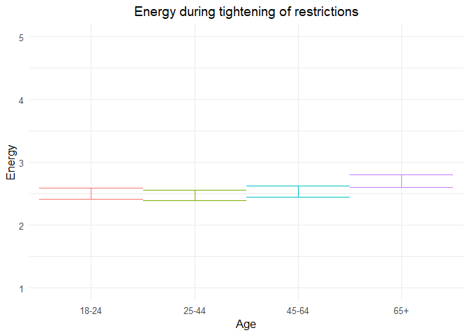
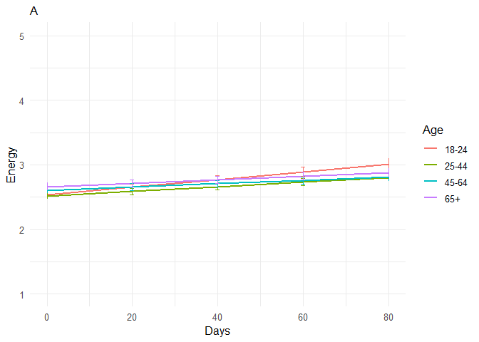
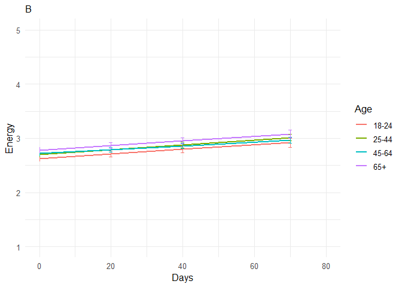
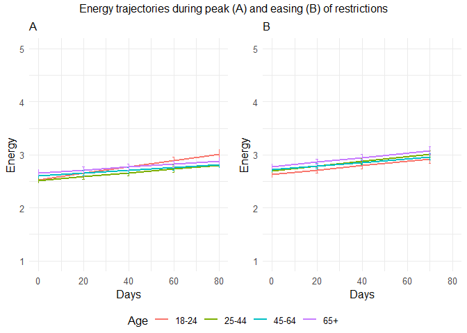

211109 energetic additional analyses
================
Anne Margit
11/05/2021

``` r
load("data_analyse2_p1.Rdata")
load("data_analyse2_p2.Rdata")
load("data_analyse2_p3.Rdata")
```

``` r
options(scipen=999)

library(dplyr)
library(tidyverse)
library(ggpubr)
library(ggplot2)
library(rockchalk)
library(effects)
library(nlme)
library(lattice)
library(broom.mixed)
library(purrr)
library(stargazer)
```

    ## Warning: package 'stargazer' was built under R version 4.0.3

``` r
library(viridis)  
```

    ## Warning: package 'viridis' was built under R version 4.0.3

``` r
data_analyse2_p1$Edu <- as.numeric(data_analyse2_p1$Edu)
```

# Phase 1

*Random: IC for ID and Country + Covariates Gender and Education*

``` r
model_Energp1 <- lme(fixed = Energ ~ Gender + Edu + Age_new,
                  random = ~1 | Country/ID, 
                  data = data_analyse2_p1, 
                  na.action = na.omit)

summary(model_Energp1)
```

    Linear mixed-effects model fit by REML
     Data: data_analyse2_p1 
        AIC      BIC    logLik
      11498 11554.97 -5739.998
    
    Random effects:
     Formula: ~1 | Country
            (Intercept)
    StdDev:   0.3283937
    
     Formula: ~1 | ID %in% Country
            (Intercept)  Residual
    StdDev:   0.6971015 0.7247549
    
    Fixed effects: Energ ~ Gender + Edu + Age_new 
                     Value  Std.Error   DF   t-value p-value
    (Intercept)  2.3806436 0.11243817 2716 21.172912  0.0000
    Gender1     -0.1442251 0.03948871 2716 -3.652312  0.0003
    Edu          0.0468506 0.01436711 2716  3.260963  0.0011
    Age_new1    -0.0275301 0.05499456 2716 -0.500596  0.6167
    Age_new2     0.0372594 0.05839030 2716  0.638110  0.5235
    Age_new3     0.2030552 0.08296051 2716  2.447612  0.0144
     Correlation: 
             (Intr) Gendr1 Edu    Ag_nw1 Ag_nw2
    Gender1  -0.265                            
    Edu      -0.527 -0.045                     
    Age_new1 -0.228  0.079 -0.248              
    Age_new2 -0.269  0.130 -0.164  0.714       
    Age_new3 -0.228  0.185 -0.100  0.493  0.498
    
    Standardized Within-Group Residuals:
            Min          Q1         Med          Q3         Max 
    -2.80031227 -0.57855599 -0.05394512  0.54102097  3.22725052 
    
    Number of Observations: 4155
    Number of Groups: 
            Country ID %in% Country 
                 26            2747 

*Plot of predicted values*

``` r
ef_Energp1 <- effect("Age_new", model_Energp1)

plot_Energp1 <- ggplot(as.data.frame(ef_Energp1), 
  aes(Age_new, fit, color=Age_new)) + geom_line() + 
  geom_errorbar(aes(ymin=fit-se, ymax=fit+se), width=1) + theme_minimal(base_size=12) + 
  labs(title="Energy during tightening of restrictions", y = "Energy") +
  theme(plot.title = element_text(hjust = 0.5)) +
  scale_x_discrete(name ="Age", labels=c("18-24", "25-44", "45-64", "65+")) +
  theme(legend.position = "none") +                 
  scale_color_discrete() + 
  expand_limits(y=c(1, 5))
```

``` r
plot_Energp1
```

<!-- -->

``` r
intervals(model_Energp1)
```

    Approximate 95% confidence intervals
    
     Fixed effects:
                      lower        est.       upper
    (Intercept)  2.16017056  2.38064358  2.60111661
    Gender1     -0.22165604 -0.14422508 -0.06679413
    Edu          0.01867904  0.04685062  0.07502219
    Age_new1    -0.13536549 -0.02753008  0.08030533
    Age_new2    -0.07723446  0.03725944  0.15175334
    Age_new3     0.04038306  0.20305517  0.36572729
    attr(,"label")
    [1] "Fixed effects:"
    
     Random Effects:
      Level: Country 
                        lower      est.     upper
    sd((Intercept)) 0.2239158 0.3283937 0.4816203
      Level: ID 
                      lower      est.     upper
    sd((Intercept)) 0.66039 0.6971015 0.7358539
    
     Within-group standard error:
        lower      est.     upper 
    0.6992701 0.7247549 0.7511685 

``` r
VarCorr(model_Energp1)
```

``` 
            Variance     StdDev   
Country =   pdLogChol(1)          
(Intercept) 0.1078424    0.3283937
ID =        pdLogChol(1)          
(Intercept) 0.4859506    0.6971015
Residual    0.5252697    0.7247549
```

*Effect sizes*

``` r
ISDs <- data_analyse2_p1 %>% 
  group_by(ID) %>%
  summarize_at(c("Energ"), sd, na.rm=TRUE) %>%
  ungroup()

ISDs_av <- ISDs %>%
  summarize_at(c("Energ"), mean, na.rm=TRUE) %>%
  stack() %>%
  rename(sd=values) 
```

> Effect size = regression coefficient / average ISD of Energetic

``` r
coef_Energp1 = tidy(model_Energp1, 
               effects = "fixed")

coef_Energp1 <- coef_Energp1 %>%
  mutate (e_size = estimate/0.5177984) %>% 
  mutate(across(2:7, round, 2)) 
```

``` r
coef_Energp1
```

    ## # A tibble: 6 x 7
    ##   term        estimate std.error    df statistic p.value e_size
    ##   <chr>          <dbl>     <dbl> <dbl>     <dbl>   <dbl>  <dbl>
    ## 1 (Intercept)     2.38      0.11  2716     21.2     0      4.6 
    ## 2 Gender1        -0.14      0.04  2716     -3.65    0     -0.28
    ## 3 Edu             0.05      0.01  2716      3.26    0      0.09
    ## 4 Age_new1       -0.03      0.05  2716     -0.5     0.62  -0.05
    ## 5 Age_new2        0.04      0.06  2716      0.64    0.52   0.07
    ## 6 Age_new3        0.2       0.08  2716      2.45    0.01   0.39

``` r
coef_Energp1 <- as.matrix(coef_Energp1)
```

# Phase 2

*Best model*

> Random intercept for ID and Country, random slope for ID, no
> correlation between IC and S for ID + AR correlation structure at
> Measurement level

``` r
data_analyse2_p2$Edu <- as.numeric(data_analyse2_p2$Edu)
data_analyse2_p2 <- data_analyse2_p2[with(data_analyse2_p2, order(Country, ID, Time)),]
data_analyse2_p2$Time <- as.numeric(data_analyse2_p2$Time)
model_Energp2 <- lme(fixed = Energ ~ Gender + Edu + DaysMax_p2 + Age_new + DaysMax_p2*Age_new,
                  random = list(Country = ~1, ID = pdDiag(~DaysMax_p2)),
                  data = data_analyse2_p2, 
                  na.action = na.omit,
                  correlation = corAR1(form = ~Time | Country/ID))
summary(model_Energp2)
```

    Linear mixed-effects model fit by REML
     Data: data_analyse2_p2 
           AIC      BIC    logLik
      75285.14 75409.55 -37627.57
    
    Random effects:
     Formula: ~1 | Country
            (Intercept)
    StdDev:   0.2537355
    
     Formula: ~DaysMax_p2 | ID %in% Country
     Structure: Diagonal
            (Intercept)  DaysMax_p2  Residual
    StdDev:    0.704748 0.005704374 0.7027223
    
    Correlation Structure: ARMA(1,0)
     Formula: ~Time | Country/ID 
     Parameter estimate(s):
         Phi1 
    0.1633033 
    Fixed effects: Energ ~ Gender + Edu + DaysMax_p2 + Age_new + DaysMax_p2 * Age_new 
                             Value  Std.Error    DF  t-value p-value
    (Intercept)          2.4034515 0.06423207 20356 37.41825  0.0000
    Gender1             -0.1589114 0.01964721  9176 -8.08824  0.0000
    Edu                  0.0512901 0.00643592  9176  7.96934  0.0000
    DaysMax_p2           0.0060308 0.00103754 20356  5.81262  0.0000
    Age_new1            -0.0136746 0.03851585  9176 -0.35504  0.7226
    Age_new2             0.0755541 0.03950802  9176  1.91237  0.0559
    Age_new3             0.1279671 0.04792528  9176  2.67014  0.0076
    DaysMax_p2:Age_new1 -0.0024713 0.00114608 20356 -2.15629  0.0311
    DaysMax_p2:Age_new2 -0.0035060 0.00115907 20356 -3.02481  0.0025
    DaysMax_p2:Age_new3 -0.0032889 0.00131805 20356 -2.49530  0.0126
     Correlation: 
                        (Intr) Gendr1 Edu    DysM_2 Ag_nw1 Ag_nw2 Ag_nw3 DM_2:A_1
    Gender1             -0.229                                                   
    Edu                 -0.373 -0.031                                            
    DaysMax_p2          -0.288  0.001 -0.023                                     
    Age_new1            -0.342  0.044 -0.213  0.530                              
    Age_new2            -0.371  0.075 -0.133  0.520  0.747                       
    Age_new3            -0.332  0.140 -0.092  0.429  0.618  0.620                
    DaysMax_p2:Age_new1  0.264 -0.001  0.023 -0.898 -0.599 -0.462 -0.381         
    DaysMax_p2:Age_new2  0.258 -0.001  0.028 -0.890 -0.471 -0.614 -0.381  0.803  
    DaysMax_p2:Age_new3  0.230 -0.010  0.020 -0.783 -0.414 -0.408 -0.630  0.707  
                        DM_2:A_2
    Gender1                     
    Edu                         
    DaysMax_p2                  
    Age_new1                    
    Age_new2                    
    Age_new3                    
    DaysMax_p2:Age_new1         
    DaysMax_p2:Age_new2         
    DaysMax_p2:Age_new3  0.701  
    
    Standardized Within-Group Residuals:
            Min          Q1         Med          Q3         Max 
    -3.80984060 -0.56986595  0.01628134  0.57918843  4.01837605 
    
    Number of Observations: 29574
    Number of Groups: 
            Country ID %in% Country 
                 33            9214 

``` r
VarCorr(model_Energp2)
```

``` 
            Variance           StdDev     
Country =   pdLogChol(1)                  
(Intercept) 0.06438171256      0.253735517
ID =        pdDiag(DaysMax_p2)            
(Intercept) 0.49666980348      0.704748043
DaysMax_p2  0.00003253989      0.005704374
Residual    0.49381869518      0.702722346
```

*Plot of predicted values*

``` r
ef_Energp2 <- effect("DaysMax_p2:Age_new", model_Energp2)
plot_Energp2 <- ggplot(as.data.frame(ef_Energp2), aes(DaysMax_p2, fit, color=Age_new)) + 
  geom_line(size=1) + 
  geom_errorbar(aes(ymin=fit-se, ymax=fit+se), width=1) + 
  theme_minimal(base_size=12) + 
  labs(title="A",
       x="Days", y = "Energy") +
  xlim(0,80)+
  theme(plot.title = element_text(size=12)) +
  scale_color_discrete(name="Age", labels = c("18-24", "25-44", "45-64", "65+")) + 
  expand_limits(y=c(1, 5))
```

``` r
plot_Energp2
```

<!-- -->

``` r
VarCorr(model_Energp2)
```

``` 
            Variance           StdDev     
Country =   pdLogChol(1)                  
(Intercept) 0.06438171256      0.253735517
ID =        pdDiag(DaysMax_p2)            
(Intercept) 0.49666980348      0.704748043
DaysMax_p2  0.00003253989      0.005704374
Residual    0.49381869518      0.702722346
```

``` r
intervals(model_Energp2, which = 'fixed')
```

    Approximate 95% confidence intervals
    
     Fixed effects:
                               lower         est.         upper
    (Intercept)          2.277551421  2.403451453  2.5293514858
    Gender1             -0.197424339 -0.158911436 -0.1203985330
    Edu                  0.038674211  0.051290050  0.0639058896
    DaysMax_p2           0.003997169  0.006030832  0.0080644954
    Age_new1            -0.089174247 -0.013674607  0.0618250329
    Age_new2            -0.001890379  0.075554129  0.1529986372
    Age_new3             0.034022927  0.127967150  0.2219113729
    DaysMax_p2:Age_new1 -0.004717715 -0.002471296 -0.0002248776
    DaysMax_p2:Age_new2 -0.005777860 -0.003505980 -0.0012341004
    DaysMax_p2:Age_new3 -0.005872403 -0.003288922 -0.0007054421
    attr(,"label")
    [1] "Fixed effects:"

*Effect sizes*

**Within person SD and average within person SD**

``` r
ISDs <- data_analyse2_p2 %>% 
  group_by(ID) %>%
  summarize_at(c("DaysMax_p2", "Energ"), sd, na.rm=TRUE) %>%
  ungroup()

ISDs_av <- ISDs %>%
  summarize_at(c("DaysMax_p2", "Energ"), mean, na.rm=TRUE) %>%
  stack() %>%
  rename(sd=values) 
```

> Effect sizes for intercept and main effect of age and covariates =
> regression coefficient / average ISD of Energetic Effect size for main
> effect of DaysMax = (regression coefficient \* 28)/ average ISD of
> Energetic Effect sizes for interaction effects = (regression
> coefficient \* 28)/ average ISD of Energetic The effect sizes for main
> effect of DaysMax and the interaction effects reflect the increase in
> SD of Energetic over 4 weeks (28 days)

``` r
coef_Energp2 = tidy(model_Energp2, 
               effects = "fixed")
coef_Energp2 <- coef_Energp2 %>%
  mutate(e_size = ifelse(row_number()== 1 | row_number()== 2 |  row_number()== 3 |  row_number()== 5 |  row_number()== 6 |  row_number()== 7, estimate/0.5600974, (estimate*28)/0.5600974)) %>%
  mutate(across(2:7, round, 2)) 
```

``` r
coef_Energp2 <- as.matrix(coef_Energp2)
coef_Energp2
```

    ##       term                  estimate std.error df      statistic p.value
    ##  [1,] "(Intercept)"         " 2.40"  "0.06"    "20356" "37.42"   "0.00" 
    ##  [2,] "Gender1"             "-0.16"  "0.02"    " 9176" "-8.09"   "0.00" 
    ##  [3,] "Edu"                 " 0.05"  "0.01"    " 9176" " 7.97"   "0.00" 
    ##  [4,] "DaysMax_p2"          " 0.01"  "0.00"    "20356" " 5.81"   "0.00" 
    ##  [5,] "Age_new1"            "-0.01"  "0.04"    " 9176" "-0.36"   "0.72" 
    ##  [6,] "Age_new2"            " 0.08"  "0.04"    " 9176" " 1.91"   "0.06" 
    ##  [7,] "Age_new3"            " 0.13"  "0.05"    " 9176" " 2.67"   "0.01" 
    ##  [8,] "DaysMax_p2:Age_new1" " 0.00"  "0.00"    "20356" "-2.16"   "0.03" 
    ##  [9,] "DaysMax_p2:Age_new2" " 0.00"  "0.00"    "20356" "-3.02"   "0.00" 
    ## [10,] "DaysMax_p2:Age_new3" " 0.00"  "0.00"    "20356" "-2.50"   "0.01" 
    ##       e_size 
    ##  [1,] " 4.29"
    ##  [2,] "-0.28"
    ##  [3,] " 0.09"
    ##  [4,] " 0.30"
    ##  [5,] "-0.02"
    ##  [6,] " 0.13"
    ##  [7,] " 0.23"
    ##  [8,] "-0.12"
    ##  [9,] "-0.18"
    ## [10,] "-0.16"

# Phase 3

> Random: IC for ID and Country, S for ID, no correlation between IC and
> S for ID + AR

``` r
data_analyse2_p3$Edu <- as.numeric(data_analyse2_p3$Edu)
data_analyse2_p3 <- data_analyse2_p3[with(data_analyse2_p3, order(Country, ID, Time)),]
data_analyse2_p3$Time <- as.numeric(data_analyse2_p3$Time)
model_Energp3 <- lme(fixed = Energ ~ Gender + Edu + DaysPhase3 + Age_new + DaysPhase3*Age_new,
                  random = list (Country = ~1, ID = pdDiag(~DaysPhase3)), 
                  data = data_analyse2_p3, 
                  na.action = na.omit,
                  correlation = corAR1(form = ~ Time | Country/ID))
summary(model_Energp3)
```

    Linear mixed-effects model fit by REML
     Data: data_analyse2_p3 
           AIC      BIC   logLik
      63424.99 63546.88 -31697.5
    
    Random effects:
     Formula: ~1 | Country
            (Intercept)
    StdDev:   0.2415993
    
     Formula: ~DaysPhase3 | ID %in% Country
     Structure: Diagonal
            (Intercept)  DaysPhase3  Residual
    StdDev:   0.7433635 0.006799194 0.7021125
    
    Correlation Structure: ARMA(1,0)
     Formula: ~Time | Country/ID 
     Parameter estimate(s):
         Phi1 
    0.1467871 
    Fixed effects: Energ ~ Gender + Edu + DaysPhase3 + Age_new + DaysPhase3 * Age_new 
                             Value  Std.Error    DF  t-value p-value
    (Intercept)          2.5322454 0.06638722 17940 38.14357  0.0000
    Gender1             -0.1686158 0.02303738  7009 -7.31923  0.0000
    Edu                  0.0465354 0.00766613  7009  6.07025  0.0000
    DaysPhase3           0.0041748 0.00117072 17940  3.56604  0.0004
    Age_new1             0.0721520 0.04413516  7009  1.63480  0.1021
    Age_new2             0.0901931 0.04341169  7009  2.07762  0.0378
    Age_new3             0.1495852 0.04969917  7009  3.00981  0.0026
    DaysPhase3:Age_new1  0.0002787 0.00135299 17940  0.20596  0.8368
    DaysPhase3:Age_new2 -0.0006767 0.00130960 17940 -0.51674  0.6053
    DaysPhase3:Age_new3  0.0001515 0.00144638 17940  0.10475  0.9166
     Correlation: 
                        (Intr) Gendr1 Edu    DysPh3 Ag_nw1 Ag_nw2 Ag_nw3 DP3:A_1
    Gender1             -0.270                                                  
    Edu                 -0.435 -0.027                                           
    DaysPhase3          -0.294 -0.003 -0.007                                    
    Age_new1            -0.370  0.049 -0.216  0.448                             
    Age_new2            -0.439  0.103 -0.113  0.455  0.753                      
    Age_new3            -0.424  0.180 -0.074  0.397  0.661  0.702               
    DaysPhase3:Age_new1  0.258  0.000  0.004 -0.863 -0.522 -0.395 -0.345        
    DaysPhase3:Age_new2  0.264  0.002  0.006 -0.892 -0.402 -0.519 -0.357  0.772 
    DaysPhase3:Age_new3  0.241 -0.001  0.003 -0.808 -0.363 -0.370 -0.509  0.699 
                        DP3:A_2
    Gender1                    
    Edu                        
    DaysPhase3                 
    Age_new1                   
    Age_new2                   
    Age_new3                   
    DaysPhase3:Age_new1        
    DaysPhase3:Age_new2        
    DaysPhase3:Age_new3  0.723 
    
    Standardized Within-Group Residuals:
            Min          Q1         Med          Q3         Max 
    -4.35825262 -0.54398914  0.04364334  0.55548617  4.17357917 
    
    Number of Observations: 24990
    Number of Groups: 
            Country ID %in% Country 
                 32            7046 

``` r
VarCorr(model_Energp3)
```

``` 
            Variance           StdDev     
Country =   pdLogChol(1)                  
(Intercept) 0.05837020453      0.241599264
ID =        pdDiag(DaysPhase3)            
(Intercept) 0.55258935259      0.743363540
DaysPhase3  0.00004622904      0.006799194
Residual    0.49296190262      0.702112457
```

*Confidence intervals*

``` r
intervals(model_Energp3, which = 'fixed')
```

    Approximate 95% confidence intervals
    
     Fixed effects:
                               lower          est.        upper
    (Intercept)          2.402120096  2.5322454348  2.662370774
    Gender1             -0.213775998 -0.1686157692 -0.123455541
    Edu                  0.031507415  0.0465353509  0.061563287
    DaysPhase3           0.001880114  0.0041748398  0.006469566
    Age_new1            -0.014366318  0.0721519513  0.158670220
    Age_new2             0.005093074  0.0901931103  0.175293147
    Age_new3             0.052159773  0.1495851808  0.247010588
    DaysPhase3:Age_new1 -0.002373322  0.0002786668  0.002930656
    DaysPhase3:Age_new2 -0.003243668 -0.0006767185  0.001890231
    DaysPhase3:Age_new3 -0.002683536  0.0001515091  0.002986554
    attr(,"label")
    [1] "Fixed effects:"

*Plot of predicted values*

``` r
ef_Energp3 <- effect("DaysPhase3:Age_new", model_Energp3)
plot_Energp3 <- ggplot(as.data.frame(ef_Energp3), aes(DaysPhase3, fit, color=Age_new)) + 
  geom_line(size=1) + 
  geom_errorbar(aes(ymin=fit-se, ymax=fit+se), width=1) + 
  theme_minimal(base_size=12) + 
  xlim(0,80)+
  labs(title="B",
       x="Days", y = "Energy") +
  theme(plot.title = element_text(size = 12)) +
  scale_color_discrete(name="Age", labels = c("18-24", "25-44", "45-64", "65+")) + 
  expand_limits(y=c(1, 5))
```

``` r
plot_Energp3
```

    ## Warning: Removed 4 row(s) containing missing values (geom_path).

<!-- -->

``` r
plot_Energp2and3 <- ggarrange(plot_Energp2, plot_Energp3 , 
          ncol = 2, nrow = 1, common.legend=TRUE, legend= "bottom")
```

    ## Warning: Removed 4 row(s) containing missing values (geom_path).

``` r
plot_Energp2and3 <- annotate_figure(plot_Energp2and3,top = text_grob("Energy trajectories during peak (A) and easing (B) of restrictions", size = 12))
```

``` r
plot_Energp2and3
```

<!-- -->

*Effect sizes* **Within person SD and average within person SD for
Energetic**

``` r
ISDs <- data_analyse2_p3 %>% 
  group_by(ID) %>%
  summarize_at(c("Energ"), sd, na.rm=TRUE) %>%
  ungroup()
ISDs_av <- ISDs %>%
  summarize_at(c("Energ"), mean, na.rm=TRUE) %>%
  stack() %>%
  rename(sd=values) 
```

> Effect sizes for intercept and main effect of age = regression
> coefficient / average ISD of Energetic Effect size for main effect of
> DaysMax = (regression coefficient \* 28)/ average ISD of Energetic
> Effect sizes for interaction effects = (regression coefficient \* 28)/
> average ISD of Energetic The effect sizes for main effect of DaysMax
> and the interaction effects reflect the increase in SD of Energetic
> over 4 weeks (28 days)

``` r
coef_Energp3 = tidy(model_Energp3, 
               effects = "fixed")
coef_Energp3 <- coef_Energp3 %>%
 mutate(e_size = ifelse(row_number()== 1 | row_number()== 2 |  row_number()== 3 |  row_number()== 5 |  row_number()== 6 |  row_number()== 7, estimate/0.5613025, (estimate*28)/0.5613025)) %>%
  mutate(across(2:7, round, 2)) 
```

``` r
coef_Energp3 <- as.matrix(coef_Energp3)
coef_Energp3
```

    ##       term                  estimate std.error df      statistic p.value
    ##  [1,] "(Intercept)"         " 2.53"  "0.07"    "17940" "38.14"   "0.00" 
    ##  [2,] "Gender1"             "-0.17"  "0.02"    " 7009" "-7.32"   "0.00" 
    ##  [3,] "Edu"                 " 0.05"  "0.01"    " 7009" " 6.07"   "0.00" 
    ##  [4,] "DaysPhase3"          " 0.00"  "0.00"    "17940" " 3.57"   "0.00" 
    ##  [5,] "Age_new1"            " 0.07"  "0.04"    " 7009" " 1.63"   "0.10" 
    ##  [6,] "Age_new2"            " 0.09"  "0.04"    " 7009" " 2.08"   "0.04" 
    ##  [7,] "Age_new3"            " 0.15"  "0.05"    " 7009" " 3.01"   "0.00" 
    ##  [8,] "DaysPhase3:Age_new1" " 0.00"  "0.00"    "17940" " 0.21"   "0.84" 
    ##  [9,] "DaysPhase3:Age_new2" " 0.00"  "0.00"    "17940" "-0.52"   "0.61" 
    ## [10,] "DaysPhase3:Age_new3" " 0.00"  "0.00"    "17940" " 0.10"   "0.92" 
    ##       e_size 
    ##  [1,] " 4.51"
    ##  [2,] "-0.30"
    ##  [3,] " 0.08"
    ##  [4,] " 0.21"
    ##  [5,] " 0.13"
    ##  [6,] " 0.16"
    ##  [7,] " 0.27"
    ##  [8,] " 0.01"
    ##  [9,] "-0.03"
    ## [10,] " 0.01"

``` r
stargazer(coef_Energp1, coef_Energp2, coef_Energp3,
type="html", df = TRUE, out="star_coefEnergp123.doc",  single.row=TRUE, digits = 2, align = TRUE)
```

    ## 
    ## <table style="text-align:center"><tr><td colspan="7" style="border-bottom: 1px solid black"></td></tr><tr><td>term</td><td>estimate</td><td>std.error</td><td>df</td><td>statistic</td><td>p.value</td><td>e_size</td></tr>
    ## <tr><td colspan="7" style="border-bottom: 1px solid black"></td></tr><tr><td>(Intercept)</td><td>2.38</td><td>0.11</td><td>2716</td><td>21.17</td><td>0.00</td><td>4.60</td></tr>
    ## <tr><td>Gender1</td><td>-0.14</td><td>0.04</td><td>2716</td><td>-3.65</td><td>0.00</td><td>-0.28</td></tr>
    ## <tr><td>Edu</td><td>0.05</td><td>0.01</td><td>2716</td><td>3.26</td><td>0.00</td><td>0.09</td></tr>
    ## <tr><td>Age_new1</td><td>-0.03</td><td>0.05</td><td>2716</td><td>-0.50</td><td>0.62</td><td>-0.05</td></tr>
    ## <tr><td>Age_new2</td><td>0.04</td><td>0.06</td><td>2716</td><td>0.64</td><td>0.52</td><td>0.07</td></tr>
    ## <tr><td>Age_new3</td><td>0.20</td><td>0.08</td><td>2716</td><td>2.45</td><td>0.01</td><td>0.39</td></tr>
    ## <tr><td colspan="7" style="border-bottom: 1px solid black"></td></tr></table>
    ## 
    ## <table style="text-align:center"><tr><td colspan="7" style="border-bottom: 1px solid black"></td></tr><tr><td>term</td><td>estimate</td><td>std.error</td><td>df</td><td>statistic</td><td>p.value</td><td>e_size</td></tr>
    ## <tr><td colspan="7" style="border-bottom: 1px solid black"></td></tr><tr><td>(Intercept)</td><td>2.40</td><td>0.06</td><td>20356</td><td>37.42</td><td>0.00</td><td>4.29</td></tr>
    ## <tr><td>Gender1</td><td>-0.16</td><td>0.02</td><td>9176</td><td>-8.09</td><td>0.00</td><td>-0.28</td></tr>
    ## <tr><td>Edu</td><td>0.05</td><td>0.01</td><td>9176</td><td>7.97</td><td>0.00</td><td>0.09</td></tr>
    ## <tr><td>DaysMax_p2</td><td>0.01</td><td>0.00</td><td>20356</td><td>5.81</td><td>0.00</td><td>0.30</td></tr>
    ## <tr><td>Age_new1</td><td>-0.01</td><td>0.04</td><td>9176</td><td>-0.36</td><td>0.72</td><td>-0.02</td></tr>
    ## <tr><td>Age_new2</td><td>0.08</td><td>0.04</td><td>9176</td><td>1.91</td><td>0.06</td><td>0.13</td></tr>
    ## <tr><td>Age_new3</td><td>0.13</td><td>0.05</td><td>9176</td><td>2.67</td><td>0.01</td><td>0.23</td></tr>
    ## <tr><td>DaysMax_p2:Age_new1</td><td>0.00</td><td>0.00</td><td>20356</td><td>-2.16</td><td>0.03</td><td>-0.12</td></tr>
    ## <tr><td>DaysMax_p2:Age_new2</td><td>0.00</td><td>0.00</td><td>20356</td><td>-3.02</td><td>0.00</td><td>-0.18</td></tr>
    ## <tr><td>DaysMax_p2:Age_new3</td><td>0.00</td><td>0.00</td><td>20356</td><td>-2.50</td><td>0.01</td><td>-0.16</td></tr>
    ## <tr><td colspan="7" style="border-bottom: 1px solid black"></td></tr></table>
    ## 
    ## <table style="text-align:center"><tr><td colspan="7" style="border-bottom: 1px solid black"></td></tr><tr><td>term</td><td>estimate</td><td>std.error</td><td>df</td><td>statistic</td><td>p.value</td><td>e_size</td></tr>
    ## <tr><td colspan="7" style="border-bottom: 1px solid black"></td></tr><tr><td>(Intercept)</td><td>2.53</td><td>0.07</td><td>17940</td><td>38.14</td><td>0.00</td><td>4.51</td></tr>
    ## <tr><td>Gender1</td><td>-0.17</td><td>0.02</td><td>7009</td><td>-7.32</td><td>0.00</td><td>-0.30</td></tr>
    ## <tr><td>Edu</td><td>0.05</td><td>0.01</td><td>7009</td><td>6.07</td><td>0.00</td><td>0.08</td></tr>
    ## <tr><td>DaysPhase3</td><td>0.00</td><td>0.00</td><td>17940</td><td>3.57</td><td>0.00</td><td>0.21</td></tr>
    ## <tr><td>Age_new1</td><td>0.07</td><td>0.04</td><td>7009</td><td>1.63</td><td>0.10</td><td>0.13</td></tr>
    ## <tr><td>Age_new2</td><td>0.09</td><td>0.04</td><td>7009</td><td>2.08</td><td>0.04</td><td>0.16</td></tr>
    ## <tr><td>Age_new3</td><td>0.15</td><td>0.05</td><td>7009</td><td>3.01</td><td>0.00</td><td>0.27</td></tr>
    ## <tr><td>DaysPhase3:Age_new1</td><td>0.00</td><td>0.00</td><td>17940</td><td>0.21</td><td>0.84</td><td>0.01</td></tr>
    ## <tr><td>DaysPhase3:Age_new2</td><td>0.00</td><td>0.00</td><td>17940</td><td>-0.52</td><td>0.61</td><td>-0.03</td></tr>
    ## <tr><td>DaysPhase3:Age_new3</td><td>0.00</td><td>0.00</td><td>17940</td><td>0.10</td><td>0.92</td><td>0.01</td></tr>
    ## <tr><td colspan="7" style="border-bottom: 1px solid black"></td></tr></table>

``` r
stargazer(model_Energp1, model_Energp2, model_Energp3,
type="html", df = TRUE, out="star_modelEnergp123.doc",  single.row=TRUE, digits = 2, align = TRUE,
intercept.top = TRUE, intercept.bottom = FALSE)
```

    ## 
    ## <table style="text-align:center"><tr><td colspan="4" style="border-bottom: 1px solid black"></td></tr><tr><td style="text-align:left"></td><td colspan="3"><em>Dependent variable:</em></td></tr>
    ## <tr><td></td><td colspan="3" style="border-bottom: 1px solid black"></td></tr>
    ## <tr><td style="text-align:left"></td><td colspan="3">Energ</td></tr>
    ## <tr><td style="text-align:left"></td><td>(1)</td><td>(2)</td><td>(3)</td></tr>
    ## <tr><td colspan="4" style="border-bottom: 1px solid black"></td></tr><tr><td style="text-align:left">Constant</td><td>2.38<sup>***</sup> (0.11)</td><td>2.40<sup>***</sup> (0.06)</td><td>2.53<sup>***</sup> (0.07)</td></tr>
    ## <tr><td style="text-align:left">Gender1</td><td>-0.14<sup>***</sup> (0.04)</td><td>-0.16<sup>***</sup> (0.02)</td><td>-0.17<sup>***</sup> (0.02)</td></tr>
    ## <tr><td style="text-align:left">Edu</td><td>0.05<sup>***</sup> (0.01)</td><td>0.05<sup>***</sup> (0.01)</td><td>0.05<sup>***</sup> (0.01)</td></tr>
    ## <tr><td style="text-align:left">DaysMax_p2</td><td></td><td>0.01<sup>***</sup> (0.001)</td><td></td></tr>
    ## <tr><td style="text-align:left">DaysPhase3</td><td></td><td></td><td>0.004<sup>***</sup> (0.001)</td></tr>
    ## <tr><td style="text-align:left">Age_new1</td><td>-0.03 (0.05)</td><td>-0.01 (0.04)</td><td>0.07 (0.04)</td></tr>
    ## <tr><td style="text-align:left">Age_new2</td><td>0.04 (0.06)</td><td>0.08<sup>*</sup> (0.04)</td><td>0.09<sup>**</sup> (0.04)</td></tr>
    ## <tr><td style="text-align:left">Age_new3</td><td>0.20<sup>**</sup> (0.08)</td><td>0.13<sup>***</sup> (0.05)</td><td>0.15<sup>***</sup> (0.05)</td></tr>
    ## <tr><td style="text-align:left">DaysMax_p2:Age_new1</td><td></td><td>-0.002<sup>**</sup> (0.001)</td><td></td></tr>
    ## <tr><td style="text-align:left">DaysMax_p2:Age_new2</td><td></td><td>-0.004<sup>***</sup> (0.001)</td><td></td></tr>
    ## <tr><td style="text-align:left">DaysMax_p2:Age_new3</td><td></td><td>-0.003<sup>**</sup> (0.001)</td><td></td></tr>
    ## <tr><td style="text-align:left">DaysPhase3:Age_new1</td><td></td><td></td><td>0.0003 (0.001)</td></tr>
    ## <tr><td style="text-align:left">DaysPhase3:Age_new2</td><td></td><td></td><td>-0.001 (0.001)</td></tr>
    ## <tr><td style="text-align:left">DaysPhase3:Age_new3</td><td></td><td></td><td>0.0002 (0.001)</td></tr>
    ## <tr><td colspan="4" style="border-bottom: 1px solid black"></td></tr><tr><td style="text-align:left">Observations</td><td>4,155</td><td>29,574</td><td>24,990</td></tr>
    ## <tr><td style="text-align:left">Log Likelihood</td><td>-5,740.00</td><td>-37,627.57</td><td>-31,697.50</td></tr>
    ## <tr><td style="text-align:left">Akaike Inf. Crit.</td><td>11,498.00</td><td>75,285.14</td><td>63,424.99</td></tr>
    ## <tr><td style="text-align:left">Bayesian Inf. Crit.</td><td>11,554.97</td><td>75,409.55</td><td>63,546.88</td></tr>
    ## <tr><td colspan="4" style="border-bottom: 1px solid black"></td></tr><tr><td style="text-align:left"><em>Note:</em></td><td colspan="3" style="text-align:right"><sup>*</sup>p<0.1; <sup>**</sup>p<0.05; <sup>***</sup>p<0.01</td></tr>
    ## </table>
