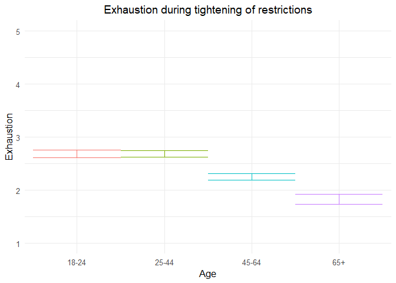

211109 exhausted additional analyses
================
Anne Margit
11/05/2021

``` r
load("data_analyse2_p1.Rdata")
load("data_analyse2_p2.Rdata")
load("data_analyse2_p3.Rdata")
```

``` r
options(scipen=999)

library(dplyr)
library(tidyverse)
library(ggpubr)
library(ggplot2)
library(rockchalk)
library(effects)
library(nlme)
library(lattice)
library(broom.mixed)
library(purrr)
library(stargazer)
```

    ## Warning: package 'stargazer' was built under R version 4.0.3

``` r
library(viridis)  
```

    ## Warning: package 'viridis' was built under R version 4.0.3

``` r
data_analyse2_p1$Edu <- as.numeric(data_analyse2_p1$Edu)
```

# Phase 1

*Random: IC for ID and Country + Covariates Gender and Education*

``` r
model_Exhp1 <- lme(fixed = Exh ~ Gender + Edu + Age_new,
                  random = ~1 | Country/ID, 
                  data = data_analyse2_p1, 
                  na.action = na.omit)

summary(model_Exhp1)
```

    Linear mixed-effects model fit by REML
     Data: data_analyse2_p1 
           AIC      BIC    logLik
      12690.15 12747.13 -6336.076
    
    Random effects:
     Formula: ~1 | Country
            (Intercept)
    StdDev:   0.1982824
    
     Formula: ~1 | ID %in% Country
            (Intercept)  Residual
    StdDev:    0.795404 0.8452716
    
    Fixed effects: Exh ~ Gender + Edu + Age_new 
                     Value  Std.Error   DF   t-value p-value
    (Intercept)  2.5746252 0.10556880 2716 24.388127  0.0000
    Gender1      0.3038408 0.04542422 2716  6.688960  0.0000
    Edu         -0.0193964 0.01647410 2716 -1.177390  0.2391
    Age_new1    -0.0070731 0.06310430 2716 -0.112086  0.9108
    Age_new2    -0.4382590 0.06685742 2716 -6.555129  0.0000
    Age_new3    -0.8586036 0.09478949 2716 -9.058004  0.0000
     Correlation: 
             (Intr) Gendr1 Edu    Ag_nw1 Ag_nw2
    Gender1  -0.321                            
    Edu      -0.637 -0.046                     
    Age_new1 -0.277  0.078 -0.247              
    Age_new2 -0.327  0.129 -0.162  0.712       
    Age_new3 -0.281  0.184 -0.097  0.493  0.494
    
    Standardized Within-Group Residuals:
           Min         Q1        Med         Q3        Max 
    -3.0875138 -0.5773729 -0.1318291  0.5883747  3.1185630 
    
    Number of Observations: 4155
    Number of Groups: 
            Country ID %in% Country 
                 26            2747 

*Plot of predicted values*

``` r
ef_Exhp1 <- effect("Age_new", model_Exhp1)

plot_Exhp1 <- ggplot(as.data.frame(ef_Exhp1), 
  aes(Age_new, fit, color=Age_new)) + geom_line() + 
  geom_errorbar(aes(ymin=fit-se, ymax=fit+se), width=1) + theme_minimal(base_size=12) + 
  labs(title="Exhaustion during tightening of restrictions", y = "Exhaustion") +
  theme(plot.title = element_text(hjust = 0.5)) +
  scale_x_discrete(name ="Age", labels=c("18-24", "25-44", "45-64", "65+")) +
  theme(legend.position = "none") +                 
  scale_color_discrete() + 
  expand_limits(y=c(1, 5))
```

``` r
plot_Exhp1
```

<!-- -->

``` r
intervals(model_Exhp1)
```

    Approximate 95% confidence intervals
    
     Fixed effects:
                     lower         est.      upper
    (Intercept)  2.3676219  2.574625208  2.7816285
    Gender1      0.2147712  0.303840773  0.3929103
    Edu         -0.0516995 -0.019396450  0.0129066
    Age_new1    -0.1308104 -0.007073115  0.1166642
    Age_new2    -0.5693556 -0.438259015 -0.3071625
    Age_new3    -1.0444704 -0.858603598 -0.6727368
    attr(,"label")
    [1] "Fixed effects:"
    
     Random Effects:
      Level: Country 
                        lower      est.    upper
    sd((Intercept)) 0.1237482 0.1982824 0.317709
      Level: ID 
                        lower     est.     upper
    sd((Intercept)) 0.7499082 0.795404 0.8436599
    
     Within-group standard error:
        lower      est.     upper 
    0.8139753 0.8452716 0.8777712 

``` r
VarCorr(model_Exhp1)
```

``` 
            Variance     StdDev   
Country =   pdLogChol(1)          
(Intercept) 0.0393159    0.1982824
ID =        pdLogChol(1)          
(Intercept) 0.6326675    0.7954040
Residual    0.7144841    0.8452716
```

*Effect sizes*

``` r
ISDs <- data_analyse2_p1 %>% 
  group_by(ID) %>%
  summarize_at(c("Exh"), sd, na.rm=TRUE) %>%
  ungroup()

ISDs_av <- ISDs %>%
  summarize_at(c("Exh"), mean, na.rm=TRUE) %>%
  stack() %>%
  rename(sd=values) 
```

> Effect size = regression coefficient / average ISD of Exhaustion

``` r
coef_Exhp1 = tidy(model_Exhp1, 
               effects = "fixed")

coef_Exhp1 <- coef_Exhp1 %>%
  mutate (e_size = estimate/0.6054988) %>% 
  mutate(across(2:7, round, 2)) 
```

``` r
coef_Exhp1
```

    ## # A tibble: 6 x 7
    ##   term        estimate std.error    df statistic p.value e_size
    ##   <chr>          <dbl>     <dbl> <dbl>     <dbl>   <dbl>  <dbl>
    ## 1 (Intercept)     2.57      0.11  2716     24.4     0      4.25
    ## 2 Gender1         0.3       0.05  2716      6.69    0      0.5 
    ## 3 Edu            -0.02      0.02  2716     -1.18    0.24  -0.03
    ## 4 Age_new1       -0.01      0.06  2716     -0.11    0.91  -0.01
    ## 5 Age_new2       -0.44      0.07  2716     -6.56    0     -0.72
    ## 6 Age_new3       -0.86      0.09  2716     -9.06    0     -1.42

``` r
coef_Exhp1 <- as.matrix(coef_Exhp1)
```

# Phase 2

*Best model*

> Random intercept for ID and Country, random slope for Country, AR
> correlation structure at Measurement level

``` r
data_analyse2_p2$Edu <- as.numeric(data_analyse2_p2$Edu)
data_analyse2_p2 <- data_analyse2_p2[with(data_analyse2_p2, order(Country, ID, Time)),]
data_analyse2_p2$Time <- as.numeric(data_analyse2_p2$Time)
model_Exhp2 <- lme(fixed = Exh ~ Gender + Edu + DaysMax_p2 + Age_new + DaysMax_p2*Age_new,
                  random = list (Country = ~1, ID = ~DaysMax_p2), 
                  data = data_analyse2_p2, 
                  na.action = na.omit,
                  correlation = corAR1(form = ~ Time | Country/ID))
summary(model_Exhp2)
```

    Linear mixed-effects model fit by REML
     Data: data_analyse2_p2 
           AIC      BIC    logLik
      82625.67 82758.38 -41296.84
    
    Random effects:
     Formula: ~1 | Country
            (Intercept)
    StdDev:   0.1773177
    
     Formula: ~DaysMax_p2 | ID %in% Country
     Structure: General positive-definite, Log-Cholesky parametrization
                StdDev      Corr  
    (Intercept) 0.874790817 (Intr)
    DaysMax_p2  0.009286457 -0.333
    Residual    0.784050592       
    
    Correlation Structure: ARMA(1,0)
     Formula: ~Time | Country/ID 
     Parameter estimate(s):
         Phi1 
    0.1497474 
    Fixed effects: Exh ~ Gender + Edu + DaysMax_p2 + Age_new + DaysMax_p2 * Age_new 
                             Value  Std.Error    DF   t-value p-value
    (Intercept)          2.5141541 0.06060123 20356  41.48685  0.0000
    Gender1              0.2700997 0.02241713  9176  12.04881  0.0000
    Edu                 -0.0065103 0.00733254  9176  -0.88786  0.3746
    DaysMax_p2           0.0010531 0.00119544 20356   0.88091  0.3784
    Age_new1            -0.0616618 0.04515462  9176  -1.36557  0.1721
    Age_new2            -0.4170674 0.04624766  9176  -9.01813  0.0000
    Age_new3            -0.8110218 0.05608231  9176 -14.46128  0.0000
    DaysMax_p2:Age_new1  0.0001202 0.00132388 20356   0.09077  0.9277
    DaysMax_p2:Age_new2 -0.0003572 0.00133994 20356  -0.26661  0.7898
    DaysMax_p2:Age_new3  0.0005360 0.00152737 20356   0.35092  0.7257
     Correlation: 
                        (Intr) Gendr1 Edu    DysM_2 Ag_nw1 Ag_nw2 Ag_nw3 DM_2:A_1
    Gender1             -0.278                                                   
    Edu                 -0.447 -0.031                                            
    DaysMax_p2          -0.377  0.001 -0.024                                     
    Age_new1            -0.437  0.044 -0.206  0.549                              
    Age_new2            -0.472  0.075 -0.127  0.539  0.744                       
    Age_new3            -0.423  0.139 -0.086  0.444  0.615  0.616                
    DaysMax_p2:Age_new1  0.343 -0.002  0.023 -0.895 -0.623 -0.477 -0.394         
    DaysMax_p2:Age_new2  0.337 -0.002  0.027 -0.887 -0.485 -0.638 -0.393  0.798  
    DaysMax_p2:Age_new3  0.300 -0.013  0.018 -0.778 -0.426 -0.419 -0.656  0.700  
                        DM_2:A_2
    Gender1                     
    Edu                         
    DaysMax_p2                  
    Age_new1                    
    Age_new2                    
    Age_new3                    
    DaysMax_p2:Age_new1         
    DaysMax_p2:Age_new2         
    DaysMax_p2:Age_new3  0.694  
    
    Standardized Within-Group Residuals:
           Min         Q1        Med         Q3        Max 
    -4.2723579 -0.5519383 -0.1409627  0.5621264  3.4689964 
    
    Number of Observations: 29574
    Number of Groups: 
            Country ID %in% Country 
                 33            9214 

``` r
VarCorr(model_Exhp2)
```

``` 
            Variance              StdDev      Corr  
Country =   pdLogChol(1)                            
(Intercept) 0.03144158183         0.177317743       
ID =        pdLogChol(DaysMax_p2)                   
(Intercept) 0.76525897368         0.874790817 (Intr)
DaysMax_p2  0.00008623829         0.009286457 -0.333
Residual    0.61473533111         0.784050592       
```

*Plot of predicted values*

``` r
ef_Exhp2 <- effect("DaysMax_p2:Age_new", model_Exhp2)
plot_Exhp2 <- ggplot(as.data.frame(ef_Exhp2), aes(DaysMax_p2, fit, color=Age_new)) + 
  geom_line(size=1) + 
  geom_errorbar(aes(ymin=fit-se, ymax=fit+se), width=1) + 
  theme_minimal(base_size=12) + 
  labs(title="A",
       x="Days", y = "Exhaustion") +
  xlim(0,80)+
  theme(plot.title = element_text(size=12)) +
  scale_color_discrete(name="Age", labels = c("18-24", "25-44", "45-64", "65+")) + 
  expand_limits(y=c(1, 5))
```

``` r
plot_Exhp2
```

<!-- -->

``` r
VarCorr(model_Exhp2)
```

``` 
            Variance              StdDev      Corr  
Country =   pdLogChol(1)                            
(Intercept) 0.03144158183         0.177317743       
ID =        pdLogChol(DaysMax_p2)                   
(Intercept) 0.76525897368         0.874790817 (Intr)
DaysMax_p2  0.00008623829         0.009286457 -0.333
Residual    0.61473533111         0.784050592       
```

``` r
intervals(model_Exhp2, which = 'fixed')
```

    Approximate 95% confidence intervals
    
     Fixed effects:
                               lower          est.        upper
    (Intercept)          2.395370813  2.5141540958  2.632937379
    Gender1              0.226157164  0.2700997203  0.314042277
    Edu                 -0.020883691 -0.0065102753  0.007863140
    DaysMax_p2          -0.001290090  0.0010530724  0.003396235
    Age_new1            -0.150174903 -0.0616618016  0.026851300
    Age_new2            -0.507723106 -0.4170673926 -0.326411679
    Age_new3            -0.920955621 -0.8110218165 -0.701088012
    DaysMax_p2:Age_new1 -0.002474750  0.0001201712  0.002715092
    DaysMax_p2:Age_new2 -0.002983633 -0.0003572384  0.002269156
    DaysMax_p2:Age_new3 -0.002457795  0.0005359819  0.003529759
    attr(,"label")
    [1] "Fixed effects:"

*Effect sizes*

**Within person SD and average within person SD**

``` r
ISDs <- data_analyse2_p2 %>% 
  group_by(ID) %>%
  summarize_at(c("DaysMax_p2", "Exh"), sd, na.rm=TRUE) %>%
  ungroup()

ISDs_av <- ISDs %>%
  summarize_at(c("DaysMax_p2", "Exh"), mean, na.rm=TRUE) %>%
  stack() %>%
  rename(sd=values) 
```

> Effect sizes for intercept and main effect of age and covariates =
> regression coefficient / average ISD of Exhaustion Effect size for
> main effect of DaysMax = (regression coefficient \* 28)/ average ISD
> of Exhaustion Effect sizes for interaction effects = (regression
> coefficient \* 28)/ average ISD of Exhaustion The effect sizes for
> main effect of DaysMax and the interaction effects reflect the
> increase in SD of Exhaustion over 4 weeks (28 days)

``` r
coef_Exhp2 = tidy(model_Exhp2, 
               effects = "fixed")
coef_Exhp2 <- coef_Exhp2 %>%
  mutate(e_size = ifelse(row_number()== 1 | row_number()== 2 |  row_number()== 3 |  row_number()== 5 |  row_number()== 6 |  row_number()== 7, estimate/0.6187587, (estimate*28)/0.6187587)) %>%
  mutate(across(2:7, round, 2)) 
```

``` r
coef_Exhp2 <- as.matrix(coef_Exhp2)
coef_Exhp2
```

    ##       term                  estimate std.error df      statistic p.value
    ##  [1,] "(Intercept)"         " 2.51"  "0.06"    "20356" " 41.49"  "0.00" 
    ##  [2,] "Gender1"             " 0.27"  "0.02"    " 9176" " 12.05"  "0.00" 
    ##  [3,] "Edu"                 "-0.01"  "0.01"    " 9176" " -0.89"  "0.37" 
    ##  [4,] "DaysMax_p2"          " 0.00"  "0.00"    "20356" "  0.88"  "0.38" 
    ##  [5,] "Age_new1"            "-0.06"  "0.05"    " 9176" " -1.37"  "0.17" 
    ##  [6,] "Age_new2"            "-0.42"  "0.05"    " 9176" " -9.02"  "0.00" 
    ##  [7,] "Age_new3"            "-0.81"  "0.06"    " 9176" "-14.46"  "0.00" 
    ##  [8,] "DaysMax_p2:Age_new1" " 0.00"  "0.00"    "20356" "  0.09"  "0.93" 
    ##  [9,] "DaysMax_p2:Age_new2" " 0.00"  "0.00"    "20356" " -0.27"  "0.79" 
    ## [10,] "DaysMax_p2:Age_new3" " 0.00"  "0.00"    "20356" "  0.35"  "0.73" 
    ##       e_size 
    ##  [1,] " 4.06"
    ##  [2,] " 0.44"
    ##  [3,] "-0.01"
    ##  [4,] " 0.05"
    ##  [5,] "-0.10"
    ##  [6,] "-0.67"
    ##  [7,] "-1.31"
    ##  [8,] " 0.01"
    ##  [9,] "-0.02"
    ## [10,] " 0.02"

# Phase 3

> Random IC for Country and ID, random S for ID, AR structure

``` r
data_analyse2_p3$Edu <- as.numeric(data_analyse2_p3$Edu)
data_analyse2_p3 <- data_analyse2_p3[with(data_analyse2_p3, order(Country, ID, Time)),]
data_analyse2_p3$Time <- as.numeric(data_analyse2_p3$Time)
model_Exhp3 <- lme(fixed = Exh ~ Gender + Edu + DaysPhase3 + Age_new + DaysPhase3*Age_new,
                  random = list (Country = ~1, ID = ~DaysPhase3), 
                  data = data_analyse2_p3, 
                  na.action = na.omit,
                  correlation = corAR1(form = ~ Time | Country/ID))
summary(model_Exhp3)
```

    Linear mixed-effects model fit by REML
     Data: data_analyse2_p3 
           AIC      BIC    logLik
      67896.95 68026.97 -33932.48
    
    Random effects:
     Formula: ~1 | Country
            (Intercept)
    StdDev:   0.1817554
    
     Formula: ~DaysPhase3 | ID %in% Country
     Structure: General positive-definite, Log-Cholesky parametrization
                StdDev     Corr  
    (Intercept) 0.84896237 (Intr)
    DaysPhase3  0.01026099 -0.227
    Residual    0.75773712       
    
    Correlation Structure: ARMA(1,0)
     Formula: ~Time | Country/ID 
     Parameter estimate(s):
         Phi1 
    0.1232149 
    Fixed effects: Exh ~ Gender + Edu + DaysPhase3 + Age_new + DaysPhase3 * Age_new 
                             Value  Std.Error    DF   t-value p-value
    (Intercept)          2.4987878 0.06447447 17940  38.75623  0.0000
    Gender1              0.2006299 0.02513441  7009   7.98228  0.0000
    Edu                 -0.0067760 0.00835590  7009  -0.81092  0.4174
    DaysPhase3           0.0038567 0.00130398 17940   2.95764  0.0031
    Age_new1            -0.0468486 0.04893751  7009  -0.95731  0.3384
    Age_new2            -0.3672270 0.04803284  7009  -7.64533  0.0000
    Age_new3            -0.7517269 0.05496351  7009 -13.67684  0.0000
    DaysPhase3:Age_new1 -0.0022507 0.00150820 17940  -1.49229  0.1356
    DaysPhase3:Age_new2 -0.0021341 0.00145992 17940  -1.46180  0.1438
    DaysPhase3:Age_new3 -0.0045865 0.00161470 17940  -2.84046  0.0045
     Correlation: 
                        (Intr) Gendr1 Edu    DysPh3 Ag_nw1 Ag_nw2 Ag_nw3 DP3:A_1
    Gender1             -0.304                                                  
    Edu                 -0.487 -0.027                                           
    DaysPhase3          -0.351 -0.003 -0.007                                    
    Age_new1            -0.431  0.049 -0.211  0.469                             
    Age_new2            -0.509  0.102 -0.109  0.477  0.751                      
    Age_new3            -0.490  0.178 -0.070  0.416  0.659  0.699               
    DaysPhase3:Age_new1  0.307  0.000  0.004 -0.862 -0.547 -0.413 -0.361        
    DaysPhase3:Age_new2  0.315  0.002  0.007 -0.891 -0.420 -0.545 -0.374  0.771 
    DaysPhase3:Age_new3  0.287 -0.002  0.003 -0.806 -0.378 -0.386 -0.536  0.697 
                        DP3:A_2
    Gender1                    
    Edu                        
    DaysPhase3                 
    Age_new1                   
    Age_new2                   
    Age_new3                   
    DaysPhase3:Age_new1        
    DaysPhase3:Age_new2        
    DaysPhase3:Age_new3  0.721 
    
    Standardized Within-Group Residuals:
           Min         Q1        Med         Q3        Max 
    -3.8628673 -0.5288470 -0.1491869  0.5424487  4.2386687 
    
    Number of Observations: 24990
    Number of Groups: 
            Country ID %in% Country 
                 32            7046 

``` r
VarCorr(model_Exhp3)
```

``` 
            Variance              StdDev     Corr  
Country =   pdLogChol(1)                           
(Intercept) 0.033035032           0.18175542       
ID =        pdLogChol(DaysPhase3)                  
(Intercept) 0.720737112           0.84896237 (Intr)
DaysPhase3  0.000105288           0.01026099 -0.227
Residual    0.574165548           0.75773712       
```

*Confidence intervals*

``` r
intervals(model_Exhp3, which = 'fixed')
```

    Approximate 95% confidence intervals
    
     Fixed effects:
                               lower         est.         upper
    (Intercept)          2.372411653  2.498787825  2.6251639978
    Gender1              0.151358848  0.200629885  0.2499009218
    Edu                 -0.023156100 -0.006776007  0.0096040864
    DaysPhase3           0.001300766  0.003856683  0.0064126001
    Age_new1            -0.142780874 -0.046848553  0.0490837682
    Age_new2            -0.461385929 -0.367227042 -0.2730681544
    Age_new3            -0.859472051 -0.751726941 -0.6439818302
    DaysPhase3:Age_new1 -0.005206874 -0.002250665  0.0007055444
    DaysPhase3:Age_new2 -0.004995691 -0.002134113  0.0007274651
    DaysPhase3:Age_new3 -0.007751474 -0.004586502 -0.0014215299
    attr(,"label")
    [1] "Fixed effects:"

*Plot of predicted values*

``` r
ef_Exhp3 <- effect("DaysPhase3:Age_new", model_Exhp3)
plot_Exhp3 <- ggplot(as.data.frame(ef_Exhp3), aes(DaysPhase3, fit, color=Age_new)) + 
  geom_line(size=1) + 
  geom_errorbar(aes(ymin=fit-se, ymax=fit+se), width=1) + 
  theme_minimal(base_size=12) + 
  xlim(0,80)+
  labs(title="B",
       x="Days", y = "Exhaustion") +
  theme(plot.title = element_text(size = 12)) +
  scale_color_discrete(name="Age", labels = c("18-24", "25-44", "45-64", "65+")) + 
  expand_limits(y=c(1, 5))
```

``` r
plot_Exhp3
```

    ## Warning: Removed 4 row(s) containing missing values (geom_path).

<!-- -->

``` r
plot_Exhp2and3 <- ggarrange(plot_Exhp2, plot_Exhp3 , 
          ncol = 2, nrow = 1, common.legend=TRUE, legend= "bottom")
```

    ## Warning: Removed 4 row(s) containing missing values (geom_path).

``` r
plot_Exhp2and3 <- annotate_figure(plot_Exhp2and3,top = text_grob("Exhaustion trajectories during peak (A) and easing (B) of restrictions", size = 12))
```

``` r
plot_Exhp2and3
```

<!-- -->

*Effect sizes* **Within person SD and average within person SD for
Exhaustion**

``` r
ISDs <- data_analyse2_p3 %>% 
  group_by(ID) %>%
  summarize_at(c("Exh"), sd, na.rm=TRUE) %>%
  ungroup()
ISDs_av <- ISDs %>%
  summarize_at(c("Exh"), mean, na.rm=TRUE) %>%
  stack() %>%
  rename(sd=values) 
```

> Effect sizes for intercept and main effect of age = regression
> coefficient / average ISD of Exhaustion Effect size for main effect of
> DaysMax = (regression coefficient \* 28)/ average ISD of Exhaustion
> Effect sizes for interaction effects = (regression coefficient \* 28)/
> average ISD of Exhaustion The effect sizes for main effect of DaysMax
> and the interaction effects reflect the increase in SD of Exhaustion
> over 4 weeks (28 days)

``` r
coef_Exhp3 = tidy(model_Exhp3, 
               effects = "fixed")
coef_Exhp3 <- coef_Exhp3 %>%
 mutate(e_size = ifelse(row_number()== 1 | row_number()== 2 |  row_number()== 3 |  row_number()== 5 |  row_number()== 6 |  row_number()== 7, estimate/0.6005619, (estimate*28)/0.6005619)) %>%
  mutate(across(2:7, round, 2)) 
```

``` r
coef_Exhp3 <- as.matrix(coef_Exhp3)
coef_Exhp3
```

    ##       term                  estimate std.error df      statistic p.value
    ##  [1,] "(Intercept)"         " 2.50"  "0.06"    "17940" " 38.76"  "0.00" 
    ##  [2,] "Gender1"             " 0.20"  "0.03"    " 7009" "  7.98"  "0.00" 
    ##  [3,] "Edu"                 "-0.01"  "0.01"    " 7009" " -0.81"  "0.42" 
    ##  [4,] "DaysPhase3"          " 0.00"  "0.00"    "17940" "  2.96"  "0.00" 
    ##  [5,] "Age_new1"            "-0.05"  "0.05"    " 7009" " -0.96"  "0.34" 
    ##  [6,] "Age_new2"            "-0.37"  "0.05"    " 7009" " -7.65"  "0.00" 
    ##  [7,] "Age_new3"            "-0.75"  "0.05"    " 7009" "-13.68"  "0.00" 
    ##  [8,] "DaysPhase3:Age_new1" " 0.00"  "0.00"    "17940" " -1.49"  "0.14" 
    ##  [9,] "DaysPhase3:Age_new2" " 0.00"  "0.00"    "17940" " -1.46"  "0.14" 
    ## [10,] "DaysPhase3:Age_new3" " 0.00"  "0.00"    "17940" " -2.84"  "0.00" 
    ##       e_size 
    ##  [1,] " 4.16"
    ##  [2,] " 0.33"
    ##  [3,] "-0.01"
    ##  [4,] " 0.18"
    ##  [5,] "-0.08"
    ##  [6,] "-0.61"
    ##  [7,] "-1.25"
    ##  [8,] "-0.10"
    ##  [9,] "-0.10"
    ## [10,] "-0.21"

``` r
stargazer(coef_Exhp1, coef_Exhp2, coef_Exhp3,
type="html", df = TRUE, out="star_coefExhp123.doc",  single.row=TRUE, digits = 2, align = TRUE)
```

    ## 
    ## <table style="text-align:center"><tr><td colspan="7" style="border-bottom: 1px solid black"></td></tr><tr><td>term</td><td>estimate</td><td>std.error</td><td>df</td><td>statistic</td><td>p.value</td><td>e_size</td></tr>
    ## <tr><td colspan="7" style="border-bottom: 1px solid black"></td></tr><tr><td>(Intercept)</td><td>2.57</td><td>0.11</td><td>2716</td><td>24.39</td><td>0.00</td><td>4.25</td></tr>
    ## <tr><td>Gender1</td><td>0.30</td><td>0.05</td><td>2716</td><td>6.69</td><td>0.00</td><td>0.50</td></tr>
    ## <tr><td>Edu</td><td>-0.02</td><td>0.02</td><td>2716</td><td>-1.18</td><td>0.24</td><td>-0.03</td></tr>
    ## <tr><td>Age_new1</td><td>-0.01</td><td>0.06</td><td>2716</td><td>-0.11</td><td>0.91</td><td>-0.01</td></tr>
    ## <tr><td>Age_new2</td><td>-0.44</td><td>0.07</td><td>2716</td><td>-6.56</td><td>0.00</td><td>-0.72</td></tr>
    ## <tr><td>Age_new3</td><td>-0.86</td><td>0.09</td><td>2716</td><td>-9.06</td><td>0.00</td><td>-1.42</td></tr>
    ## <tr><td colspan="7" style="border-bottom: 1px solid black"></td></tr></table>
    ## 
    ## <table style="text-align:center"><tr><td colspan="7" style="border-bottom: 1px solid black"></td></tr><tr><td>term</td><td>estimate</td><td>std.error</td><td>df</td><td>statistic</td><td>p.value</td><td>e_size</td></tr>
    ## <tr><td colspan="7" style="border-bottom: 1px solid black"></td></tr><tr><td>(Intercept)</td><td>2.51</td><td>0.06</td><td>20356</td><td>41.49</td><td>0.00</td><td>4.06</td></tr>
    ## <tr><td>Gender1</td><td>0.27</td><td>0.02</td><td>9176</td><td>12.05</td><td>0.00</td><td>0.44</td></tr>
    ## <tr><td>Edu</td><td>-0.01</td><td>0.01</td><td>9176</td><td>-0.89</td><td>0.37</td><td>-0.01</td></tr>
    ## <tr><td>DaysMax_p2</td><td>0.00</td><td>0.00</td><td>20356</td><td>0.88</td><td>0.38</td><td>0.05</td></tr>
    ## <tr><td>Age_new1</td><td>-0.06</td><td>0.05</td><td>9176</td><td>-1.37</td><td>0.17</td><td>-0.10</td></tr>
    ## <tr><td>Age_new2</td><td>-0.42</td><td>0.05</td><td>9176</td><td>-9.02</td><td>0.00</td><td>-0.67</td></tr>
    ## <tr><td>Age_new3</td><td>-0.81</td><td>0.06</td><td>9176</td><td>-14.46</td><td>0.00</td><td>-1.31</td></tr>
    ## <tr><td>DaysMax_p2:Age_new1</td><td>0.00</td><td>0.00</td><td>20356</td><td>0.09</td><td>0.93</td><td>0.01</td></tr>
    ## <tr><td>DaysMax_p2:Age_new2</td><td>0.00</td><td>0.00</td><td>20356</td><td>-0.27</td><td>0.79</td><td>-0.02</td></tr>
    ## <tr><td>DaysMax_p2:Age_new3</td><td>0.00</td><td>0.00</td><td>20356</td><td>0.35</td><td>0.73</td><td>0.02</td></tr>
    ## <tr><td colspan="7" style="border-bottom: 1px solid black"></td></tr></table>
    ## 
    ## <table style="text-align:center"><tr><td colspan="7" style="border-bottom: 1px solid black"></td></tr><tr><td>term</td><td>estimate</td><td>std.error</td><td>df</td><td>statistic</td><td>p.value</td><td>e_size</td></tr>
    ## <tr><td colspan="7" style="border-bottom: 1px solid black"></td></tr><tr><td>(Intercept)</td><td>2.50</td><td>0.06</td><td>17940</td><td>38.76</td><td>0.00</td><td>4.16</td></tr>
    ## <tr><td>Gender1</td><td>0.20</td><td>0.03</td><td>7009</td><td>7.98</td><td>0.00</td><td>0.33</td></tr>
    ## <tr><td>Edu</td><td>-0.01</td><td>0.01</td><td>7009</td><td>-0.81</td><td>0.42</td><td>-0.01</td></tr>
    ## <tr><td>DaysPhase3</td><td>0.00</td><td>0.00</td><td>17940</td><td>2.96</td><td>0.00</td><td>0.18</td></tr>
    ## <tr><td>Age_new1</td><td>-0.05</td><td>0.05</td><td>7009</td><td>-0.96</td><td>0.34</td><td>-0.08</td></tr>
    ## <tr><td>Age_new2</td><td>-0.37</td><td>0.05</td><td>7009</td><td>-7.65</td><td>0.00</td><td>-0.61</td></tr>
    ## <tr><td>Age_new3</td><td>-0.75</td><td>0.05</td><td>7009</td><td>-13.68</td><td>0.00</td><td>-1.25</td></tr>
    ## <tr><td>DaysPhase3:Age_new1</td><td>0.00</td><td>0.00</td><td>17940</td><td>-1.49</td><td>0.14</td><td>-0.10</td></tr>
    ## <tr><td>DaysPhase3:Age_new2</td><td>0.00</td><td>0.00</td><td>17940</td><td>-1.46</td><td>0.14</td><td>-0.10</td></tr>
    ## <tr><td>DaysPhase3:Age_new3</td><td>0.00</td><td>0.00</td><td>17940</td><td>-2.84</td><td>0.00</td><td>-0.21</td></tr>
    ## <tr><td colspan="7" style="border-bottom: 1px solid black"></td></tr></table>

``` r
stargazer(model_Exhp1, model_Exhp2, model_Exhp3,
type="html", df = TRUE, out="star_modelExhp123.doc",  single.row=TRUE, digits = 2, align = TRUE,
intercept.top = TRUE, intercept.bottom = FALSE)
```

    ## 
    ## <table style="text-align:center"><tr><td colspan="4" style="border-bottom: 1px solid black"></td></tr><tr><td style="text-align:left"></td><td colspan="3"><em>Dependent variable:</em></td></tr>
    ## <tr><td></td><td colspan="3" style="border-bottom: 1px solid black"></td></tr>
    ## <tr><td style="text-align:left"></td><td colspan="3">Exh</td></tr>
    ## <tr><td style="text-align:left"></td><td>(1)</td><td>(2)</td><td>(3)</td></tr>
    ## <tr><td colspan="4" style="border-bottom: 1px solid black"></td></tr><tr><td style="text-align:left">Constant</td><td>2.57<sup>***</sup> (0.11)</td><td>2.51<sup>***</sup> (0.06)</td><td>2.50<sup>***</sup> (0.06)</td></tr>
    ## <tr><td style="text-align:left">Gender1</td><td>0.30<sup>***</sup> (0.05)</td><td>0.27<sup>***</sup> (0.02)</td><td>0.20<sup>***</sup> (0.03)</td></tr>
    ## <tr><td style="text-align:left">Edu</td><td>-0.02 (0.02)</td><td>-0.01 (0.01)</td><td>-0.01 (0.01)</td></tr>
    ## <tr><td style="text-align:left">DaysMax_p2</td><td></td><td>0.001 (0.001)</td><td></td></tr>
    ## <tr><td style="text-align:left">DaysPhase3</td><td></td><td></td><td>0.004<sup>***</sup> (0.001)</td></tr>
    ## <tr><td style="text-align:left">Age_new1</td><td>-0.01 (0.06)</td><td>-0.06 (0.05)</td><td>-0.05 (0.05)</td></tr>
    ## <tr><td style="text-align:left">Age_new2</td><td>-0.44<sup>***</sup> (0.07)</td><td>-0.42<sup>***</sup> (0.05)</td><td>-0.37<sup>***</sup> (0.05)</td></tr>
    ## <tr><td style="text-align:left">Age_new3</td><td>-0.86<sup>***</sup> (0.09)</td><td>-0.81<sup>***</sup> (0.06)</td><td>-0.75<sup>***</sup> (0.05)</td></tr>
    ## <tr><td style="text-align:left">DaysMax_p2:Age_new1</td><td></td><td>0.0001 (0.001)</td><td></td></tr>
    ## <tr><td style="text-align:left">DaysMax_p2:Age_new2</td><td></td><td>-0.0004 (0.001)</td><td></td></tr>
    ## <tr><td style="text-align:left">DaysMax_p2:Age_new3</td><td></td><td>0.001 (0.002)</td><td></td></tr>
    ## <tr><td style="text-align:left">DaysPhase3:Age_new1</td><td></td><td></td><td>-0.002 (0.002)</td></tr>
    ## <tr><td style="text-align:left">DaysPhase3:Age_new2</td><td></td><td></td><td>-0.002 (0.001)</td></tr>
    ## <tr><td style="text-align:left">DaysPhase3:Age_new3</td><td></td><td></td><td>-0.005<sup>***</sup> (0.002)</td></tr>
    ## <tr><td colspan="4" style="border-bottom: 1px solid black"></td></tr><tr><td style="text-align:left">Observations</td><td>4,155</td><td>29,574</td><td>24,990</td></tr>
    ## <tr><td style="text-align:left">Log Likelihood</td><td>-6,336.08</td><td>-41,296.84</td><td>-33,932.48</td></tr>
    ## <tr><td style="text-align:left">Akaike Inf. Crit.</td><td>12,690.15</td><td>82,625.67</td><td>67,896.95</td></tr>
    ## <tr><td style="text-align:left">Bayesian Inf. Crit.</td><td>12,747.13</td><td>82,758.38</td><td>68,026.97</td></tr>
    ## <tr><td colspan="4" style="border-bottom: 1px solid black"></td></tr><tr><td style="text-align:left"><em>Note:</em></td><td colspan="3" style="text-align:right"><sup>*</sup>p<0.1; <sup>**</sup>p<0.05; <sup>***</sup>p<0.01</td></tr>
    ## </table>
