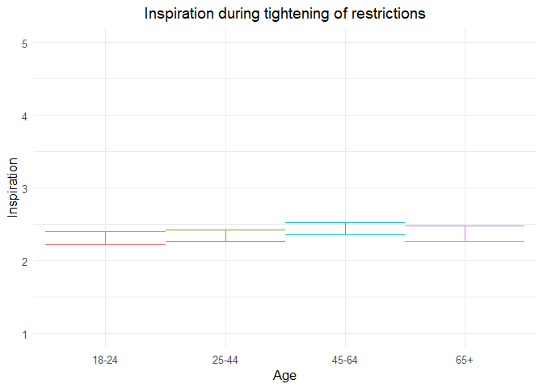
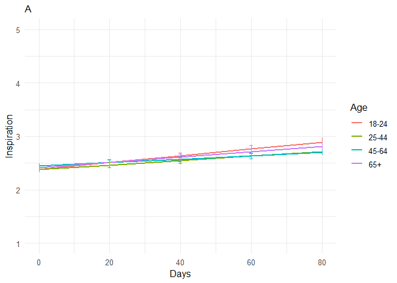
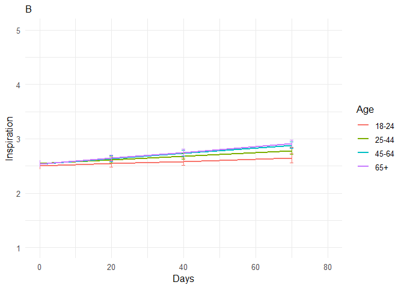
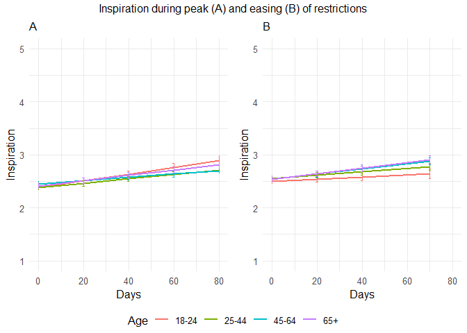

211109 inspired additional analyses
================
Anne Margit
11/05/2021

``` r
load("data_analyse2_p1.Rdata")
load("data_analyse2_p2.Rdata")
load("data_analyse2_p3.Rdata")
```

``` r
options(scipen=999)

library(dplyr)
library(tidyverse)
library(ggpubr)
library(ggplot2)
library(rockchalk)
library(effects)
library(nlme)
library(lattice)
library(broom.mixed)
library(purrr)
library(stargazer)
```

    ## Warning: package 'stargazer' was built under R version 4.0.3

``` r
library(viridis)  
```

    ## Warning: package 'viridis' was built under R version 4.0.3

``` r
data_analyse2_p1$Edu <- as.numeric(data_analyse2_p1$Edu)
```

# Phase 1

*Random: IC for ID and Country + Covariates Gender and Education*

``` r
model_Inspp1 <- lme(fixed = Insp ~ Gender + Edu + Age_new,
                  random = ~1 | Country/ID, 
                  data = data_analyse2_p1, 
                  na.action = na.omit)

summary(model_Inspp1)
```

    Linear mixed-effects model fit by REML
     Data: data_analyse2_p1 
           AIC      BIC    logLik
      12122.07 12179.04 -6052.034
    
    Random effects:
     Formula: ~1 | Country
            (Intercept)
    StdDev:   0.3014441
    
     Formula: ~1 | ID %in% Country
            (Intercept)  Residual
    StdDev:   0.7619773 0.7758794
    
    Fixed effects: Insp ~ Gender + Edu + Age_new 
                     Value  Std.Error   DF   t-value p-value
    (Intercept)  2.2997221 0.11399974 2716 20.173046  0.0000
    Gender1     -0.1591030 0.04276916 2716 -3.720040  0.0002
    Edu          0.0260035 0.01555042 2716  1.672205  0.0946
    Age_new1     0.0388673 0.05955364 2716  0.652644  0.5140
    Age_new2     0.1338366 0.06319744 2716  2.117754  0.0343
    Age_new3     0.0645468 0.08969881 2716  0.719595  0.4718
     Correlation: 
             (Intr) Gendr1 Edu    Ag_nw1 Ag_nw2
    Gender1  -0.283                            
    Edu      -0.561 -0.045                     
    Age_new1 -0.243  0.079 -0.247              
    Age_new2 -0.286  0.129 -0.164  0.713       
    Age_new3 -0.245  0.184 -0.099  0.493  0.498
    
    Standardized Within-Group Residuals:
            Min          Q1         Med          Q3         Max 
    -3.10913168 -0.61363823 -0.07141668  0.56485655  3.77919126 
    
    Number of Observations: 4155
    Number of Groups: 
            Country ID %in% Country 
                 26            2747 

*Plot of predicted values*

``` r
ef_Inspp1 <- effect("Age_new", model_Inspp1)

plot_Inspp1 <- ggplot(as.data.frame(ef_Inspp1), 
  aes(Age_new, fit, color=Age_new)) + geom_line() + 
  geom_errorbar(aes(ymin=fit-se, ymax=fit+se), width=1) + theme_minimal(base_size=12) + 
  labs(title="Inspiration during tightening of restrictions", y = "Inspiration") +
  theme(plot.title = element_text(hjust = 0.5)) +
  scale_x_discrete(name ="Age", labels=c("18-24", "25-44", "45-64", "65+")) +
  theme(legend.position = "none") +                 
  scale_color_discrete() + 
  expand_limits(y=c(1, 5))
```

``` r
plot_Inspp1
```

<!-- -->

``` r
intervals(model_Inspp1)
```

    Approximate 95% confidence intervals
    
     Fixed effects:
                       lower        est.       upper
    (Intercept)  2.076187046  2.29972205  2.52325706
    Gender1     -0.242966372 -0.15910299 -0.07523960
    Edu         -0.004488358  0.02600349  0.05649535
    Age_new1    -0.077907689  0.03886734  0.15564237
    Age_new2     0.009916701  0.13383664  0.25775657
    Age_new3    -0.111338041  0.06454677  0.24043158
    attr(,"label")
    [1] "Fixed effects:"
    
     Random Effects:
      Level: Country 
                        lower      est.     upper
    sd((Intercept)) 0.2020523 0.3014441 0.4497279
      Level: ID 
                        lower      est.    upper
    sd((Intercept)) 0.7223792 0.7619773 0.803746
    
     Within-group standard error:
        lower      est.     upper 
    0.7483467 0.7758794 0.8044251 

``` r
VarCorr(model_Inspp1)
```

``` 
            Variance     StdDev   
Country =   pdLogChol(1)          
(Intercept) 0.09086853   0.3014441
ID =        pdLogChol(1)          
(Intercept) 0.58060941   0.7619773
Residual    0.60198885   0.7758794
```

*Effect sizes*

``` r
ISDs <- data_analyse2_p1 %>% 
  group_by(ID) %>%
  summarize_at(c("Insp"), sd, na.rm=TRUE) %>%
  ungroup()

ISDs_av <- ISDs %>%
  summarize_at(c("Insp"), mean, na.rm=TRUE) %>%
  stack() %>%
  rename(sd=values) 
```

> Effect size = regression coefficient / average ISD of Inspired

``` r
coef_Inspp1 = tidy(model_Inspp1, 
               effects = "fixed")

coef_Inspp1 <- coef_Inspp1 %>%
  mutate (e_size = estimate/0.5828323) %>% 
  mutate(across(2:7, round, 2)) 
```

``` r
coef_Inspp1
```

    ## # A tibble: 6 x 7
    ##   term        estimate std.error    df statistic p.value e_size
    ##   <chr>          <dbl>     <dbl> <dbl>     <dbl>   <dbl>  <dbl>
    ## 1 (Intercept)     2.3       0.11  2716     20.2     0      3.95
    ## 2 Gender1        -0.16      0.04  2716     -3.72    0     -0.27
    ## 3 Edu             0.03      0.02  2716      1.67    0.09   0.04
    ## 4 Age_new1        0.04      0.06  2716      0.65    0.51   0.07
    ## 5 Age_new2        0.13      0.06  2716      2.12    0.03   0.23
    ## 6 Age_new3        0.06      0.09  2716      0.72    0.47   0.11

``` r
coef_Inspp1 <- as.matrix(coef_Inspp1)
```

# Phase 2

*Best model*

> Random intercept for ID and Country, random slope for ID, no
> correlation between IC and S for ID + AR correlation structure at
> Measurement level

``` r
data_analyse2_p2$Edu <- as.numeric(data_analyse2_p2$Edu)
data_analyse2_p2 <- data_analyse2_p2[with(data_analyse2_p2, order(Country, ID, Time)),]
data_analyse2_p2$Time <- as.numeric(data_analyse2_p2$Time)
model_Inspp2 <- lme(fixed = Insp ~ Gender + Edu + DaysMax_p2 + Age_new + DaysMax_p2*Age_new,
                  random = list(Country = ~1, ID = pdDiag(~DaysMax_p2)),
                  data = data_analyse2_p2, 
                  na.action = na.omit,
                  correlation = corAR1(form = ~Time | Country/ID))
summary(model_Inspp2)
```

    Linear mixed-effects model fit by REML
     Data: data_analyse2_p2 
           AIC      BIC    logLik
      78791.32 78915.73 -39380.66
    
    Random effects:
     Formula: ~1 | Country
            (Intercept)
    StdDev:   0.2411607
    
     Formula: ~DaysMax_p2 | ID %in% Country
     Structure: Diagonal
            (Intercept)  DaysMax_p2 Residual
    StdDev:   0.7533975 0.006156103  0.74411
    
    Correlation Structure: ARMA(1,0)
     Formula: ~Time | Country/ID 
     Parameter estimate(s):
         Phi1 
    0.1647782 
    Fixed effects: Insp ~ Gender + Edu + DaysMax_p2 + Age_new + DaysMax_p2 * Age_new 
                             Value  Std.Error    DF  t-value p-value
    (Intercept)          2.2567981 0.06467566 20356 34.89409  0.0000
    Gender1             -0.1741786 0.02095343  9176 -8.31265  0.0000
    Edu                  0.0530358 0.00686334  9176  7.72740  0.0000
    DaysMax_p2           0.0063701 0.00110168 20356  5.78220  0.0000
    Age_new1            -0.0037660 0.04096595  9176 -0.09193  0.9268
    Age_new2             0.0634456 0.04200434  9176  1.51045  0.1310
    Age_new3             0.0317211 0.05095169  9176  0.62257  0.5336
    DaysMax_p2:Age_new1 -0.0021683 0.00121729 20356 -1.78126  0.0749
    DaysMax_p2:Age_new2 -0.0031616 0.00123106 20356 -2.56818  0.0102
    DaysMax_p2:Age_new3 -0.0014076 0.00140009 20356 -1.00536  0.3147
     Correlation: 
                        (Intr) Gendr1 Edu    DysM_2 Ag_nw1 Ag_nw2 Ag_nw3 DM_2:A_1
    Gender1             -0.242                                                   
    Edu                 -0.395 -0.031                                            
    DaysMax_p2          -0.304  0.001 -0.022                                     
    Age_new1            -0.362  0.044 -0.214  0.528                              
    Age_new2            -0.392  0.076 -0.133  0.518  0.747                       
    Age_new3            -0.352  0.141 -0.092  0.427  0.617  0.620                
    DaysMax_p2:Age_new1  0.278 -0.001  0.023 -0.898 -0.596 -0.460 -0.379         
    DaysMax_p2:Age_new2  0.272 -0.001  0.028 -0.890 -0.469 -0.612 -0.379  0.803  
    DaysMax_p2:Age_new3  0.243 -0.010  0.020 -0.783 -0.412 -0.406 -0.628  0.706  
                        DM_2:A_2
    Gender1                     
    Edu                         
    DaysMax_p2                  
    Age_new1                    
    Age_new2                    
    Age_new3                    
    DaysMax_p2:Age_new1         
    DaysMax_p2:Age_new2         
    DaysMax_p2:Age_new3  0.700  
    
    Standardized Within-Group Residuals:
            Min          Q1         Med          Q3         Max 
    -3.27763550 -0.57606775 -0.05183891  0.57112447  4.09710370 
    
    Number of Observations: 29574
    Number of Groups: 
            Country ID %in% Country 
                 33            9214 

``` r
VarCorr(model_Inspp2)
```

``` 
            Variance           StdDev     
Country =   pdLogChol(1)                  
(Intercept) 0.0581584961       0.241160727
ID =        pdDiag(DaysMax_p2)            
(Intercept) 0.5676077627       0.753397480
DaysMax_p2  0.0000378976       0.006156103
Residual    0.5536997195       0.744110018
```

*Plot of predicted values*

``` r
ef_Inspp2 <- effect("DaysMax_p2:Age_new", model_Inspp2)
plot_Inspp2 <- ggplot(as.data.frame(ef_Inspp2), aes(DaysMax_p2, fit, color=Age_new)) + 
  geom_line(size=1) + 
  geom_errorbar(aes(ymin=fit-se, ymax=fit+se), width=1) + 
  theme_minimal(base_size=12) + 
  labs(title="A",
       x="Days", y = "Inspiration") +
  xlim(0,80)+
  theme(plot.title = element_text(size=12)) +
  scale_color_discrete(name="Age", labels = c("18-24", "25-44", "45-64", "65+")) + 
  expand_limits(y=c(1, 5))
```

``` r
plot_Inspp2
```

<!-- -->

``` r
VarCorr(model_Inspp2)
```

``` 
            Variance           StdDev     
Country =   pdLogChol(1)                  
(Intercept) 0.0581584961       0.241160727
ID =        pdDiag(DaysMax_p2)            
(Intercept) 0.5676077627       0.753397480
DaysMax_p2  0.0000378976       0.006156103
Residual    0.5536997195       0.744110018
```

``` r
intervals(model_Inspp2, which = 'fixed')
```

    Approximate 95% confidence intervals
    
     Fixed effects:
                               lower         est.         upper
    (Intercept)          2.130028565  2.256798068  2.3835675704
    Gender1             -0.215252009 -0.174178615 -0.1331052209
    Edu                  0.039582091  0.053035757  0.0664894237
    DaysMax_p2           0.004210749  0.006370127  0.0085295051
    Age_new1            -0.084068412 -0.003766037  0.0765363370
    Age_new2            -0.018892290  0.063445573  0.1457834361
    Age_new3            -0.068155586  0.031721074  0.1315977331
    DaysMax_p2:Age_new1 -0.004554301 -0.002168312  0.0002176763
    DaysMax_p2:Age_new2 -0.005574564 -0.003161588 -0.0007486119
    DaysMax_p2:Age_new3 -0.004151887 -0.001407595  0.0013366956
    attr(,"label")
    [1] "Fixed effects:"

*Effect sizes*

**Within person SD and average within person SD**

``` r
ISDs <- data_analyse2_p2 %>% 
  group_by(ID) %>%
  summarize_at(c("DaysMax_p2", "Insp"), sd, na.rm=TRUE) %>%
  ungroup()

ISDs_av <- ISDs %>%
  summarize_at(c("DaysMax_p2", "Insp"), mean, na.rm=TRUE) %>%
  stack() %>%
  rename(sd=values) 
```

> Effect sizes for intercept and main effect of age and covariates =
> regression coefficient / average ISD of Inspired Effect size for main
> effect of DaysMax = (regression coefficient \* 28)/ average ISD of
> Inspired Effect sizes for interaction effects = (regression
> coefficient \* 28)/ average ISD of Inspired The effect sizes for main
> effect of DaysMax and the interaction effects reflect the increase in
> SD of Inspired over 4 weeks (28 days)

``` r
coef_Inspp2 = tidy(model_Inspp2, 
               effects = "fixed")
coef_Inspp2 <- coef_Inspp2 %>%
  mutate(e_size = ifelse(row_number()== 1 | row_number()== 2 |  row_number()== 3 |  row_number()== 5 |  row_number()== 6 |  row_number()== 7, estimate/0.5925649, (estimate*28)/0.5925649)) %>%
  mutate(across(2:7, round, 2)) 
```

``` r
coef_Inspp2 <- as.matrix(coef_Inspp2)
coef_Inspp2
```

    ##       term                  estimate std.error df      statistic p.value
    ##  [1,] "(Intercept)"         " 2.26"  "0.06"    "20356" "34.89"   "0.00" 
    ##  [2,] "Gender1"             "-0.17"  "0.02"    " 9176" "-8.31"   "0.00" 
    ##  [3,] "Edu"                 " 0.05"  "0.01"    " 9176" " 7.73"   "0.00" 
    ##  [4,] "DaysMax_p2"          " 0.01"  "0.00"    "20356" " 5.78"   "0.00" 
    ##  [5,] "Age_new1"            " 0.00"  "0.04"    " 9176" "-0.09"   "0.93" 
    ##  [6,] "Age_new2"            " 0.06"  "0.04"    " 9176" " 1.51"   "0.13" 
    ##  [7,] "Age_new3"            " 0.03"  "0.05"    " 9176" " 0.62"   "0.53" 
    ##  [8,] "DaysMax_p2:Age_new1" " 0.00"  "0.00"    "20356" "-1.78"   "0.07" 
    ##  [9,] "DaysMax_p2:Age_new2" " 0.00"  "0.00"    "20356" "-2.57"   "0.01" 
    ## [10,] "DaysMax_p2:Age_new3" " 0.00"  "0.00"    "20356" "-1.01"   "0.31" 
    ##       e_size 
    ##  [1,] " 3.81"
    ##  [2,] "-0.29"
    ##  [3,] " 0.09"
    ##  [4,] " 0.30"
    ##  [5,] "-0.01"
    ##  [6,] " 0.11"
    ##  [7,] " 0.05"
    ##  [8,] "-0.10"
    ##  [9,] "-0.15"
    ## [10,] "-0.07"

# Phase 3

> Random: IC for ID and Country, S for ID, no correlation between IC and
> S for ID + AR

``` r
data_analyse2_p3$Edu <- as.numeric(data_analyse2_p3$Edu)
data_analyse2_p3 <- data_analyse2_p3[with(data_analyse2_p3, order(Country, ID, Time)),]
data_analyse2_p3$Time <- as.numeric(data_analyse2_p3$Time)
model_Inspp3 <- lme(fixed = Insp ~ Gender + Edu + DaysPhase3 + Age_new + DaysPhase3*Age_new,
                  random = list (Country = ~1, ID = pdDiag(~DaysPhase3)), 
                  data = data_analyse2_p3, 
                  na.action = na.omit,
                  correlation = corAR1(form = ~ Time | Country/ID))
summary(model_Inspp3)
```

    Linear mixed-effects model fit by REML
     Data: data_analyse2_p3 
           AIC      BIC    logLik
      65016.28 65138.17 -32493.14
    
    Random effects:
     Formula: ~1 | Country
            (Intercept)
    StdDev:   0.2742112
    
     Formula: ~DaysPhase3 | ID %in% Country
     Structure: Diagonal
            (Intercept)  DaysPhase3  Residual
    StdDev:   0.7726679 0.007576181 0.7206405
    
    Correlation Structure: ARMA(1,0)
     Formula: ~Time | Country/ID 
     Parameter estimate(s):
         Phi1 
    0.1380675 
    Fixed effects: Insp ~ Gender + Edu + DaysPhase3 + Age_new + DaysPhase3 * Age_new 
                             Value  Std.Error    DF  t-value p-value
    (Intercept)          2.4117171 0.07155089 17940 33.70632  0.0000
    Gender1             -0.2197133 0.02389937  7009 -9.19327  0.0000
    Edu                  0.0532586 0.00795387  7009  6.69594  0.0000
    DaysPhase3           0.0019834 0.00121208 17940  1.63635  0.1018
    Age_new1             0.0455979 0.04562089  7009  0.99950  0.3176
    Age_new2             0.0351773 0.04489057  7009  0.78362  0.4333
    Age_new3             0.0352831 0.05140264  7009  0.68641  0.4925
    DaysPhase3:Age_new1  0.0012446 0.00140094 17940  0.88839  0.3743
    DaysPhase3:Age_new2  0.0029101 0.00135589 17940  2.14626  0.0319
    DaysPhase3:Age_new3  0.0032506 0.00149770 17940  2.17039  0.0300
     Correlation: 
                        (Intr) Gendr1 Edu    DysPh3 Ag_nw1 Ag_nw2 Ag_nw3 DP3:A_1
    Gender1             -0.260                                                  
    Edu                 -0.419 -0.027                                           
    DaysPhase3          -0.279 -0.003 -0.007                                    
    Age_new1            -0.353  0.050 -0.217  0.443                             
    Age_new2            -0.419  0.104 -0.114  0.450  0.753                      
    Age_new3            -0.405  0.181 -0.075  0.392  0.661  0.703               
    DaysPhase3:Age_new1  0.245  0.000  0.004 -0.863 -0.517 -0.391 -0.341        
    DaysPhase3:Age_new2  0.251  0.002  0.006 -0.892 -0.398 -0.513 -0.353  0.772 
    DaysPhase3:Age_new3  0.229 -0.001  0.003 -0.808 -0.359 -0.366 -0.504  0.699 
                        DP3:A_2
    Gender1                    
    Edu                        
    DaysPhase3                 
    Age_new1                   
    Age_new2                   
    Age_new3                   
    DaysPhase3:Age_new1        
    DaysPhase3:Age_new2        
    DaysPhase3:Age_new3  0.723 
    
    Standardized Within-Group Residuals:
             Min           Q1          Med           Q3          Max 
    -4.337394054 -0.548011991 -0.005738036  0.554618927  3.918198304 
    
    Number of Observations: 24990
    Number of Groups: 
            Country ID %in% Country 
                 32            7046 

``` r
VarCorr(model_Inspp3)
```

``` 
            Variance           StdDev     
Country =   pdLogChol(1)                  
(Intercept) 0.07519178492      0.274211205
ID =        pdDiag(DaysPhase3)            
(Intercept) 0.59701568339      0.772667900
DaysPhase3  0.00005739852      0.007576181
Residual    0.51932273117      0.720640501
```

*Confidence intervals*

``` r
intervals(model_Inspp3, which = 'fixed')
```

    Approximate 95% confidence intervals
    
     Fixed effects:
                                lower         est.        upper
    (Intercept)          2.2714704388  2.411717077  2.551963715
    Gender1             -0.2665633032 -0.219713315 -0.172863327
    Edu                  0.0376666312  0.053258621  0.068850610
    DaysPhase3          -0.0003923998  0.001983385  0.004359170
    Age_new1            -0.0438328094  0.045597938  0.135028685
    Age_new2            -0.0528217965  0.035177294  0.123176384
    Age_new3            -0.0654816349  0.035283089  0.136047814
    DaysPhase3:Age_new1 -0.0015013935  0.001244583  0.003990560
    DaysPhase3:Age_new2  0.0002524177  0.002910099  0.005567779
    DaysPhase3:Age_new3  0.0003149610  0.003250602  0.006186244
    attr(,"label")
    [1] "Fixed effects:"

*Plot of predicted values*

``` r
ef_Inspp3 <- effect("DaysPhase3:Age_new", model_Inspp3)
plot_Inspp3 <- ggplot(as.data.frame(ef_Inspp3), aes(DaysPhase3, fit, color=Age_new)) + 
  geom_line(size=1) + 
  geom_errorbar(aes(ymin=fit-se, ymax=fit+se), width=1) + 
  theme_minimal(base_size=12) + 
  xlim(0,80)+
  labs(title="B",
       x="Days", y = "Inspiration") +
  theme(plot.title = element_text(size = 12)) +
  scale_color_discrete(name="Age", labels = c("18-24", "25-44", "45-64", "65+")) + 
  expand_limits(y=c(1, 5))
```

``` r
plot_Inspp3
```

    ## Warning: Removed 4 row(s) containing missing values (geom_path).

<!-- -->

``` r
plot_Inspp2and3 <- ggarrange(plot_Inspp2, plot_Inspp3 , 
          ncol = 2, nrow = 1, common.legend=TRUE, legend= "bottom")
```

    ## Warning: Removed 4 row(s) containing missing values (geom_path).

``` r
plot_Inspp2and3 <- annotate_figure(plot_Inspp2and3,top = text_grob("Inspiration during peak (A) and easing (B) of restrictions", size = 12))
```

``` r
plot_Inspp2and3
```

<!-- -->

*Effect sizes* **Within person SD and average within person SD for
Inspetic**

``` r
ISDs <- data_analyse2_p3 %>% 
  group_by(ID) %>%
  summarize_at(c("Insp"), sd, na.rm=TRUE) %>%
  ungroup()
ISDs_av <- ISDs %>%
  summarize_at(c("Insp"), mean, na.rm=TRUE) %>%
  stack() %>%
  rename(sd=values) 
```

> Effect sizes for intercept and main effect of age = regression
> coefficient / average ISD of Inspired Effect size for main effect of
> DaysMax = (regression coefficient \* 28)/ average ISD of Inspired
> Effect sizes for interaction effects = (regression coefficient \* 28)/
> average ISD of Inspired The effect sizes for main effect of DaysMax
> and the interaction effects reflect the increase in SD of Inspired
> over 4 weeks (28 days)

``` r
coef_Inspp3 = tidy(model_Inspp3, 
               effects = "fixed")
coef_Inspp3 <- coef_Inspp3 %>%
 mutate(e_size = ifelse(row_number()== 1 | row_number()== 2 |  row_number()== 3 |  row_number()== 5 |  row_number()== 6 |  row_number()== 7, estimate/0.5855497, (estimate*28)/0.5855497)) %>%
  mutate(across(2:7, round, 2)) 
```

``` r
coef_Inspp3 <- as.matrix(coef_Inspp3)
coef_Inspp3
```

    ##       term                  estimate std.error df      statistic p.value
    ##  [1,] "(Intercept)"         " 2.41"  "0.07"    "17940" "33.71"   "0.00" 
    ##  [2,] "Gender1"             "-0.22"  "0.02"    " 7009" "-9.19"   "0.00" 
    ##  [3,] "Edu"                 " 0.05"  "0.01"    " 7009" " 6.70"   "0.00" 
    ##  [4,] "DaysPhase3"          " 0.00"  "0.00"    "17940" " 1.64"   "0.10" 
    ##  [5,] "Age_new1"            " 0.05"  "0.05"    " 7009" " 1.00"   "0.32" 
    ##  [6,] "Age_new2"            " 0.04"  "0.04"    " 7009" " 0.78"   "0.43" 
    ##  [7,] "Age_new3"            " 0.04"  "0.05"    " 7009" " 0.69"   "0.49" 
    ##  [8,] "DaysPhase3:Age_new1" " 0.00"  "0.00"    "17940" " 0.89"   "0.37" 
    ##  [9,] "DaysPhase3:Age_new2" " 0.00"  "0.00"    "17940" " 2.15"   "0.03" 
    ## [10,] "DaysPhase3:Age_new3" " 0.00"  "0.00"    "17940" " 2.17"   "0.03" 
    ##       e_size 
    ##  [1,] " 4.12"
    ##  [2,] "-0.38"
    ##  [3,] " 0.09"
    ##  [4,] " 0.09"
    ##  [5,] " 0.08"
    ##  [6,] " 0.06"
    ##  [7,] " 0.06"
    ##  [8,] " 0.06"
    ##  [9,] " 0.14"
    ## [10,] " 0.16"

``` r
stargazer(coef_Inspp1, coef_Inspp2, coef_Inspp3,
type="html", df = TRUE, out="star_coefInspp123.doc",  single.row=TRUE, digits = 2, align = TRUE)
```

    ## 
    ## <table style="text-align:center"><tr><td colspan="7" style="border-bottom: 1px solid black"></td></tr><tr><td>term</td><td>estimate</td><td>std.error</td><td>df</td><td>statistic</td><td>p.value</td><td>e_size</td></tr>
    ## <tr><td colspan="7" style="border-bottom: 1px solid black"></td></tr><tr><td>(Intercept)</td><td>2.30</td><td>0.11</td><td>2716</td><td>20.17</td><td>0.00</td><td>3.95</td></tr>
    ## <tr><td>Gender1</td><td>-0.16</td><td>0.04</td><td>2716</td><td>-3.72</td><td>0.00</td><td>-0.27</td></tr>
    ## <tr><td>Edu</td><td>0.03</td><td>0.02</td><td>2716</td><td>1.67</td><td>0.09</td><td>0.04</td></tr>
    ## <tr><td>Age_new1</td><td>0.04</td><td>0.06</td><td>2716</td><td>0.65</td><td>0.51</td><td>0.07</td></tr>
    ## <tr><td>Age_new2</td><td>0.13</td><td>0.06</td><td>2716</td><td>2.12</td><td>0.03</td><td>0.23</td></tr>
    ## <tr><td>Age_new3</td><td>0.06</td><td>0.09</td><td>2716</td><td>0.72</td><td>0.47</td><td>0.11</td></tr>
    ## <tr><td colspan="7" style="border-bottom: 1px solid black"></td></tr></table>
    ## 
    ## <table style="text-align:center"><tr><td colspan="7" style="border-bottom: 1px solid black"></td></tr><tr><td>term</td><td>estimate</td><td>std.error</td><td>df</td><td>statistic</td><td>p.value</td><td>e_size</td></tr>
    ## <tr><td colspan="7" style="border-bottom: 1px solid black"></td></tr><tr><td>(Intercept)</td><td>2.26</td><td>0.06</td><td>20356</td><td>34.89</td><td>0.00</td><td>3.81</td></tr>
    ## <tr><td>Gender1</td><td>-0.17</td><td>0.02</td><td>9176</td><td>-8.31</td><td>0.00</td><td>-0.29</td></tr>
    ## <tr><td>Edu</td><td>0.05</td><td>0.01</td><td>9176</td><td>7.73</td><td>0.00</td><td>0.09</td></tr>
    ## <tr><td>DaysMax_p2</td><td>0.01</td><td>0.00</td><td>20356</td><td>5.78</td><td>0.00</td><td>0.30</td></tr>
    ## <tr><td>Age_new1</td><td>0.00</td><td>0.04</td><td>9176</td><td>-0.09</td><td>0.93</td><td>-0.01</td></tr>
    ## <tr><td>Age_new2</td><td>0.06</td><td>0.04</td><td>9176</td><td>1.51</td><td>0.13</td><td>0.11</td></tr>
    ## <tr><td>Age_new3</td><td>0.03</td><td>0.05</td><td>9176</td><td>0.62</td><td>0.53</td><td>0.05</td></tr>
    ## <tr><td>DaysMax_p2:Age_new1</td><td>0.00</td><td>0.00</td><td>20356</td><td>-1.78</td><td>0.07</td><td>-0.10</td></tr>
    ## <tr><td>DaysMax_p2:Age_new2</td><td>0.00</td><td>0.00</td><td>20356</td><td>-2.57</td><td>0.01</td><td>-0.15</td></tr>
    ## <tr><td>DaysMax_p2:Age_new3</td><td>0.00</td><td>0.00</td><td>20356</td><td>-1.01</td><td>0.31</td><td>-0.07</td></tr>
    ## <tr><td colspan="7" style="border-bottom: 1px solid black"></td></tr></table>
    ## 
    ## <table style="text-align:center"><tr><td colspan="7" style="border-bottom: 1px solid black"></td></tr><tr><td>term</td><td>estimate</td><td>std.error</td><td>df</td><td>statistic</td><td>p.value</td><td>e_size</td></tr>
    ## <tr><td colspan="7" style="border-bottom: 1px solid black"></td></tr><tr><td>(Intercept)</td><td>2.41</td><td>0.07</td><td>17940</td><td>33.71</td><td>0.00</td><td>4.12</td></tr>
    ## <tr><td>Gender1</td><td>-0.22</td><td>0.02</td><td>7009</td><td>-9.19</td><td>0.00</td><td>-0.38</td></tr>
    ## <tr><td>Edu</td><td>0.05</td><td>0.01</td><td>7009</td><td>6.70</td><td>0.00</td><td>0.09</td></tr>
    ## <tr><td>DaysPhase3</td><td>0.00</td><td>0.00</td><td>17940</td><td>1.64</td><td>0.10</td><td>0.09</td></tr>
    ## <tr><td>Age_new1</td><td>0.05</td><td>0.05</td><td>7009</td><td>1.00</td><td>0.32</td><td>0.08</td></tr>
    ## <tr><td>Age_new2</td><td>0.04</td><td>0.04</td><td>7009</td><td>0.78</td><td>0.43</td><td>0.06</td></tr>
    ## <tr><td>Age_new3</td><td>0.04</td><td>0.05</td><td>7009</td><td>0.69</td><td>0.49</td><td>0.06</td></tr>
    ## <tr><td>DaysPhase3:Age_new1</td><td>0.00</td><td>0.00</td><td>17940</td><td>0.89</td><td>0.37</td><td>0.06</td></tr>
    ## <tr><td>DaysPhase3:Age_new2</td><td>0.00</td><td>0.00</td><td>17940</td><td>2.15</td><td>0.03</td><td>0.14</td></tr>
    ## <tr><td>DaysPhase3:Age_new3</td><td>0.00</td><td>0.00</td><td>17940</td><td>2.17</td><td>0.03</td><td>0.16</td></tr>
    ## <tr><td colspan="7" style="border-bottom: 1px solid black"></td></tr></table>

``` r
stargazer(model_Inspp1, model_Inspp2, model_Inspp3,
type="html", df = TRUE, out="star_modelInspp123.doc",  single.row=TRUE, digits = 2, align = TRUE,
intercept.top = TRUE, intercept.bottom = FALSE)
```

    ## 
    ## <table style="text-align:center"><tr><td colspan="4" style="border-bottom: 1px solid black"></td></tr><tr><td style="text-align:left"></td><td colspan="3"><em>Dependent variable:</em></td></tr>
    ## <tr><td></td><td colspan="3" style="border-bottom: 1px solid black"></td></tr>
    ## <tr><td style="text-align:left"></td><td colspan="3">Insp</td></tr>
    ## <tr><td style="text-align:left"></td><td>(1)</td><td>(2)</td><td>(3)</td></tr>
    ## <tr><td colspan="4" style="border-bottom: 1px solid black"></td></tr><tr><td style="text-align:left">Constant</td><td>2.30<sup>***</sup> (0.11)</td><td>2.26<sup>***</sup> (0.06)</td><td>2.41<sup>***</sup> (0.07)</td></tr>
    ## <tr><td style="text-align:left">Gender1</td><td>-0.16<sup>***</sup> (0.04)</td><td>-0.17<sup>***</sup> (0.02)</td><td>-0.22<sup>***</sup> (0.02)</td></tr>
    ## <tr><td style="text-align:left">Edu</td><td>0.03<sup>*</sup> (0.02)</td><td>0.05<sup>***</sup> (0.01)</td><td>0.05<sup>***</sup> (0.01)</td></tr>
    ## <tr><td style="text-align:left">DaysMax_p2</td><td></td><td>0.01<sup>***</sup> (0.001)</td><td></td></tr>
    ## <tr><td style="text-align:left">DaysPhase3</td><td></td><td></td><td>0.002 (0.001)</td></tr>
    ## <tr><td style="text-align:left">Age_new1</td><td>0.04 (0.06)</td><td>-0.004 (0.04)</td><td>0.05 (0.05)</td></tr>
    ## <tr><td style="text-align:left">Age_new2</td><td>0.13<sup>**</sup> (0.06)</td><td>0.06 (0.04)</td><td>0.04 (0.04)</td></tr>
    ## <tr><td style="text-align:left">Age_new3</td><td>0.06 (0.09)</td><td>0.03 (0.05)</td><td>0.04 (0.05)</td></tr>
    ## <tr><td style="text-align:left">DaysMax_p2:Age_new1</td><td></td><td>-0.002<sup>*</sup> (0.001)</td><td></td></tr>
    ## <tr><td style="text-align:left">DaysMax_p2:Age_new2</td><td></td><td>-0.003<sup>**</sup> (0.001)</td><td></td></tr>
    ## <tr><td style="text-align:left">DaysMax_p2:Age_new3</td><td></td><td>-0.001 (0.001)</td><td></td></tr>
    ## <tr><td style="text-align:left">DaysPhase3:Age_new1</td><td></td><td></td><td>0.001 (0.001)</td></tr>
    ## <tr><td style="text-align:left">DaysPhase3:Age_new2</td><td></td><td></td><td>0.003<sup>**</sup> (0.001)</td></tr>
    ## <tr><td style="text-align:left">DaysPhase3:Age_new3</td><td></td><td></td><td>0.003<sup>**</sup> (0.001)</td></tr>
    ## <tr><td colspan="4" style="border-bottom: 1px solid black"></td></tr><tr><td style="text-align:left">Observations</td><td>4,155</td><td>29,574</td><td>24,990</td></tr>
    ## <tr><td style="text-align:left">Log Likelihood</td><td>-6,052.03</td><td>-39,380.66</td><td>-32,493.14</td></tr>
    ## <tr><td style="text-align:left">Akaike Inf. Crit.</td><td>12,122.07</td><td>78,791.32</td><td>65,016.28</td></tr>
    ## <tr><td style="text-align:left">Bayesian Inf. Crit.</td><td>12,179.04</td><td>78,915.73</td><td>65,138.17</td></tr>
    ## <tr><td colspan="4" style="border-bottom: 1px solid black"></td></tr><tr><td style="text-align:left"><em>Note:</em></td><td colspan="3" style="text-align:right"><sup>*</sup>p<0.1; <sup>**</sup>p<0.05; <sup>***</sup>p<0.01</td></tr>
    ## </table>
