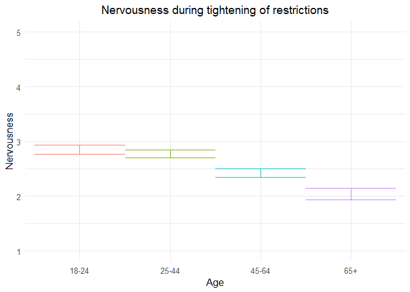
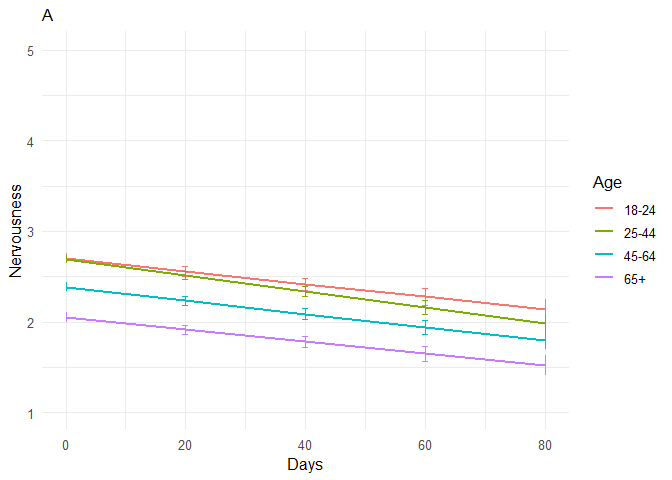
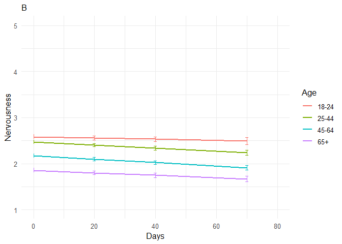
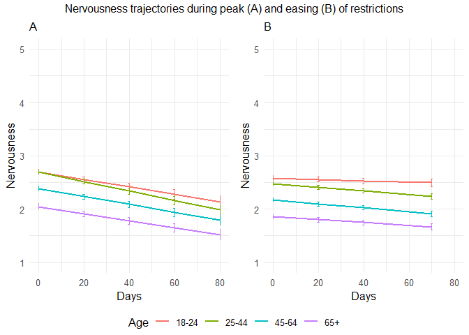

211109 nervousness additional analyses
================
Anne Margit
11/05/2021

``` r
load("data_analyse2_p1.Rdata")
load("data_analyse2_p2.Rdata")
load("data_analyse2_p3.Rdata")
```

``` r
options(scipen=999)

library(dplyr)
library(tidyverse)
library(ggpubr)
library(ggplot2)
library(rockchalk)
library(effects)
library(nlme)
library(lattice)
library(broom.mixed)
library(purrr)
library(stargazer)
```

    ## Warning: package 'stargazer' was built under R version 4.0.3

``` r
library(viridis)  
```

    ## Warning: package 'viridis' was built under R version 4.0.3

``` r
data_analyse2_p1$Edu <- as.numeric(data_analyse2_p1$Edu)
```

# Phase 1

*Random: IC for ID and Country + Covariates Gender and Education*

``` r
model_Nervp1 <- lme(fixed = Nerv ~ Gender + Edu + Age_new,
                  random = ~1 | Country/ID, 
                  data = data_analyse2_p1, 
                  na.action = na.omit)

summary(model_Nervp1)
```

    Linear mixed-effects model fit by REML
     Data: data_analyse2_p1 
           AIC   BIC   logLik
      12493.02 12550 -6237.51
    
    Random effects:
     Formula: ~1 | Country
            (Intercept)
    StdDev:   0.2797207
    
     Formula: ~1 | ID %in% Country
            (Intercept)  Residual
    StdDev:   0.8005592 0.8096566
    
    Fixed effects: Nerv ~ Gender + Edu + Age_new 
                     Value  Std.Error   DF   t-value p-value
    (Intercept)  2.6590599 0.11451097 2716 23.221005  0.0000
    Gender1      0.2763717 0.04479561 2716  6.169617  0.0000
    Edu          0.0020359 0.01627834 2716  0.125069  0.9005
    Age_new1    -0.0818073 0.06235782 2716 -1.311902  0.1897
    Age_new2    -0.4329613 0.06614629 2716 -6.545511  0.0000
    Age_new3    -0.8153243 0.09382621 2716 -8.689729  0.0000
     Correlation: 
             (Intr) Gendr1 Edu    Ag_nw1 Ag_nw2
    Gender1  -0.294                            
    Edu      -0.584 -0.045                     
    Age_new1 -0.253  0.079 -0.247              
    Age_new2 -0.298  0.129 -0.163  0.713       
    Age_new3 -0.255  0.184 -0.099  0.493  0.497
    
    Standardized Within-Group Residuals:
            Min          Q1         Med          Q3         Max 
    -2.56409702 -0.59091725 -0.06181333  0.57337719  2.94009325 
    
    Number of Observations: 4155
    Number of Groups: 
            Country ID %in% Country 
                 26            2747 

*Plot of predicted values*

``` r
ef_Nervp1 <- effect("Age_new", model_Nervp1)

plot_Nervp1 <- ggplot(as.data.frame(ef_Nervp1), 
  aes(Age_new, fit, color=Age_new)) + geom_line() + 
  geom_errorbar(aes(ymin=fit-se, ymax=fit+se), width=1) + theme_minimal(base_size=12) + 
  labs(title="Nervousness during tightening of restrictions", y = "Nervousness") +
  theme(plot.title = element_text(hjust = 0.5)) +
  scale_x_discrete(name ="Age", labels=c("18-24", "25-44", "45-64", "65+")) +
  theme(legend.position = "none") +                 
  scale_color_discrete() + 
  expand_limits(y=c(1, 5))
```

``` r
plot_Nervp1
```

<!-- -->

``` r
intervals(model_Nervp1)
```

    Approximate 95% confidence intervals
    
     Fixed effects:
                      lower         est.       upper
    (Intercept)  2.43452242  2.659059874  2.88359732
    Gender1      0.18853481  0.276371726  0.36420865
    Edu         -0.02988328  0.002035915  0.03395511
    Age_new1    -0.20408091 -0.081807334  0.04046624
    Age_new2    -0.56266342 -0.432961268 -0.30325912
    Age_new3    -0.99930233 -0.815324339 -0.63134635
    attr(,"label")
    [1] "Fixed effects:"
    
     Random Effects:
      Level: Country 
                        lower      est.    upper
    sd((Intercept)) 0.1852294 0.2797207 0.422415
      Level: ID 
                        lower      est.     upper
    sd((Intercept)) 0.7595792 0.8005592 0.8437502
    
     Within-group standard error:
        lower      est.     upper 
    0.7812502 0.8096566 0.8390959 

``` r
VarCorr(model_Nervp1)
```

``` 
            Variance     StdDev   
Country =   pdLogChol(1)          
(Intercept) 0.07824369   0.2797207
ID =        pdLogChol(1)          
(Intercept) 0.64089504   0.8005592
Residual    0.65554380   0.8096566
```

*Effect sizes*

``` r
ISDs <- data_analyse2_p1 %>% 
  group_by(ID) %>%
  summarize_at(c("Nerv"), sd, na.rm=TRUE) %>%
  ungroup()

ISDs_av <- ISDs %>%
  summarize_at(c("Nerv"), mean, na.rm=TRUE) %>%
  stack() %>%
  rename(sd=values) 
```

> Effect size = regression coefficient / average ISD of Nervousness

``` r
coef_Nervp1 = tidy(model_Nervp1, 
               effects = "fixed")

coef_Nervp1 <- coef_Nervp1 %>%
  mutate (e_size = estimate/0.6072834) %>% 
  mutate(across(2:7, round, 2)) 
```

``` r
coef_Nervp1
```

    ## # A tibble: 6 x 7
    ##   term        estimate std.error    df statistic p.value e_size
    ##   <chr>          <dbl>     <dbl> <dbl>     <dbl>   <dbl>  <dbl>
    ## 1 (Intercept)     2.66      0.11  2716     23.2     0      4.38
    ## 2 Gender1         0.28      0.04  2716      6.17    0      0.46
    ## 3 Edu             0         0.02  2716      0.13    0.9    0   
    ## 4 Age_new1       -0.08      0.06  2716     -1.31    0.19  -0.13
    ## 5 Age_new2       -0.43      0.07  2716     -6.55    0     -0.71
    ## 6 Age_new3       -0.82      0.09  2716     -8.69    0     -1.34

``` r
coef_Nervp1 <- as.matrix(coef_Nervp1)
```

# Phase 2

*Best model*

> Random intercept for ID and Country, random slope for Country and ID,
> no correlation between random intercept and slope for Country, AR
> correlation structure at Measurement level

``` r
data_analyse2_p2$Edu <- as.numeric(data_analyse2_p2$Edu)

data_analyse2_p2 <- data_analyse2_p2[with(data_analyse2_p2, order(Country, ID, Time)),]
data_analyse2_p2$Time <- as.numeric(data_analyse2_p2$Time)

model_Nervp2 <- lme(fixed = Nerv ~ Gender + Edu + DaysMax_p2 + Age_new + DaysMax_p2*Age_new,
                  random = list(Country = pdDiag(~DaysMax_p2), ID = ~DaysMax_p2),  
                  data = data_analyse2_p2, 
                  na.action = na.omit,
                  correlation = corAR1(form = ~ Time | Country/ID))
summary(model_Nervp2)
```

    Linear mixed-effects model fit by REML
     Data: data_analyse2_p2 
           AIC      BIC    logLik
      79535.34 79676.34 -39750.67
    
    Random effects:
     Formula: ~DaysMax_p2 | Country
     Structure: Diagonal
            (Intercept)  DaysMax_p2
    StdDev:   0.2020044 0.004130583
    
     Formula: ~DaysMax_p2 | ID %in% Country
     Structure: General positive-definite, Log-Cholesky parametrization
                StdDev      Corr  
    (Intercept) 0.851213101 (Intr)
    DaysMax_p2  0.008836877 -0.342
    Residual    0.749236863       
    
    Correlation Structure: ARMA(1,0)
     Formula: ~Time | Country/ID 
     Parameter estimate(s):
        Phi1 
    0.217945 
    Fixed effects: Nerv ~ Gender + Edu + DaysMax_p2 + Age_new + DaysMax_p2 * Age_new 
                             Value  Std.Error    DF   t-value p-value
    (Intercept)          2.6328693 0.06260882 20356  42.05269  0.0000
    Gender1              0.2161056 0.02178715  9176   9.91895  0.0000
    Edu                 -0.0178525 0.00713645  9176  -2.50160  0.0124
    DaysMax_p2          -0.0070488 0.00153472 20356  -4.59289  0.0000
    Age_new1            -0.0082007 0.04431143  9176  -0.18507  0.8532
    Age_new2            -0.3159029 0.04560399  9176  -6.92709  0.0000
    Age_new3            -0.6522841 0.05519030  9176 -11.81882  0.0000
    DaysMax_p2:Age_new1 -0.0017845 0.00130506 20356  -1.36740  0.1715
    DaysMax_p2:Age_new2 -0.0003455 0.00133042 20356  -0.25973  0.7951
    DaysMax_p2:Age_new3  0.0004385 0.00151761 20356   0.28896  0.7726
     Correlation: 
                        (Intr) Gendr1 Edu    DysM_2 Ag_nw1 Ag_nw2 Ag_nw3 DM_2:A_1
    Gender1             -0.263                                                   
    Edu                 -0.426 -0.030                                            
    DaysMax_p2          -0.308  0.005 -0.008                                     
    Age_new1            -0.396  0.042 -0.208  0.383                              
    Age_new2            -0.425  0.071 -0.130  0.369  0.751                       
    Age_new3            -0.384  0.136 -0.089  0.306  0.622  0.627                
    DaysMax_p2:Age_new1  0.304  0.001  0.028 -0.627 -0.630 -0.493 -0.409         
    DaysMax_p2:Age_new2  0.295  0.000  0.031 -0.612 -0.498 -0.648 -0.412  0.808  
    DaysMax_p2:Age_new3  0.266 -0.011  0.020 -0.539 -0.437 -0.437 -0.664  0.710  
                        DM_2:A_2
    Gender1                     
    Edu                         
    DaysMax_p2                  
    Age_new1                    
    Age_new2                    
    Age_new3                    
    DaysMax_p2:Age_new1         
    DaysMax_p2:Age_new2         
    DaysMax_p2:Age_new3  0.708  
    
    Standardized Within-Group Residuals:
           Min         Q1        Med         Q3        Max 
    -4.0457937 -0.5566805 -0.1208926  0.5407339  4.6081803 
    
    Number of Observations: 29574
    Number of Groups: 
            Country ID %in% Country 
                 33            9214 

*Plot of predicted values*

``` r
ef_Nervp2 <- effect("DaysMax_p2:Age_new", model_Nervp2)
plot_Nervp2 <- ggplot(as.data.frame(ef_Nervp2), aes(DaysMax_p2, fit, color=Age_new)) + 
  geom_line(size=1) + 
  geom_errorbar(aes(ymin=fit-se, ymax=fit+se), width=1) + 
  theme_minimal(base_size=12) + 
  labs(title="A",
       x="Days", y = "Nervousness") +
  xlim(0,80)+
  theme(plot.title = element_text(size=12)) +
  scale_color_discrete(name="Age", labels = c("18-24", "25-44", "45-64", "65+")) + 
  expand_limits(y=c(1, 5))
```

``` r
plot_Nervp2
```

<!-- -->

``` r
VarCorr(model_Nervp2)
```

``` 
            Variance              StdDev      Corr  
Country =   pdDiag(DaysMax_p2)                      
(Intercept) 0.04080576831         0.202004377       
DaysMax_p2  0.00001706172         0.004130583       
ID =        pdLogChol(DaysMax_p2)                   
(Intercept) 0.72456374396         0.851213101 (Intr)
DaysMax_p2  0.00007809040         0.008836877 -0.342
Residual    0.56135587617         0.749236863       
```

``` r
intervals(model_Nervp2, which = 'fixed')
```

    Approximate 95% confidence intervals
    
     Fixed effects:
                               lower          est.         upper
    (Intercept)          2.510150920  2.6328692538  2.7555875875
    Gender1              0.173397947  0.2161056130  0.2588132789
    Edu                 -0.031841571 -0.0178525327 -0.0038634948
    DaysMax_p2          -0.010056998 -0.0070488158 -0.0040406335
    Age_new1            -0.095061002 -0.0082007374  0.0786595272
    Age_new2            -0.405296846 -0.3159028859 -0.2265089258
    Age_new3            -0.760469328 -0.6522840518 -0.5440987754
    DaysMax_p2:Age_new1 -0.004342556 -0.0017845359  0.0007734845
    DaysMax_p2:Age_new2 -0.002953285 -0.0003455479  0.0022621889
    DaysMax_p2:Age_new3 -0.002536108  0.0004385320  0.0034131721
    attr(,"label")
    [1] "Fixed effects:"

*Effect sizes*

**Within person SD and average within person SD**

``` r
ISDs <- data_analyse2_p2 %>% 
  group_by(ID) %>%
  summarize_at(c("DaysMax_p2", "Nerv"), sd, na.rm=TRUE) %>%
  ungroup()

ISDs_av <- ISDs %>%
  summarize_at(c("DaysMax_p2", "Nerv"), mean, na.rm=TRUE) %>%
  stack() %>%
  rename(sd=values) 
```

> Effect sizes for intercept and main effect of age and covariates =
> regression coefficient / average ISD of Nervousness Effect size for
> main effect of DaysMax = (regression coefficient \* 28)/ average ISD
> of Nervousness Effect sizes for interaction effects = (regression
> coefficient \* 28)/ average ISD of Nervousness The effect sizes for
> main effect of DaysMax and the interaction effects reflect the
> increase in SD of Nervousness over 4 weeks (28 days)

``` r
coef_Nervp2 = tidy(model_Nervp2, 
               effects = "fixed")
coef_Nervp2 <- coef_Nervp2 %>%
  mutate(e_size = ifelse(row_number()== 1 | row_number()== 2 |  row_number()== 3 |  row_number()== 5 |  row_number()== 6 |  row_number()== 7, estimate/0.588966, (estimate*28)/0.588966)) %>%
  mutate(across(2:7, round, 2)) 
```

``` r
coef_Nervp2 <- as.matrix(coef_Nervp2)
coef_Nervp2
```

    ##       term                  estimate std.error df      statistic p.value
    ##  [1,] "(Intercept)"         " 2.63"  "0.06"    "20356" " 42.05"  "0.00" 
    ##  [2,] "Gender1"             " 0.22"  "0.02"    " 9176" "  9.92"  "0.00" 
    ##  [3,] "Edu"                 "-0.02"  "0.01"    " 9176" " -2.50"  "0.01" 
    ##  [4,] "DaysMax_p2"          "-0.01"  "0.00"    "20356" " -4.59"  "0.00" 
    ##  [5,] "Age_new1"            "-0.01"  "0.04"    " 9176" " -0.19"  "0.85" 
    ##  [6,] "Age_new2"            "-0.32"  "0.05"    " 9176" " -6.93"  "0.00" 
    ##  [7,] "Age_new3"            "-0.65"  "0.06"    " 9176" "-11.82"  "0.00" 
    ##  [8,] "DaysMax_p2:Age_new1" " 0.00"  "0.00"    "20356" " -1.37"  "0.17" 
    ##  [9,] "DaysMax_p2:Age_new2" " 0.00"  "0.00"    "20356" " -0.26"  "0.80" 
    ## [10,] "DaysMax_p2:Age_new3" " 0.00"  "0.00"    "20356" "  0.29"  "0.77" 
    ##       e_size 
    ##  [1,] " 4.47"
    ##  [2,] " 0.37"
    ##  [3,] "-0.03"
    ##  [4,] "-0.34"
    ##  [5,] "-0.01"
    ##  [6,] "-0.54"
    ##  [7,] "-1.11"
    ##  [8,] "-0.08"
    ##  [9,] "-0.02"
    ## [10,] " 0.02"

# Phase 3

> Random intercept for ID and Country, random slope for ID and AR
> correlation structure at Measurement level

``` r
data_analyse2_p3$Edu <- as.numeric(data_analyse2_p3$Edu)
data_analyse2_p3 <- data_analyse2_p3[with(data_analyse2_p3, order(Country, ID, Time)),]
data_analyse2_p3$Time <- as.numeric(data_analyse2_p3$Time)
model_Nervp3 <- lme(fixed = Nerv ~ Gender + Edu + DaysPhase3 + Age_new + DaysPhase3*Age_new,
                  random = list (Country = ~1, ID = ~DaysPhase3), 
                  data = data_analyse2_p3, 
                  na.action = na.omit,
                  correlation = corAR1(form = ~ Time | Country/ID))
summary(model_Nervp3)
```

    Linear mixed-effects model fit by REML
     Data: data_analyse2_p3 
           AIC      BIC    logLik
      64890.58 65020.59 -32429.29
    
    Random effects:
     Formula: ~1 | Country
            (Intercept)
    StdDev:   0.1736424
    
     Formula: ~DaysPhase3 | ID %in% Country
     Structure: General positive-definite, Log-Cholesky parametrization
                StdDev     Corr  
    (Intercept) 0.84788045 (Intr)
    DaysPhase3  0.01015745 -0.374
    Residual    0.70932815       
    
    Correlation Structure: ARMA(1,0)
     Formula: ~Time | Country/ID 
     Parameter estimate(s):
         Phi1 
    0.1310444 
    Fixed effects: Nerv ~ Gender + Edu + DaysPhase3 + Age_new + DaysPhase3 * Age_new 
                             Value  Std.Error    DF   t-value p-value
    (Intercept)          2.5709633 0.06200820 17940  41.46167  0.0000
    Gender1              0.1425115 0.02402738  7009   5.93121  0.0000
    Edu                 -0.0183165 0.00798939  7009  -2.29261  0.0219
    DaysPhase3          -0.0012737 0.00122479 17940  -1.03997  0.2984
    Age_new1            -0.1137097 0.04747792  7009  -2.39500  0.0166
    Age_new2            -0.4103150 0.04660520  7009  -8.80406  0.0000
    Age_new3            -0.7273326 0.05332370  7009 -13.63995  0.0000
    DaysPhase3:Age_new1 -0.0019881 0.00141652 17940  -1.40353  0.1605
    DaysPhase3:Age_new2 -0.0024582 0.00137160 17940  -1.79225  0.0731
    DaysPhase3:Age_new3 -0.0014185 0.00151765 17940  -0.93466  0.3500
     Correlation: 
                        (Intr) Gendr1 Edu    DysPh3 Ag_nw1 Ag_nw2 Ag_nw3 DP3:A_1
    Gender1             -0.303                                                  
    Edu                 -0.484 -0.027                                           
    DaysPhase3          -0.365 -0.002 -0.007                                    
    Age_new1            -0.438  0.049 -0.208  0.483                             
    Age_new2            -0.515  0.101 -0.107  0.491  0.750                      
    Age_new3            -0.494  0.176 -0.069  0.429  0.658  0.697               
    DaysPhase3:Age_new1  0.319 -0.001  0.004 -0.862 -0.565 -0.426 -0.373        
    DaysPhase3:Age_new2  0.328  0.002  0.007 -0.891 -0.433 -0.563 -0.386  0.770 
    DaysPhase3:Age_new3  0.299 -0.003  0.002 -0.805 -0.390 -0.398 -0.555  0.696 
                        DP3:A_2
    Gender1                    
    Edu                        
    DaysPhase3                 
    Age_new1                   
    Age_new2                   
    Age_new3                   
    DaysPhase3:Age_new1        
    DaysPhase3:Age_new2        
    DaysPhase3:Age_new3  0.720 
    
    Standardized Within-Group Residuals:
           Min         Q1        Med         Q3        Max 
    -3.8418614 -0.5040229 -0.1500453  0.5075569  4.9032376 
    
    Number of Observations: 24990
    Number of Groups: 
            Country ID %in% Country 
                 32            7046 

``` r
VarCorr(model_Nervp3)
```

``` 
            Variance              StdDev     Corr  
Country =   pdLogChol(1)                           
(Intercept) 0.0301516968          0.17364244       
ID =        pdLogChol(DaysPhase3)                  
(Intercept) 0.7189012522          0.84788045 (Intr)
DaysPhase3  0.0001031737          0.01015745 -0.374
Residual    0.5031464188          0.70932815       
```

*Confidence intervals*

``` r
intervals(model_Nervp3, which = 'fixed')
```

    Approximate 95% confidence intervals
    
     Fixed effects:
                               lower         est.         upper
    (Intercept)          2.449421272  2.570963310  2.6925053483
    Gender1              0.095410574  0.142511503  0.1896124326
    Edu                 -0.033978153 -0.018316532 -0.0026549100
    DaysPhase3          -0.003674447 -0.001273745  0.0011269567
    Age_new1            -0.206780814 -0.113709721 -0.0206386282
    Age_new2            -0.501675276 -0.410314981 -0.3189546865
    Age_new3            -0.831863208 -0.727332623 -0.6228020376
    DaysPhase3:Age_new1 -0.004764637 -0.001988125  0.0007883865
    DaysPhase3:Age_new2 -0.005146707 -0.002458245  0.0002302165
    DaysPhase3:Age_new3 -0.004393226 -0.001418491  0.0015562441
    attr(,"label")
    [1] "Fixed effects:"

*Plot of predicted values*

``` r
ef_Nervp3 <- effect("DaysPhase3:Age_new", model_Nervp3)
plot_Nervp3 <- ggplot(as.data.frame(ef_Nervp3), aes(DaysPhase3, fit, color=Age_new)) + 
  geom_line(size=1) + 
  geom_errorbar(aes(ymin=fit-se, ymax=fit+se), width=1) + 
  theme_minimal(base_size=12) + 
  xlim(0,80)+
  labs(title="B",
       x="Days", y = "Nervousness") +
  theme(plot.title = element_text(size = 12)) +
  scale_color_discrete(name="Age", labels = c("18-24", "25-44", "45-64", "65+")) + 
  expand_limits(y=c(1, 5))
```

``` r
plot_Nervp3
```

    ## Warning: Removed 4 row(s) containing missing values (geom_path).

<!-- -->

``` r
plot_Nervp2and3 <- ggarrange(plot_Nervp2, plot_Nervp3 , 
          ncol = 2, nrow = 1, common.legend=TRUE, legend= "bottom")
```

    ## Warning: Removed 4 row(s) containing missing values (geom_path).

``` r
plot_Nervp2and3 <- annotate_figure(plot_Nervp2and3,top = text_grob("Nervousness trajectories during peak (A) and easing (B) of restrictions", size = 12))
```

``` r
plot_Nervp2and3
```

<!-- -->

*Effect sizes* **Within person SD and average within person SD for
Nervousness**

``` r
ISDs <- data_analyse2_p3 %>% 
  group_by(ID) %>%
  summarize_at(c("Nerv"), sd, na.rm=TRUE) %>%
  ungroup()
ISDs_av <- ISDs %>%
  summarize_at(c("Nerv"), mean, na.rm=TRUE) %>%
  stack() %>%
  rename(sd=values) 
```

> Effect sizes for intercept and main effect of age = regression
> coefficient / average ISD of Nervousness Effect size for main effect
> of DaysMax = (regression coefficient \* 28)/ average ISD of
> Nervousness Effect sizes for interaction effects = (regression
> coefficient \* 28)/ average ISD of Nervousness The effect sizes for
> main effect of DaysMax and the interaction effects reflect the
> increase in SD of Nervousness over 4 weeks (28 days)

``` r
coef_Nervp3 = tidy(model_Nervp3, 
               effects = "fixed")
coef_Nervp3 <- coef_Nervp3 %>%
 mutate(e_size = ifelse(row_number()== 1 | row_number()== 2 |  row_number()== 3 |  row_number()== 5 |  row_number()== 6 |  row_number()== 7, estimate/0.5481823, (estimate*28)/0.5481823)) %>%
  mutate(across(2:7, round, 2)) 
```

``` r
coef_Nervp3 <- as.matrix(coef_Nervp3)
coef_Nervp3
```

    ##       term                  estimate std.error df      statistic p.value
    ##  [1,] "(Intercept)"         " 2.57"  "0.06"    "17940" " 41.46"  "0.00" 
    ##  [2,] "Gender1"             " 0.14"  "0.02"    " 7009" "  5.93"  "0.00" 
    ##  [3,] "Edu"                 "-0.02"  "0.01"    " 7009" " -2.29"  "0.02" 
    ##  [4,] "DaysPhase3"          " 0.00"  "0.00"    "17940" " -1.04"  "0.30" 
    ##  [5,] "Age_new1"            "-0.11"  "0.05"    " 7009" " -2.40"  "0.02" 
    ##  [6,] "Age_new2"            "-0.41"  "0.05"    " 7009" " -8.80"  "0.00" 
    ##  [7,] "Age_new3"            "-0.73"  "0.05"    " 7009" "-13.64"  "0.00" 
    ##  [8,] "DaysPhase3:Age_new1" " 0.00"  "0.00"    "17940" " -1.40"  "0.16" 
    ##  [9,] "DaysPhase3:Age_new2" " 0.00"  "0.00"    "17940" " -1.79"  "0.07" 
    ## [10,] "DaysPhase3:Age_new3" " 0.00"  "0.00"    "17940" " -0.93"  "0.35" 
    ##       e_size 
    ##  [1,] " 4.69"
    ##  [2,] " 0.26"
    ##  [3,] "-0.03"
    ##  [4,] "-0.07"
    ##  [5,] "-0.21"
    ##  [6,] "-0.75"
    ##  [7,] "-1.33"
    ##  [8,] "-0.10"
    ##  [9,] "-0.13"
    ## [10,] "-0.07"

``` r
stargazer(coef_Nervp1, coef_Nervp2, coef_Nervp3,
type="html", df = TRUE, out="star_coefNervp123.doc",  single.row=TRUE, digits = 2, align = TRUE)
```

    ## 
    ## <table style="text-align:center"><tr><td colspan="7" style="border-bottom: 1px solid black"></td></tr><tr><td>term</td><td>estimate</td><td>std.error</td><td>df</td><td>statistic</td><td>p.value</td><td>e_size</td></tr>
    ## <tr><td colspan="7" style="border-bottom: 1px solid black"></td></tr><tr><td>(Intercept)</td><td>2.66</td><td>0.11</td><td>2716</td><td>23.22</td><td>0.00</td><td>4.38</td></tr>
    ## <tr><td>Gender1</td><td>0.28</td><td>0.04</td><td>2716</td><td>6.17</td><td>0.00</td><td>0.46</td></tr>
    ## <tr><td>Edu</td><td>0.00</td><td>0.02</td><td>2716</td><td>0.13</td><td>0.90</td><td>0.00</td></tr>
    ## <tr><td>Age_new1</td><td>-0.08</td><td>0.06</td><td>2716</td><td>-1.31</td><td>0.19</td><td>-0.13</td></tr>
    ## <tr><td>Age_new2</td><td>-0.43</td><td>0.07</td><td>2716</td><td>-6.55</td><td>0.00</td><td>-0.71</td></tr>
    ## <tr><td>Age_new3</td><td>-0.82</td><td>0.09</td><td>2716</td><td>-8.69</td><td>0.00</td><td>-1.34</td></tr>
    ## <tr><td colspan="7" style="border-bottom: 1px solid black"></td></tr></table>
    ## 
    ## <table style="text-align:center"><tr><td colspan="7" style="border-bottom: 1px solid black"></td></tr><tr><td>term</td><td>estimate</td><td>std.error</td><td>df</td><td>statistic</td><td>p.value</td><td>e_size</td></tr>
    ## <tr><td colspan="7" style="border-bottom: 1px solid black"></td></tr><tr><td>(Intercept)</td><td>2.63</td><td>0.06</td><td>20356</td><td>42.05</td><td>0.00</td><td>4.47</td></tr>
    ## <tr><td>Gender1</td><td>0.22</td><td>0.02</td><td>9176</td><td>9.92</td><td>0.00</td><td>0.37</td></tr>
    ## <tr><td>Edu</td><td>-0.02</td><td>0.01</td><td>9176</td><td>-2.50</td><td>0.01</td><td>-0.03</td></tr>
    ## <tr><td>DaysMax_p2</td><td>-0.01</td><td>0.00</td><td>20356</td><td>-4.59</td><td>0.00</td><td>-0.34</td></tr>
    ## <tr><td>Age_new1</td><td>-0.01</td><td>0.04</td><td>9176</td><td>-0.19</td><td>0.85</td><td>-0.01</td></tr>
    ## <tr><td>Age_new2</td><td>-0.32</td><td>0.05</td><td>9176</td><td>-6.93</td><td>0.00</td><td>-0.54</td></tr>
    ## <tr><td>Age_new3</td><td>-0.65</td><td>0.06</td><td>9176</td><td>-11.82</td><td>0.00</td><td>-1.11</td></tr>
    ## <tr><td>DaysMax_p2:Age_new1</td><td>0.00</td><td>0.00</td><td>20356</td><td>-1.37</td><td>0.17</td><td>-0.08</td></tr>
    ## <tr><td>DaysMax_p2:Age_new2</td><td>0.00</td><td>0.00</td><td>20356</td><td>-0.26</td><td>0.80</td><td>-0.02</td></tr>
    ## <tr><td>DaysMax_p2:Age_new3</td><td>0.00</td><td>0.00</td><td>20356</td><td>0.29</td><td>0.77</td><td>0.02</td></tr>
    ## <tr><td colspan="7" style="border-bottom: 1px solid black"></td></tr></table>
    ## 
    ## <table style="text-align:center"><tr><td colspan="7" style="border-bottom: 1px solid black"></td></tr><tr><td>term</td><td>estimate</td><td>std.error</td><td>df</td><td>statistic</td><td>p.value</td><td>e_size</td></tr>
    ## <tr><td colspan="7" style="border-bottom: 1px solid black"></td></tr><tr><td>(Intercept)</td><td>2.57</td><td>0.06</td><td>17940</td><td>41.46</td><td>0.00</td><td>4.69</td></tr>
    ## <tr><td>Gender1</td><td>0.14</td><td>0.02</td><td>7009</td><td>5.93</td><td>0.00</td><td>0.26</td></tr>
    ## <tr><td>Edu</td><td>-0.02</td><td>0.01</td><td>7009</td><td>-2.29</td><td>0.02</td><td>-0.03</td></tr>
    ## <tr><td>DaysPhase3</td><td>0.00</td><td>0.00</td><td>17940</td><td>-1.04</td><td>0.30</td><td>-0.07</td></tr>
    ## <tr><td>Age_new1</td><td>-0.11</td><td>0.05</td><td>7009</td><td>-2.40</td><td>0.02</td><td>-0.21</td></tr>
    ## <tr><td>Age_new2</td><td>-0.41</td><td>0.05</td><td>7009</td><td>-8.80</td><td>0.00</td><td>-0.75</td></tr>
    ## <tr><td>Age_new3</td><td>-0.73</td><td>0.05</td><td>7009</td><td>-13.64</td><td>0.00</td><td>-1.33</td></tr>
    ## <tr><td>DaysPhase3:Age_new1</td><td>0.00</td><td>0.00</td><td>17940</td><td>-1.40</td><td>0.16</td><td>-0.10</td></tr>
    ## <tr><td>DaysPhase3:Age_new2</td><td>0.00</td><td>0.00</td><td>17940</td><td>-1.79</td><td>0.07</td><td>-0.13</td></tr>
    ## <tr><td>DaysPhase3:Age_new3</td><td>0.00</td><td>0.00</td><td>17940</td><td>-0.93</td><td>0.35</td><td>-0.07</td></tr>
    ## <tr><td colspan="7" style="border-bottom: 1px solid black"></td></tr></table>

``` r
stargazer(model_Nervp1, model_Nervp2, model_Nervp3,
type="html", df = TRUE, out="star_modelNervp123.doc",  single.row=TRUE, digits = 2, align = TRUE,
intercept.top = TRUE, intercept.bottom = FALSE)
```

    ## 
    ## <table style="text-align:center"><tr><td colspan="4" style="border-bottom: 1px solid black"></td></tr><tr><td style="text-align:left"></td><td colspan="3"><em>Dependent variable:</em></td></tr>
    ## <tr><td></td><td colspan="3" style="border-bottom: 1px solid black"></td></tr>
    ## <tr><td style="text-align:left"></td><td colspan="3">Nerv</td></tr>
    ## <tr><td style="text-align:left"></td><td>(1)</td><td>(2)</td><td>(3)</td></tr>
    ## <tr><td colspan="4" style="border-bottom: 1px solid black"></td></tr><tr><td style="text-align:left">Constant</td><td>2.66<sup>***</sup> (0.11)</td><td>2.63<sup>***</sup> (0.06)</td><td>2.57<sup>***</sup> (0.06)</td></tr>
    ## <tr><td style="text-align:left">Gender1</td><td>0.28<sup>***</sup> (0.04)</td><td>0.22<sup>***</sup> (0.02)</td><td>0.14<sup>***</sup> (0.02)</td></tr>
    ## <tr><td style="text-align:left">Edu</td><td>0.002 (0.02)</td><td>-0.02<sup>**</sup> (0.01)</td><td>-0.02<sup>**</sup> (0.01)</td></tr>
    ## <tr><td style="text-align:left">DaysMax_p2</td><td></td><td>-0.01<sup>***</sup> (0.002)</td><td></td></tr>
    ## <tr><td style="text-align:left">DaysPhase3</td><td></td><td></td><td>-0.001 (0.001)</td></tr>
    ## <tr><td style="text-align:left">Age_new1</td><td>-0.08 (0.06)</td><td>-0.01 (0.04)</td><td>-0.11<sup>**</sup> (0.05)</td></tr>
    ## <tr><td style="text-align:left">Age_new2</td><td>-0.43<sup>***</sup> (0.07)</td><td>-0.32<sup>***</sup> (0.05)</td><td>-0.41<sup>***</sup> (0.05)</td></tr>
    ## <tr><td style="text-align:left">Age_new3</td><td>-0.82<sup>***</sup> (0.09)</td><td>-0.65<sup>***</sup> (0.06)</td><td>-0.73<sup>***</sup> (0.05)</td></tr>
    ## <tr><td style="text-align:left">DaysMax_p2:Age_new1</td><td></td><td>-0.002 (0.001)</td><td></td></tr>
    ## <tr><td style="text-align:left">DaysMax_p2:Age_new2</td><td></td><td>-0.0003 (0.001)</td><td></td></tr>
    ## <tr><td style="text-align:left">DaysMax_p2:Age_new3</td><td></td><td>0.0004 (0.002)</td><td></td></tr>
    ## <tr><td style="text-align:left">DaysPhase3:Age_new1</td><td></td><td></td><td>-0.002 (0.001)</td></tr>
    ## <tr><td style="text-align:left">DaysPhase3:Age_new2</td><td></td><td></td><td>-0.002<sup>*</sup> (0.001)</td></tr>
    ## <tr><td style="text-align:left">DaysPhase3:Age_new3</td><td></td><td></td><td>-0.001 (0.002)</td></tr>
    ## <tr><td colspan="4" style="border-bottom: 1px solid black"></td></tr><tr><td style="text-align:left">Observations</td><td>4,155</td><td>29,574</td><td>24,990</td></tr>
    ## <tr><td style="text-align:left">Log Likelihood</td><td>-6,237.51</td><td>-39,750.67</td><td>-32,429.29</td></tr>
    ## <tr><td style="text-align:left">Akaike Inf. Crit.</td><td>12,493.02</td><td>79,535.34</td><td>64,890.58</td></tr>
    ## <tr><td style="text-align:left">Bayesian Inf. Crit.</td><td>12,550.00</td><td>79,676.34</td><td>65,020.59</td></tr>
    ## <tr><td colspan="4" style="border-bottom: 1px solid black"></td></tr><tr><td style="text-align:left"><em>Note:</em></td><td colspan="3" style="text-align:right"><sup>*</sup>p<0.1; <sup>**</sup>p<0.05; <sup>***</sup>p<0.01</td></tr>
    ## </table>
