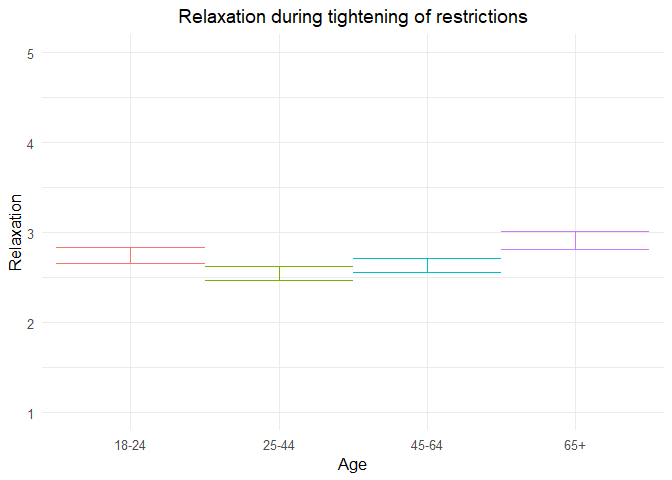
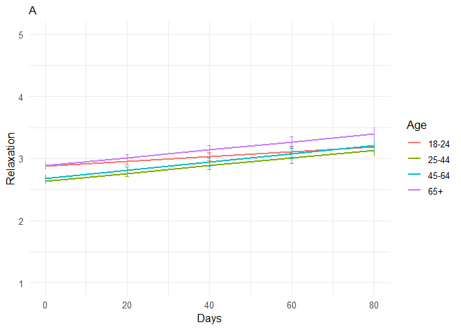
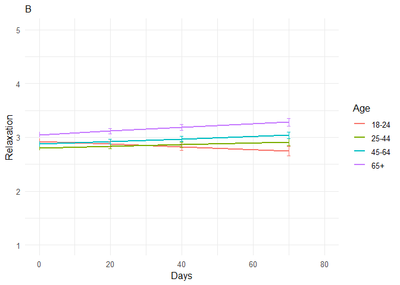
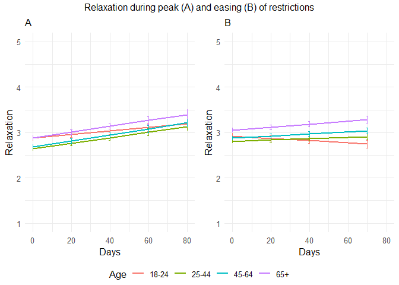

211110 Relaxed additional analyses
================
Anne Margit
11/05/2021

``` r
load("data_analyse2_p1.Rdata")
load("data_analyse2_p2.Rdata")
load("data_analyse2_p3.Rdata")
```

``` r
options(scipen=999)

library(dplyr)
library(tidyverse)
library(ggpubr)
library(ggplot2)
library(rockchalk)
library(effects)
library(nlme)
library(lattice)
library(broom.mixed)
library(purrr)
library(stargazer)
```

    ## Warning: package 'stargazer' was built under R version 4.0.3

``` r
library(viridis)  
```

    ## Warning: package 'viridis' was built under R version 4.0.3

``` r
data_analyse2_p1$Edu <- as.numeric(data_analyse2_p1$Edu)
```

# Phase 1

*Random: IC for ID and Country + Covariates Gender and Education*

``` r
model_Relp1 <- lme(fixed = Rel ~ Gender + Edu + Age_new,
                  random = ~1 | Country/ID, 
                  data = data_analyse2_p1, 
                  na.action = na.omit)

summary(model_Relp1)
```

    Linear mixed-effects model fit by REML
     Data: data_analyse2_p1 
           AIC      BIC    logLik
      11956.35 12013.33 -5969.175
    
    Random effects:
     Formula: ~1 | Country
            (Intercept)
    StdDev:   0.3055844
    
     Formula: ~1 | ID %in% Country
            (Intercept) Residual
    StdDev:   0.7042133 0.785612
    
    Fixed effects: Rel ~ Gender + Edu + Age_new 
                     Value  Std.Error   DF   t-value p-value
    (Intercept)  2.8244568 0.11186172 2716 25.249539  0.0000
    Gender1     -0.2717002 0.04116208 2716 -6.600741  0.0000
    Edu          0.0241957 0.01497386 2716  1.615861  0.1062
    Age_new1    -0.2033334 0.05725209 2716 -3.551546  0.0004
    Age_new2    -0.1119582 0.06079679 2716 -1.841516  0.0657
    Age_new3     0.1609023 0.08651977 2716  1.859717  0.0630
     Correlation: 
             (Intr) Gendr1 Edu    Ag_nw1 Ag_nw2
    Gender1  -0.277                            
    Edu      -0.550 -0.046                     
    Age_new1 -0.237  0.080 -0.248              
    Age_new2 -0.280  0.130 -0.165  0.713       
    Age_new3 -0.238  0.185 -0.100  0.492  0.496
    
    Standardized Within-Group Residuals:
             Min           Q1          Med           Q3          Max 
    -2.661276586 -0.612037280  0.005354655  0.559020298  3.404244280 
    
    Number of Observations: 4155
    Number of Groups: 
            Country ID %in% Country 
                 26            2747 

*Plot of predicted values*

``` r
ef_Relp1 <- effect("Age_new", model_Relp1)

plot_Relp1 <- ggplot(as.data.frame(ef_Relp1), 
  aes(Age_new, fit, color=Age_new)) + geom_line() + 
  geom_errorbar(aes(ymin=fit-se, ymax=fit+se), width=1) + theme_minimal(base_size=12) + 
  labs(title="Relaxation during tightening of restrictions", y = "Relaxation") +
  theme(plot.title = element_text(hjust = 0.5)) +
  scale_x_discrete(name ="Age", labels=c("18-24", "25-44", "45-64", "65+")) +
  theme(legend.position = "none") +                 
  scale_color_discrete() + 
  expand_limits(y=c(1, 5))
```

``` r
plot_Relp1
```

<!-- -->

``` r
intervals(model_Relp1)
```

    Approximate 95% confidence intervals
    
     Fixed effects:
                       lower        est.        upper
    (Intercept)  2.605114104  2.82445679  3.043799470
    Gender1     -0.352412387 -0.27170022 -0.190988062
    Edu         -0.005165642  0.02419568  0.053556995
    Age_new1    -0.315595469 -0.20333342 -0.091071362
    Age_new2    -0.231170886 -0.11195824  0.007254406
    Age_new3    -0.008748928  0.16090231  0.330553548
    attr(,"label")
    [1] "Fixed effects:"
    
     Random Effects:
      Level: Country 
                        lower      est.    upper
    sd((Intercept)) 0.2098718 0.3055844 0.444947
      Level: ID 
                        lower      est.    upper
    sd((Intercept)) 0.6639707 0.7042133 0.746895
    
     Within-group standard error:
        lower      est.     upper 
    0.7580167 0.7856120 0.8142120 

``` r
VarCorr(model_Relp1)
```

``` 
            Variance     StdDev   
Country =   pdLogChol(1)          
(Intercept) 0.09338182   0.3055844
ID =        pdLogChol(1)          
(Intercept) 0.49591642   0.7042133
Residual    0.61718627   0.7856120
```

*Effect sizes*

``` r
ISDs <- data_analyse2_p1 %>% 
  group_by(ID) %>%
  summarize_at(c("Rel"), sd, na.rm=TRUE) %>%
  ungroup()

ISDs_av <- ISDs %>%
  summarize_at(c("Rel"), mean, na.rm=TRUE) %>%
  stack() %>%
  rename(sd=values) 
```

> Effect size = regression coefficient / average ISD of Relaxation

``` r
coef_Relp1 = tidy(model_Relp1, 
               effects = "fixed")

coef_Relp1 <- coef_Relp1 %>%
  mutate (e_size = estimate/0.5787702) %>% 
  mutate(across(2:7, round, 2)) 
```

``` r
coef_Relp1
```

    ## # A tibble: 6 x 7
    ##   term        estimate std.error    df statistic p.value e_size
    ##   <chr>          <dbl>     <dbl> <dbl>     <dbl>   <dbl>  <dbl>
    ## 1 (Intercept)     2.82      0.11  2716     25.2     0      4.88
    ## 2 Gender1        -0.27      0.04  2716     -6.6     0     -0.47
    ## 3 Edu             0.02      0.01  2716      1.62    0.11   0.04
    ## 4 Age_new1       -0.2       0.06  2716     -3.55    0     -0.35
    ## 5 Age_new2       -0.11      0.06  2716     -1.84    0.07  -0.19
    ## 6 Age_new3        0.16      0.09  2716      1.86    0.06   0.28

``` r
coef_Relp1 <- as.matrix(coef_Relp1)
```

# Phase 2

*Best model*

> Random intercept for ID and Country, random slope for ID and country,
> no correlation between IC and S for ID and country + AR correlation
> structure at Measurement level

``` r
data_analyse2_p2$Edu <- as.numeric(data_analyse2_p2$Edu)
data_analyse2_p2 <- data_analyse2_p2[with(data_analyse2_p2, order(Country, ID, Time)),]
data_analyse2_p2$Time <- as.numeric(data_analyse2_p2$Time)
model_Relp2 <- lme(fixed = Rel ~ Gender + Edu + DaysMax_p2 + Age_new + DaysMax_p2*Age_new,
                  random = list(Country= pdDiag(~DaysMax_p2), ID = pdDiag(~DaysMax_p2)), 
                  data = data_analyse2_p2, 
                  na.action = na.omit,
                  correlation = corAR1(form = ~ Time | Country/ID))
summary(model_Relp2)
```

    Linear mixed-effects model fit by REML
     Data: data_analyse2_p2 
           AIC      BIC    logLik
      77067.33 77200.04 -38517.66
    
    Random effects:
     Formula: ~DaysMax_p2 | Country
     Structure: Diagonal
            (Intercept)  DaysMax_p2
    StdDev:    0.241939 0.004140159
    
     Formula: ~DaysMax_p2 | ID %in% Country
     Structure: Diagonal
            (Intercept)  DaysMax_p2  Residual
    StdDev:   0.7385255 0.004928912 0.7258038
    
    Correlation Structure: ARMA(1,0)
     Formula: ~Time | Country/ID 
     Parameter estimate(s):
         Phi1 
    0.1813235 
    Fixed effects: Rel ~ Gender + Edu + DaysMax_p2 + Age_new + DaysMax_p2 * Age_new 
                             Value  Std.Error    DF   t-value p-value
    (Intercept)          2.9432368 0.06444656 20356  45.66942  0.0000
    Gender1             -0.2580986 0.02043255  9176 -12.63174  0.0000
    Edu                  0.0239037 0.00669871  9176   3.56841  0.0004
    DaysMax_p2           0.0038925 0.00146790 20356   2.65177  0.0080
    Age_new1            -0.2368785 0.04043412  9176  -5.85838  0.0000
    Age_new2            -0.1981759 0.04163893  9176  -4.75939  0.0000
    Age_new3             0.0076583 0.05039854  9176   0.15195  0.8792
    DaysMax_p2:Age_new1  0.0022474 0.00119571 20356   1.87955  0.0602
    DaysMax_p2:Age_new2  0.0028033 0.00121721 20356   2.30302  0.0213
    DaysMax_p2:Age_new3  0.0024940 0.00138339 20356   1.80284  0.0714
     Correlation: 
                        (Intr) Gendr1 Edu    DysM_2 Ag_nw1 Ag_nw2 Ag_nw3 DM_2:A_1
    Gender1             -0.239                                                   
    Edu                 -0.391 -0.030                                            
    DaysMax_p2          -0.260  0.005 -0.006                                     
    Age_new1            -0.344  0.042 -0.215  0.352                              
    Age_new2            -0.371  0.072 -0.135  0.338  0.754                       
    Age_new3            -0.335  0.137 -0.093  0.280  0.625  0.631                
    DaysMax_p2:Age_new1  0.258  0.001  0.027 -0.602 -0.607 -0.479 -0.398         
    DaysMax_p2:Age_new2  0.251  0.001  0.031 -0.588 -0.485 -0.625 -0.401  0.815  
    DaysMax_p2:Age_new3  0.226 -0.009  0.021 -0.519 -0.427 -0.428 -0.640  0.719  
                        DM_2:A_2
    Gender1                     
    Edu                         
    DaysMax_p2                  
    Age_new1                    
    Age_new2                    
    Age_new3                    
    DaysMax_p2:Age_new1         
    DaysMax_p2:Age_new2         
    DaysMax_p2:Age_new3  0.717  
    
    Standardized Within-Group Residuals:
            Min          Q1         Med          Q3         Max 
    -4.72740044 -0.56000008  0.05103788  0.57265886  3.83862168 
    
    Number of Observations: 29574
    Number of Groups: 
            Country ID %in% Country 
                 33            9214 

``` r
VarCorr(model_Relp2)
```

``` 
            Variance           StdDev     
Country =   pdDiag(DaysMax_p2)            
(Intercept) 0.05853447547      0.241938991
DaysMax_p2  0.00001714092      0.004140159
ID =        pdDiag(DaysMax_p2)            
(Intercept) 0.54541991907      0.738525503
DaysMax_p2  0.00002429417      0.004928912
Residual    0.52679117278      0.725803811
```

*Plot of predicted values*

``` r
ef_Relp2 <- effect("DaysMax_p2:Age_new", model_Relp2)
plot_Relp2 <- ggplot(as.data.frame(ef_Relp2), aes(DaysMax_p2, fit, color=Age_new)) + 
  geom_line(size=1) + 
  geom_errorbar(aes(ymin=fit-se, ymax=fit+se), width=1) + 
  theme_minimal(base_size=12) + 
  labs(title="A",
       x="Days", y = "Relaxation") +
  xlim(0,80)+
  theme(plot.title = element_text(size=12)) +
  scale_color_discrete(name="Age", labels = c("18-24", "25-44", "45-64", "65+")) + 
  expand_limits(y=c(1, 5))
```

``` r
plot_Relp2
```

<!-- -->

``` r
VarCorr(model_Relp2)
```

``` 
            Variance           StdDev     
Country =   pdDiag(DaysMax_p2)            
(Intercept) 0.05853447547      0.241938991
DaysMax_p2  0.00001714092      0.004140159
ID =        pdDiag(DaysMax_p2)            
(Intercept) 0.54541991907      0.738525503
DaysMax_p2  0.00002429417      0.004928912
Residual    0.52679117278      0.725803811
```

``` r
intervals(model_Relp2, which = 'fixed')
```

    Approximate 95% confidence intervals
    
     Fixed effects:
                                 lower         est.        upper
    (Intercept)          2.81691634931  2.943236788  3.069557226
    Gender1             -0.29815096206 -0.258098610 -0.218046258
    Edu                  0.01077277970  0.023903739  0.037034699
    DaysMax_p2           0.00101533796  0.003892540  0.006769742
    Age_new1            -0.31613839887 -0.236878533 -0.157618667
    Age_new2            -0.27979744406 -0.198175876 -0.116554308
    Age_new3            -0.09113406647  0.007658281  0.106450628
    DaysMax_p2:Age_new1 -0.00009628795  0.002247393  0.004591074
    DaysMax_p2:Age_new2  0.00041743375  0.002803264  0.005189094
    DaysMax_p2:Age_new3 -0.00021751738  0.002494030  0.005205577
    attr(,"label")
    [1] "Fixed effects:"

*Effect sizes*

**Within person SD and average within person SD**

``` r
ISDs <- data_analyse2_p2 %>% 
  group_by(ID) %>%
  summarize_at(c("DaysMax_p2", "Rel"), sd, na.rm=TRUE) %>%
  ungroup()

ISDs_av <- ISDs %>%
  summarize_at(c("DaysMax_p2", "Rel"), mean, na.rm=TRUE) %>%
  stack() %>%
  rename(sd=values) 
```

> Effect sizes for intercept and main effect of age and covariates =
> regression coefficient / average ISD of Relaxation Effect size for
> main effect of DaysMax = (regression coefficient \* 28)/ average ISD
> of Relaxation Effect sizes for interaction effects = (regression
> coefficient \* 28)/ average ISD of Relaxation The effect sizes for
> main effect of DaysMax and the interaction effects reflect the
> increase in SD of Relaxation over 4 weeks (28 days)

``` r
coef_Relp2 = tidy(model_Relp2, 
               effects = "fixed")
coef_Relp2 <- coef_Relp2 %>%
  mutate(e_size = ifelse(row_number()== 1 | row_number()== 2 |  row_number()== 3 |  row_number()== 5 |  row_number()== 6 |  row_number()== 7, estimate/0.5882282, (estimate*28)/0.5882282)) %>%
  mutate(across(2:7, round, 2)) 
```

``` r
coef_Relp2 <- as.matrix(coef_Relp2)
coef_Relp2
```

    ##       term                  estimate std.error df      statistic p.value
    ##  [1,] "(Intercept)"         " 2.94"  "0.06"    "20356" " 45.67"  "0.00" 
    ##  [2,] "Gender1"             "-0.26"  "0.02"    " 9176" "-12.63"  "0.00" 
    ##  [3,] "Edu"                 " 0.02"  "0.01"    " 9176" "  3.57"  "0.00" 
    ##  [4,] "DaysMax_p2"          " 0.00"  "0.00"    "20356" "  2.65"  "0.01" 
    ##  [5,] "Age_new1"            "-0.24"  "0.04"    " 9176" " -5.86"  "0.00" 
    ##  [6,] "Age_new2"            "-0.20"  "0.04"    " 9176" " -4.76"  "0.00" 
    ##  [7,] "Age_new3"            " 0.01"  "0.05"    " 9176" "  0.15"  "0.88" 
    ##  [8,] "DaysMax_p2:Age_new1" " 0.00"  "0.00"    "20356" "  1.88"  "0.06" 
    ##  [9,] "DaysMax_p2:Age_new2" " 0.00"  "0.00"    "20356" "  2.30"  "0.02" 
    ## [10,] "DaysMax_p2:Age_new3" " 0.00"  "0.00"    "20356" "  1.80"  "0.07" 
    ##       e_size 
    ##  [1,] " 5.00"
    ##  [2,] "-0.44"
    ##  [3,] " 0.04"
    ##  [4,] " 0.19"
    ##  [5,] "-0.40"
    ##  [6,] "-0.34"
    ##  [7,] " 0.01"
    ##  [8,] " 0.11"
    ##  [9,] " 0.13"
    ## [10,] " 0.12"

# Phase 3

> Random: IC for ID and Country, S for ID and country, no correlation
> between IC and S for ID and country + AR

``` r
data_analyse2_p3$Edu <- as.numeric(data_analyse2_p3$Edu)
data_analyse2_p3 <- data_analyse2_p3[with(data_analyse2_p3, order(Country, ID, Time)),]
data_analyse2_p3$Time <- as.numeric(data_analyse2_p3$Time)
model_Relp3 <- lme(fixed = Rel ~ Gender + Edu + DaysPhase3 + Age_new + DaysPhase3*Age_new,
                  random = list(Country = pdDiag(~DaysPhase3), ID = pdDiag(~DaysPhase3)),
                  data = data_analyse2_p3, 
                  na.action = na.omit,
                  correlation = corAR1(form = ~ Time | Country/ID))
summary(model_Relp3)
```

    Linear mixed-effects model fit by REML
     Data: data_analyse2_p3 
           AIC      BIC    logLik
      64214.31 64344.33 -32091.16
    
    Random effects:
     Formula: ~DaysPhase3 | Country
     Structure: Diagonal
            (Intercept) DaysPhase3
    StdDev:   0.2317172  0.0017816
    
     Formula: ~DaysPhase3 | ID %in% Country
     Structure: Diagonal
            (Intercept)  DaysPhase3  Residual
    StdDev:   0.7600261 0.007347441 0.7053584
    
    Correlation Structure: ARMA(1,0)
     Formula: ~Time | Country/ID 
     Parameter estimate(s):
         Phi1 
    0.1115846 
    Fixed effects: Rel ~ Gender + Edu + DaysPhase3 + Age_new + DaysPhase3 * Age_new 
                             Value  Std.Error    DF   t-value p-value
    (Intercept)          2.9637175 0.06589781 17940  44.97444  0.0000
    Gender1             -0.2522718 0.02341702  7009 -10.77301  0.0000
    Edu                  0.0281242 0.00779094  7009   3.60986  0.0003
    DaysPhase3          -0.0025917 0.00125083 17940  -2.07202  0.0383
    Age_new1            -0.1191788 0.04466614  7009  -2.66821  0.0076
    Age_new2            -0.0494736 0.04400423  7009  -1.12429  0.2609
    Age_new3             0.1243533 0.05048272  7009   2.46328  0.0138
    DaysPhase3:Age_new1  0.0040625 0.00137305 17940   2.95875  0.0031
    DaysPhase3:Age_new2  0.0049317 0.00133901 17940   3.68314  0.0002
    DaysPhase3:Age_new3  0.0059505 0.00149108 17940   3.99073  0.0001
     Correlation: 
                        (Intr) Gendr1 Edu    DysPh3 Ag_nw1 Ag_nw2 Ag_nw3 DP3:A_1
    Gender1             -0.276                                                  
    Edu                 -0.445 -0.027                                           
    DaysPhase3          -0.290 -0.004 -0.006                                    
    Age_new1            -0.377  0.050 -0.217  0.419                             
    Age_new2            -0.447  0.104 -0.112  0.426  0.753                      
    Age_new3            -0.433  0.180 -0.073  0.375  0.661  0.704               
    DaysPhase3:Age_new1  0.259  0.000  0.003 -0.814 -0.517 -0.394 -0.345        
    DaysPhase3:Age_new2  0.265  0.003  0.005 -0.838 -0.398 -0.516 -0.360  0.774 
    DaysPhase3:Age_new3  0.243 -0.001  0.001 -0.760 -0.359 -0.371 -0.510  0.698 
                        DP3:A_2
    Gender1                    
    Edu                        
    DaysPhase3                 
    Age_new1                   
    Age_new2                   
    Age_new3                   
    DaysPhase3:Age_new1        
    DaysPhase3:Age_new2        
    DaysPhase3:Age_new3  0.728 
    
    Standardized Within-Group Residuals:
            Min          Q1         Med          Q3         Max 
    -4.30008873 -0.55466374  0.07194061  0.55393216  4.11051370 
    
    Number of Observations: 24990
    Number of Groups: 
            Country ID %in% Country 
                 32            7046 

``` r
VarCorr(model_Relp3)
```

``` 
            Variance           StdDev     
Country =   pdDiag(DaysPhase3)            
(Intercept) 0.053692866912     0.231717213
DaysPhase3  0.000003174099     0.001781600
ID =        pdDiag(DaysPhase3)            
(Intercept) 0.577639710630     0.760026125
DaysPhase3  0.000053984890     0.007347441
Residual    0.497530443581     0.705358380
```

*Confidence intervals*

``` r
intervals(model_Relp3, which = 'fixed')
```

    Approximate 95% confidence intervals
    
     Fixed effects:
                               lower         est.         upper
    (Intercept)          2.834551409  2.963717464  3.0928835182
    Gender1             -0.298176241 -0.252271796 -0.2063673522
    Edu                  0.012851596  0.028124195  0.0433967947
    DaysPhase3          -0.005043492 -0.002591747 -0.0001400027
    Age_new1            -0.206737950 -0.119178807 -0.0316196633
    Age_new2            -0.135735200 -0.049473592  0.0367880158
    Age_new3             0.025391921  0.124353325  0.2233147290
    DaysPhase3:Age_new1  0.001371206  0.004062524  0.0067538431
    DaysPhase3:Age_new2  0.002307161  0.004931742  0.0075563217
    DaysPhase3:Age_new3  0.003027836  0.005950497  0.0088731581
    attr(,"label")
    [1] "Fixed effects:"

*Plot of predicted values*

``` r
ef_Relp3 <- effect("DaysPhase3:Age_new", model_Relp3)
plot_Relp3 <- ggplot(as.data.frame(ef_Relp3), aes(DaysPhase3, fit, color=Age_new)) + 
  geom_line(size=1) + 
  geom_errorbar(aes(ymin=fit-se, ymax=fit+se), width=1) + 
  theme_minimal(base_size=12) + 
  xlim(0,80)+
  labs(title="B",
       x="Days", y = "Relaxation") +
  theme(plot.title = element_text(size = 12)) +
  scale_color_discrete(name="Age", labels = c("18-24", "25-44", "45-64", "65+")) + 
  expand_limits(y=c(1, 5))
```

``` r
plot_Relp3
```

    ## Warning: Removed 4 row(s) containing missing values (geom_path).

<!-- -->

``` r
plot_Relp2and3 <- ggarrange(plot_Relp2, plot_Relp3 , 
          ncol = 2, nrow = 1, common.legend=TRUE, legend= "bottom")
```

    ## Warning: Removed 4 row(s) containing missing values (geom_path).

``` r
plot_Relp2and3 <- annotate_figure(plot_Relp2and3,top = text_grob("Relaxation during peak (A) and easing (B) of restrictions", size = 12))
```

``` r
plot_Relp2and3
```

<!-- -->

*Effect sizes* **Within person SD and average within person SD for
Relaxation**

``` r
ISDs <- data_analyse2_p3 %>% 
  group_by(ID) %>%
  summarize_at(c("Rel"), sd, na.rm=TRUE) %>%
  ungroup()
ISDs_av <- ISDs %>%
  summarize_at(c("Rel"), mean, na.rm=TRUE) %>%
  stack() %>%
  rename(sd=values) 
```

> Effect sizes for intercept and main effect of age = regression
> coefficient / average ISD of Relaxation Effect size for main effect of
> DaysMax = (regression coefficient \* 28)/ average ISD of Relaxation
> Effect sizes for interaction effects = (regression coefficient \* 28)/
> average ISD of Relaxation The effect sizes for main effect of DaysMax
> and the interaction effects reflect the increase in SD of Relaxation
> over 4 weeks (28 days)

``` r
coef_Relp3 = tidy(model_Relp3, 
               effects = "fixed")
coef_Relp3 <- coef_Relp3 %>%
 mutate(e_size = ifelse(row_number()== 1 | row_number()== 2 |  row_number()== 3 |  row_number()== 5 |  row_number()== 6 |  row_number()== 7, estimate/0.5744865, (estimate*28)/0.5744865)) %>%
  mutate(across(2:7, round, 2)) 
```

``` r
coef_Relp3 <- as.matrix(coef_Relp3)
coef_Relp3
```

    ##       term                  estimate std.error df      statistic p.value
    ##  [1,] "(Intercept)"         " 2.96"  "0.07"    "17940" " 44.97"  "0.00" 
    ##  [2,] "Gender1"             "-0.25"  "0.02"    " 7009" "-10.77"  "0.00" 
    ##  [3,] "Edu"                 " 0.03"  "0.01"    " 7009" "  3.61"  "0.00" 
    ##  [4,] "DaysPhase3"          " 0.00"  "0.00"    "17940" " -2.07"  "0.04" 
    ##  [5,] "Age_new1"            "-0.12"  "0.04"    " 7009" " -2.67"  "0.01" 
    ##  [6,] "Age_new2"            "-0.05"  "0.04"    " 7009" " -1.12"  "0.26" 
    ##  [7,] "Age_new3"            " 0.12"  "0.05"    " 7009" "  2.46"  "0.01" 
    ##  [8,] "DaysPhase3:Age_new1" " 0.00"  "0.00"    "17940" "  2.96"  "0.00" 
    ##  [9,] "DaysPhase3:Age_new2" " 0.00"  "0.00"    "17940" "  3.68"  "0.00" 
    ## [10,] "DaysPhase3:Age_new3" " 0.01"  "0.00"    "17940" "  3.99"  "0.00" 
    ##       e_size 
    ##  [1,] " 5.16"
    ##  [2,] "-0.44"
    ##  [3,] " 0.05"
    ##  [4,] "-0.13"
    ##  [5,] "-0.21"
    ##  [6,] "-0.09"
    ##  [7,] " 0.22"
    ##  [8,] " 0.20"
    ##  [9,] " 0.24"
    ## [10,] " 0.29"

``` r
stargazer(coef_Relp1, coef_Relp2, coef_Relp3,
type="html", df = TRUE, out="star_coefRelp123.doc",  single.row=TRUE, digits = 2, align = TRUE)
```

    ## 
    ## <table style="text-align:center"><tr><td colspan="7" style="border-bottom: 1px solid black"></td></tr><tr><td>term</td><td>estimate</td><td>std.error</td><td>df</td><td>statistic</td><td>p.value</td><td>e_size</td></tr>
    ## <tr><td colspan="7" style="border-bottom: 1px solid black"></td></tr><tr><td>(Intercept)</td><td>2.82</td><td>0.11</td><td>2716</td><td>25.25</td><td>0.00</td><td>4.88</td></tr>
    ## <tr><td>Gender1</td><td>-0.27</td><td>0.04</td><td>2716</td><td>-6.60</td><td>0.00</td><td>-0.47</td></tr>
    ## <tr><td>Edu</td><td>0.02</td><td>0.01</td><td>2716</td><td>1.62</td><td>0.11</td><td>0.04</td></tr>
    ## <tr><td>Age_new1</td><td>-0.20</td><td>0.06</td><td>2716</td><td>-3.55</td><td>0.00</td><td>-0.35</td></tr>
    ## <tr><td>Age_new2</td><td>-0.11</td><td>0.06</td><td>2716</td><td>-1.84</td><td>0.07</td><td>-0.19</td></tr>
    ## <tr><td>Age_new3</td><td>0.16</td><td>0.09</td><td>2716</td><td>1.86</td><td>0.06</td><td>0.28</td></tr>
    ## <tr><td colspan="7" style="border-bottom: 1px solid black"></td></tr></table>
    ## 
    ## <table style="text-align:center"><tr><td colspan="7" style="border-bottom: 1px solid black"></td></tr><tr><td>term</td><td>estimate</td><td>std.error</td><td>df</td><td>statistic</td><td>p.value</td><td>e_size</td></tr>
    ## <tr><td colspan="7" style="border-bottom: 1px solid black"></td></tr><tr><td>(Intercept)</td><td>2.94</td><td>0.06</td><td>20356</td><td>45.67</td><td>0.00</td><td>5.00</td></tr>
    ## <tr><td>Gender1</td><td>-0.26</td><td>0.02</td><td>9176</td><td>-12.63</td><td>0.00</td><td>-0.44</td></tr>
    ## <tr><td>Edu</td><td>0.02</td><td>0.01</td><td>9176</td><td>3.57</td><td>0.00</td><td>0.04</td></tr>
    ## <tr><td>DaysMax_p2</td><td>0.00</td><td>0.00</td><td>20356</td><td>2.65</td><td>0.01</td><td>0.19</td></tr>
    ## <tr><td>Age_new1</td><td>-0.24</td><td>0.04</td><td>9176</td><td>-5.86</td><td>0.00</td><td>-0.40</td></tr>
    ## <tr><td>Age_new2</td><td>-0.20</td><td>0.04</td><td>9176</td><td>-4.76</td><td>0.00</td><td>-0.34</td></tr>
    ## <tr><td>Age_new3</td><td>0.01</td><td>0.05</td><td>9176</td><td>0.15</td><td>0.88</td><td>0.01</td></tr>
    ## <tr><td>DaysMax_p2:Age_new1</td><td>0.00</td><td>0.00</td><td>20356</td><td>1.88</td><td>0.06</td><td>0.11</td></tr>
    ## <tr><td>DaysMax_p2:Age_new2</td><td>0.00</td><td>0.00</td><td>20356</td><td>2.30</td><td>0.02</td><td>0.13</td></tr>
    ## <tr><td>DaysMax_p2:Age_new3</td><td>0.00</td><td>0.00</td><td>20356</td><td>1.80</td><td>0.07</td><td>0.12</td></tr>
    ## <tr><td colspan="7" style="border-bottom: 1px solid black"></td></tr></table>
    ## 
    ## <table style="text-align:center"><tr><td colspan="7" style="border-bottom: 1px solid black"></td></tr><tr><td>term</td><td>estimate</td><td>std.error</td><td>df</td><td>statistic</td><td>p.value</td><td>e_size</td></tr>
    ## <tr><td colspan="7" style="border-bottom: 1px solid black"></td></tr><tr><td>(Intercept)</td><td>2.96</td><td>0.07</td><td>17940</td><td>44.97</td><td>0.00</td><td>5.16</td></tr>
    ## <tr><td>Gender1</td><td>-0.25</td><td>0.02</td><td>7009</td><td>-10.77</td><td>0.00</td><td>-0.44</td></tr>
    ## <tr><td>Edu</td><td>0.03</td><td>0.01</td><td>7009</td><td>3.61</td><td>0.00</td><td>0.05</td></tr>
    ## <tr><td>DaysPhase3</td><td>0.00</td><td>0.00</td><td>17940</td><td>-2.07</td><td>0.04</td><td>-0.13</td></tr>
    ## <tr><td>Age_new1</td><td>-0.12</td><td>0.04</td><td>7009</td><td>-2.67</td><td>0.01</td><td>-0.21</td></tr>
    ## <tr><td>Age_new2</td><td>-0.05</td><td>0.04</td><td>7009</td><td>-1.12</td><td>0.26</td><td>-0.09</td></tr>
    ## <tr><td>Age_new3</td><td>0.12</td><td>0.05</td><td>7009</td><td>2.46</td><td>0.01</td><td>0.22</td></tr>
    ## <tr><td>DaysPhase3:Age_new1</td><td>0.00</td><td>0.00</td><td>17940</td><td>2.96</td><td>0.00</td><td>0.20</td></tr>
    ## <tr><td>DaysPhase3:Age_new2</td><td>0.00</td><td>0.00</td><td>17940</td><td>3.68</td><td>0.00</td><td>0.24</td></tr>
    ## <tr><td>DaysPhase3:Age_new3</td><td>0.01</td><td>0.00</td><td>17940</td><td>3.99</td><td>0.00</td><td>0.29</td></tr>
    ## <tr><td colspan="7" style="border-bottom: 1px solid black"></td></tr></table>

``` r
stargazer(model_Relp1, model_Relp2, model_Relp3,
type="html", df = TRUE, out="star_modelRelp123.doc",  single.row=TRUE, digits = 2, align = TRUE,
intercept.top = TRUE, intercept.bottom = FALSE)
```

    ## 
    ## <table style="text-align:center"><tr><td colspan="4" style="border-bottom: 1px solid black"></td></tr><tr><td style="text-align:left"></td><td colspan="3"><em>Dependent variable:</em></td></tr>
    ## <tr><td></td><td colspan="3" style="border-bottom: 1px solid black"></td></tr>
    ## <tr><td style="text-align:left"></td><td colspan="3">Rel</td></tr>
    ## <tr><td style="text-align:left"></td><td>(1)</td><td>(2)</td><td>(3)</td></tr>
    ## <tr><td colspan="4" style="border-bottom: 1px solid black"></td></tr><tr><td style="text-align:left">Constant</td><td>2.82<sup>***</sup> (0.11)</td><td>2.94<sup>***</sup> (0.06)</td><td>2.96<sup>***</sup> (0.07)</td></tr>
    ## <tr><td style="text-align:left">Gender1</td><td>-0.27<sup>***</sup> (0.04)</td><td>-0.26<sup>***</sup> (0.02)</td><td>-0.25<sup>***</sup> (0.02)</td></tr>
    ## <tr><td style="text-align:left">Edu</td><td>0.02 (0.01)</td><td>0.02<sup>***</sup> (0.01)</td><td>0.03<sup>***</sup> (0.01)</td></tr>
    ## <tr><td style="text-align:left">DaysMax_p2</td><td></td><td>0.004<sup>***</sup> (0.001)</td><td></td></tr>
    ## <tr><td style="text-align:left">DaysPhase3</td><td></td><td></td><td>-0.003<sup>**</sup> (0.001)</td></tr>
    ## <tr><td style="text-align:left">Age_new1</td><td>-0.20<sup>***</sup> (0.06)</td><td>-0.24<sup>***</sup> (0.04)</td><td>-0.12<sup>***</sup> (0.04)</td></tr>
    ## <tr><td style="text-align:left">Age_new2</td><td>-0.11<sup>*</sup> (0.06)</td><td>-0.20<sup>***</sup> (0.04)</td><td>-0.05 (0.04)</td></tr>
    ## <tr><td style="text-align:left">Age_new3</td><td>0.16<sup>*</sup> (0.09)</td><td>0.01 (0.05)</td><td>0.12<sup>**</sup> (0.05)</td></tr>
    ## <tr><td style="text-align:left">DaysMax_p2:Age_new1</td><td></td><td>0.002<sup>*</sup> (0.001)</td><td></td></tr>
    ## <tr><td style="text-align:left">DaysMax_p2:Age_new2</td><td></td><td>0.003<sup>**</sup> (0.001)</td><td></td></tr>
    ## <tr><td style="text-align:left">DaysMax_p2:Age_new3</td><td></td><td>0.002<sup>*</sup> (0.001)</td><td></td></tr>
    ## <tr><td style="text-align:left">DaysPhase3:Age_new1</td><td></td><td></td><td>0.004<sup>***</sup> (0.001)</td></tr>
    ## <tr><td style="text-align:left">DaysPhase3:Age_new2</td><td></td><td></td><td>0.005<sup>***</sup> (0.001)</td></tr>
    ## <tr><td style="text-align:left">DaysPhase3:Age_new3</td><td></td><td></td><td>0.01<sup>***</sup> (0.001)</td></tr>
    ## <tr><td colspan="4" style="border-bottom: 1px solid black"></td></tr><tr><td style="text-align:left">Observations</td><td>4,155</td><td>29,574</td><td>24,990</td></tr>
    ## <tr><td style="text-align:left">Log Likelihood</td><td>-5,969.18</td><td>-38,517.66</td><td>-32,091.16</td></tr>
    ## <tr><td style="text-align:left">Akaike Inf. Crit.</td><td>11,956.35</td><td>77,067.33</td><td>64,214.31</td></tr>
    ## <tr><td style="text-align:left">Bayesian Inf. Crit.</td><td>12,013.33</td><td>77,200.04</td><td>64,344.33</td></tr>
    ## <tr><td colspan="4" style="border-bottom: 1px solid black"></td></tr><tr><td style="text-align:left"><em>Note:</em></td><td colspan="3" style="text-align:right"><sup>*</sup>p<0.1; <sup>**</sup>p<0.05; <sup>***</sup>p<0.01</td></tr>
    ## </table>
